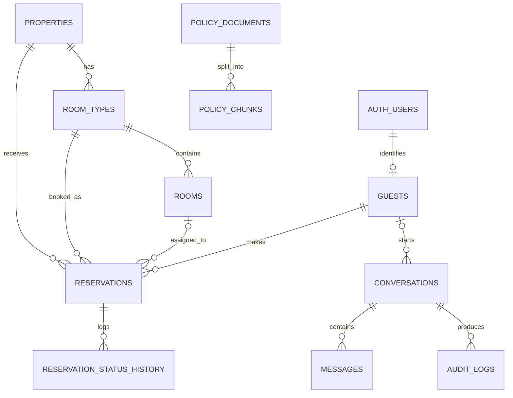

Database Design Specification
Multi-Agent AI Hotel Support System
	
Companion Docs	`project_vision.md` v2.0 · `technology_decisions.md` v2.0 · `architecture.md` v2.0 · `workflow.md` v2.0 · `reservation_agent.md` v2.0 · `rag_design.md` v2.0 · `compliance_agent.md` v2.0
Component Type	Data Layer Specification (Supabase PostgreSQL / pgvector)
Version	2.0
---
## 1. Introduction

This document specifies the persistent data layer of the Multi-Agent AI Hotel Support System: the relational schema for accounts, reservations, room inventory, and conversation/audit history, together with the pgvector-backed policy store that grounds the Compliance Agent. All of it lives in a **single Supabase-managed PostgreSQL instance** — reservation data and policy embeddings co-located, with no separate vector-database service to operate or synchronize (`rag_design.md` §7). Identity is owned by **Supabase Auth**; this schema links to it rather than storing credentials itself.

This aligns with the consolidated v2.0 architecture (`architecture.md`, `workflow.md`): a single FastAPI/LangGraph service reaches this database directly through typed tools, so there is no cross-service database boundary.

---

## 2. Design Principles

Relational integrity (guests ↔ reservations ↔ rooms enforced by the database, not application code) · ACID transactions (no double-booking) · Single-database simplicity (pgvector co-located with transactional data) · Least privilege (scoped database roles; no free-form SQL) · Auditability (every reservation and compliance decision reconstructable) · Defense in depth (application-layer scoping plus optional Row Level Security) · Identity delegation (credentials and email verification owned by Supabase Auth).

---

## 3. Entity Overview



`AUTH_USERS` is Supabase Auth's managed `auth.users` table (shown for context only; this schema does not create or own it). All other entities are defined below. The five table groups named in `architecture.md` §9 — Guests/Accounts, Reservations, Rooms/Inventory, Conversation History, Audit Logs — are all present, plus the pgvector policy store.

---

## 4. Identity & Supabase Auth Integration

Per `project_vision.md` (guests book stays; administrators maintain policy) and the account decision, **both guests and administrators authenticate through Supabase Auth**. Consequences for this schema:

- Credentials, password hashing, and **email verification** are handled entirely by Supabase Auth (`auth.users`). This schema stores no passwords.
- The `guests` table holds hotel-domain profile data and links to the auth user via `auth_user_id UUID UNIQUE REFERENCES auth.users(id)`.
- A guest row is created automatically on signup by a trigger (`handle_new_user`), copying the verified email from `auth.users`.
- **Role** (guest vs. admin) is carried as a claim in the JWT (`app_metadata.role = 'admin'`) and read by FastAPI from the verified token — no per-request role lookup needed (`security.md` §4).

```sql
-- Auto-provision a guests row when a new auth user signs up
create or replace function public.handle_new_user()
returns trigger language plpgsql security definer as $$
begin
  insert into public.guests (auth_user_id, email, full_name)
  values (new.id, new.email, coalesce(new.raw_user_meta_data->>'full_name', ''));
  return new;
end; $$;

create trigger on_auth_user_created
  after insert on auth.users
  for each row execute function public.handle_new_user();
```

> **Alignment note.** `workflow.md` §3 currently describes FastAPI validating credentials and minting its own JWT. This spec supersedes that: Supabase Auth issues the JWT; FastAPI *verifies* it (via JWKS, see `api_design.md` §3, `security.md` §3). `workflow.md` §3 should be updated to match.

---

## 5. Schema (DDL)

```sql
-- Extensions (pgvector ships enabled by default on Supabase)
create extension if not exists "pgcrypto";
create extension if not exists "vector";
create extension if not exists "citext";

-- ── Inventory ────────────────────────────────────────────────
create table properties (
    id          uuid primary key default gen_random_uuid(),
    name        text not null,
    city        text not null,
    timezone    text not null default 'UTC',
    created_at  timestamptz not null default now()
);

create table room_types (
    id              uuid primary key default gen_random_uuid(),
    property_id     uuid not null references properties(id) on delete cascade,
    code            text not null,                 -- 'STD' | 'DLX' | 'SUITE'
    name            text not null,
    max_occupancy   smallint not null check (max_occupancy > 0),
    base_rate_cents integer  not null check (base_rate_cents >= 0),
    currency        char(3)  not null default 'USD',
    unique (property_id, code)
);

create table rooms (
    id            uuid primary key default gen_random_uuid(),
    room_type_id  uuid not null references room_types(id) on delete cascade,
    room_number   text not null,
    floor         smallint,
    is_active     boolean not null default true,
    unique (room_type_id, room_number)
);

-- ── Guests / Accounts (linked to Supabase Auth) ──────────────
create table guests (
    id            uuid primary key default gen_random_uuid(),
    auth_user_id  uuid unique references auth.users(id) on delete set null,
    full_name     text,
    email         citext unique,      -- mirrors the verified auth email
    phone         text,
    created_at    timestamptz not null default now()
);

-- ── Reservations ─────────────────────────────────────────────
create type reservation_status as enum
    ('pending','confirmed','checked_in','checked_out','cancelled','no_show');

create table reservations (
    id                uuid primary key default gen_random_uuid(),
    confirmation_code text not null unique
                        default upper(substr(md5(random()::text),1,8)),
    guest_id          uuid not null references guests(id),
    property_id       uuid not null references properties(id),
    room_type_id      uuid not null references room_types(id),
    room_id           uuid references rooms(id),      -- assigned at check-in
    check_in          date not null,
    check_out         date not null,
    guests_count      smallint not null default 1 check (guests_count > 0),
    status            reservation_status not null default 'pending',
    total_cents       integer check (total_cents >= 0),  -- price, not payment
    currency          char(3) not null default 'USD',
    notes             text,
    created_at        timestamptz not null default now(),
    updated_at        timestamptz not null default now(),
    constraint chk_dates check (check_out > check_in)
);
create index idx_res_guest  on reservations (guest_id);
create index idx_res_dates  on reservations (property_id, check_in, check_out);
create index idx_res_status on reservations (status);

create table reservation_status_history (
    id             bigserial primary key,
    reservation_id uuid not null references reservations(id) on delete cascade,
    old_status     reservation_status,
    new_status     reservation_status not null,
    changed_by     text not null default 'system',   -- agent name or auth uid
    changed_at     timestamptz not null default now()
);

-- ── Conversation history ─────────────────────────────────────
create table conversations (
    id          uuid primary key default gen_random_uuid(),
    guest_id    uuid references guests(id),      -- null for anonymous Q&A
    language    text default 'en',
    created_at  timestamptz not null default now()
);

create table messages (
    id              bigserial primary key,
    conversation_id uuid not null references conversations(id) on delete cascade,
    role            text not null check (role in ('user','assistant','system')),
    content         text not null,
    created_at      timestamptz not null default now()
);
create index idx_msg_conv on messages (conversation_id, created_at);

-- ── Audit logs (agent decisions & compliance outcomes) ───────
create table audit_logs (
    id              bigserial primary key,
    conversation_id uuid references conversations(id) on delete cascade,
    agent           text not null,        -- 'conversation'|'reservation'|'compliance'
    event_type      text not null,        -- 'tool_call'|'compliance_pass'|'compliance_fail'|'error'
    policy_ref      text,                 -- retrieved policy chunk id(s), for compliance decisions
    payload         jsonb,
    created_at      timestamptz not null default now()
);
create index idx_audit_conv on audit_logs (conversation_id, created_at);

-- ── Policy store (RAG / pgvector) ────────────────────────────
create table policy_documents (
    id          uuid primary key default gen_random_uuid(),
    title       text not null,
    category    text,                      -- 'cancellation'|'pet'|'checkin'|'faq'...
    source_uri  text,
    version     integer not null default 1,
    created_at  timestamptz not null default now()
);

create table policy_chunks (
    id           uuid primary key default gen_random_uuid(),
    document_id  uuid not null references policy_documents(id) on delete cascade,
    chunk_index  integer not null,
    content      text not null,
    category     text,                      -- denormalized for metadata filtering
    embedding    vector(1536),              -- text-embedding-3-small (swappable)
    unique (document_id, chunk_index)
);
create index idx_policy_embedding
    on policy_chunks using hnsw (embedding vector_cosine_ops);
```

> **Scope note.** Payment processing is out of scope for v1 (`project_vision.md`), so there is no payments table. `reservations.total_cents` stores the quoted price for display only.

---

## 6. Availability Logic

Availability is **derived**, never stored as a counter that can drift. A room type is available for `[check_in, check_out)` when overlapping active reservations are fewer than the room count.

```sql
create view v_room_type_availability as
select rt.id as room_type_id, rt.property_id, rt.name,
       count(r.id) filter (where r.is_active) as total_rooms
from room_types rt
join rooms r on r.room_type_id = rt.id
group by rt.id;
```

The Reservation Agent computes availability with a parameterized query counting reservations where `check_in < :out and check_out > :in and status not in ('cancelled','no_show')` (`reservation_agent.md` §4).

---

## 7. pgvector Policy Store

Per `rag_design.md`: each administrator-curated policy document is validated, cleaned, chunked, embedded, and stored as rows in `policy_chunks`, with `source / category / version` kept as ordinary relational columns beside the vector column. Retrieval is a native similarity search (`vector_cosine_ops`, HNSW index) combined with standard SQL `WHERE` filtering — no separate query language, and transactional consistency with reservation data for free. The Compliance Agent is the only component that queries these tables.

---

## 8. Access Control & Least-Privilege Roles

FastAPI connects to Postgres with narrow roles — never the Supabase `service_role` key from application code, and never a role that can run DDL.

```sql
-- Read-only: lookups, availability, retrieval
create role app_readonly login password :'ro_pw';
grant connect on database postgres to app_readonly;
grant usage on schema public to app_readonly;
grant select on all tables in schema public to app_readonly;

-- Writer: booking tables only; no DELETE, no policy-table writes
create role app_writer login password :'rw_pw';
grant connect on database postgres to app_writer;
grant usage on schema public to app_writer;
grant select, insert, update on
    reservations, reservation_status_history, guests,
    conversations, messages, audit_logs to app_writer;
-- No delete grant anywhere: cancellations are status changes, not row deletes.
```

Policy ingestion (writes to `policy_documents` / `policy_chunks`) runs as a separate administrative operation, not with guest-facing credentials (`rag_design.md` §9).

---

## 9. Row Level Security (defense in depth)

RLS is Supabase's headline database-layer protection. In this backend-mediated design the **primary** guest-scoping is enforced in FastAPI (the authenticated `guest_id` is injected into every query — `reservation_agent.md` §7). RLS is layered on top as defense in depth, so a bug or leaked connection string still cannot expose another guest's data.

```sql
alter table reservations enable row level security;

-- Effective when the request's Supabase JWT is set on the DB session
create policy guest_owns_reservations on reservations
  for all
  using  (guest_id = (select id from guests where auth_user_id = auth.uid()))
  with check (guest_id = (select id from guests where auth_user_id = auth.uid()));
```

> To make `auth.uid()`-based RLS effective *through* FastAPI, the per-request user JWT/claims must be set on the database session; otherwise RLS is dormant and app-layer scoping is the active control. Enabling RLS with `policy_chunks` restricted to the compliance path is recommended for parity.

---

## 10. Audit Logging

Every reservation operation and every compliance decision is written to `audit_logs`, linked to the originating `conversation_id`, giving one reconstructable trail per interaction (`workflow.md` §9). Compliance approvals record the retrieved `policy_ref`, so any policy statement a guest received can be traced to an approved document (`compliance_agent.md` §9). This complements LangSmith tracing (`deployment.md` §6).

---

## 11. Seed Data

Seed at least: 1 property; 3 room types (STD/DLX/SUITE) with 5–10 rooms each; a handful of guests (each linked to a Supabase Auth test user); and reservations spanning past/current/future dates and every status — so acceptance tests (A2) can exercise lookup / availability / create / modify / cancel / sold-out / past-date without hand-editing rows. Seed a small policy corpus (cancellation, check-in/out, pet, FAQ) for the Compliance Agent.

---

## 12. Design Decisions

| Decision | Chosen | Alternative | Why |
|---|---|---|---|
| Host | Supabase (managed Postgres) | Self-managed Postgres | Managed ops, pgvector on by default, built-in Auth with email verification |
| Vector store | pgvector (same DB) | ChromaDB / Pinecone | One system; transactional consistency; supersedes the v1.1 ChromaDB choice |
| Identity | Supabase Auth + `auth_user_id` link | FastAPI-owned credentials | Free email verification, OAuth, password reset; no home-grown auth |
| Money | integer cents | float / numeric | No floating-point currency error |
| Cancellation | status change + history | row DELETE | Auditable; enforced by withholding DELETE grant |
| Availability | derived view + query | stored counter | Cannot drift out of sync |
| Keys | UUID | serial int | Safe to expose; no booking enumeration |

---

## 13. Migration & Scaling

Local → cloud is a single `pg_dump`/restore into Supabase — and because embeddings live in the same database, the **RAG data migrates with it**, with no separate vector-store export (`deployment.md` §9). pgvector with an HNSW index handles the single-property policy corpus comfortably; the documented growth path at multi-property scale is Azure AI Search (`rag_design.md` §7, `technology_decisions.md` §8).

End of Document — Database Design Specification v2.0
