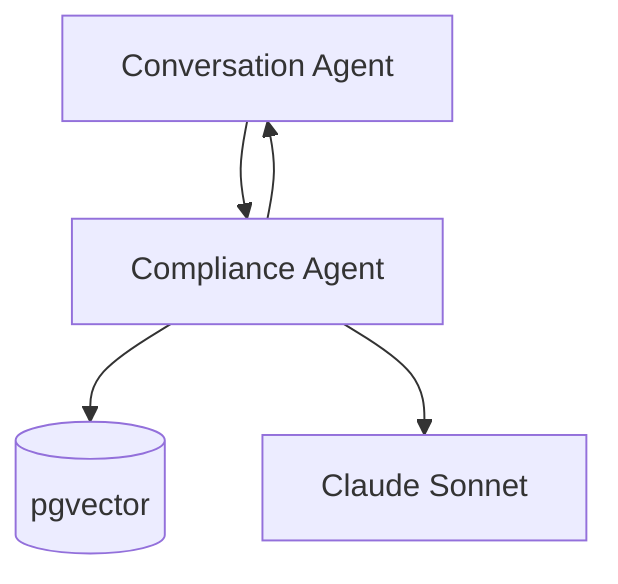
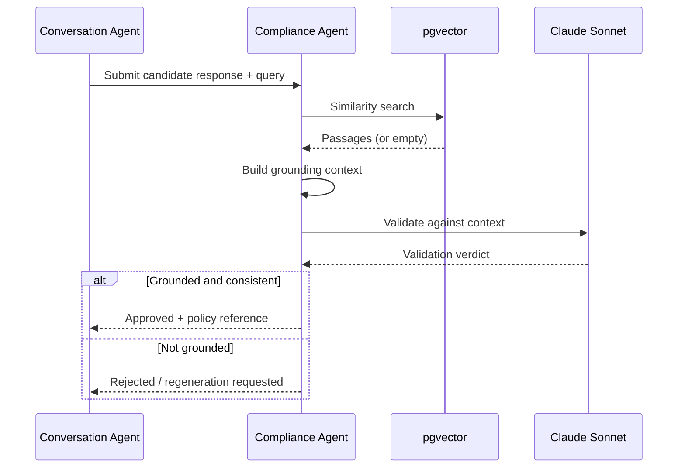
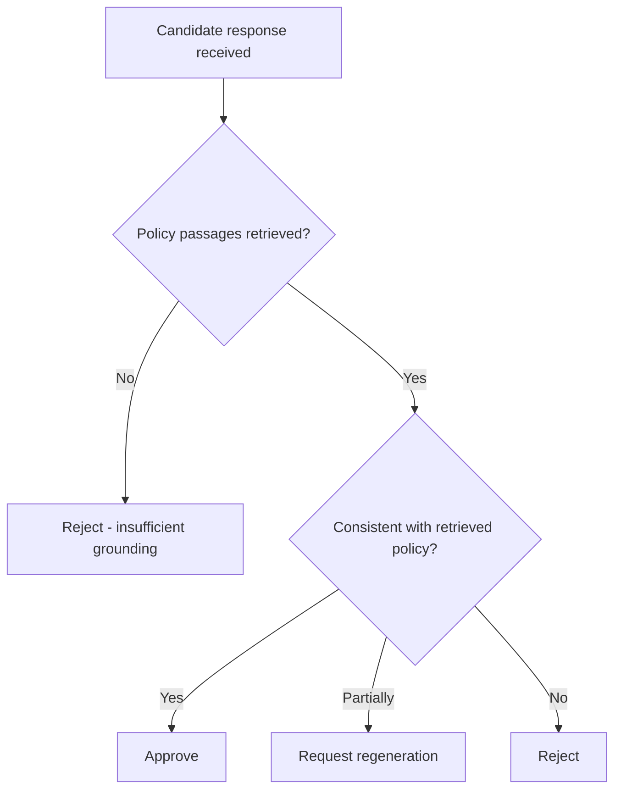

Compliance Agent Specification
Multi-Agent AI Hotel Support System
	
Companion Docs	`project_vision.md` v2.0 · `technology_decisions.md` v2.0 · `architecture.md` v2.0 · `workflow.md` v2.0 · `conversation_agent.md` v2.0
Component Type	RAG-based Validation Agent (Python / LangChain / pgvector / Claude Sonnet, hosted within FastAPI)
Version	2.0
---
1. Introduction
The Compliance Agent is the governance and safety layer of the Multi-Agent AI Hotel Support System. It validates every AI-generated response for accuracy, policy compliance, and freedom from hallucination before release. It runs as a LangGraph node within the same FastAPI backend service, and communicates only with the Conversation Agent, pgvector (policy retrieval, via the shared PostgreSQL connection), and Claude Sonnet (validation reasoning). No response reaches a guest without passing through it.
---
2. Responsibilities
Policy validation — confirm consistency with ingested hotel policy content.
Response verification — check factual/booking claims are supported by retrieved content or Reservation Agent data.
Hallucination prevention — reject or correct ungrounded statements.
Compliance checking — ensure safety and appropriateness of guest-facing responses.
Response approval — issue an authoritative approve/reject/regenerate decision.
---
3. Architecture Position

The Compliance Agent has no path to the guest, and its only outbound dependencies are pgvector and Claude Sonnet.
---
4. Inputs and Outputs
	Description
Input	Guest query/intent, candidate response text, any referenced structured booking data
Output — Approved	Response marked approved, with supporting policy reference(s) for audit logging
Output — Rejected/Regeneration	A rejected status, a reason, and (where supportable) a corrected, grounded response
---
5. Validation Workflow

---
6. RAG Integration
Validation is grounded through LangChain-orchestrated retrieval: a retriever issues a similarity search against pgvector (embeddings of the ingested policy corpus, stored as a table within the same PostgreSQL instance), assembles retrieved passages into a context object, and restricts Claude Sonnet's validation strictly to that context — never the model's general training knowledge.
---
7. Decision Logic

---
8. Error Handling
Condition	Response
Missing policy documents	Approve only a generic, non-committal response
Empty search results	Treated as "cannot ground" — rejected or downgraded
pgvector/PostgreSQL failure	Fail closed — no response approved without retrieval
Claude Sonnet failure	Bounded retry; reject on exhaustion
Default posture is uniformly fail-closed.
---
9. Security and Governance
Prompt injection protection: validation is against retrieved policy content only, not the guest's raw phrasing.
Policy enforcement: every approval ties to a specific retrieved passage.
Secure retrieval: pgvector access is scoped to the Compliance Agent's data-access path within the shared PostgreSQL instance.
Audit logging: every decision, source, and reasoning is logged (`workflow.md` §9).
---
10. Summary
The Compliance Agent turns "an LLM answered a guest" into "a hotel's official policy answered a guest, verified before delivery." By forbidding any response from bypassing retrieval-grounded validation and defaulting to rejection under uncertainty, it is what allows this system to use a generative model for guest conversation without inheriting its capacity for hallucination.
End of Document — Compliance Agent Specification v2.0