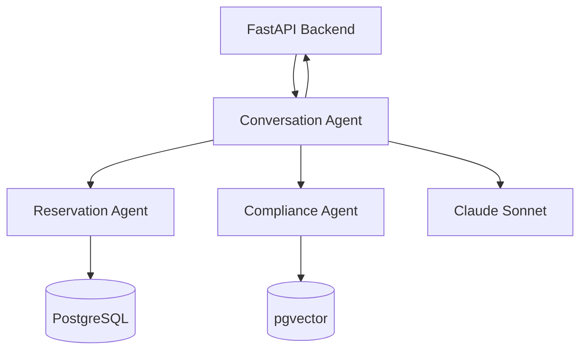
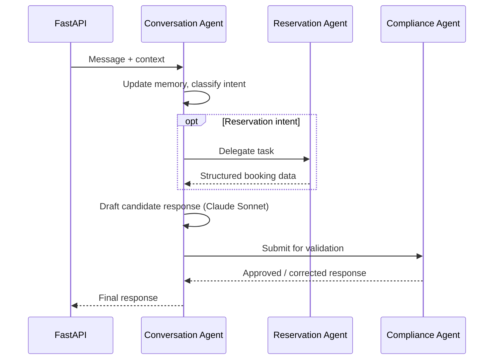
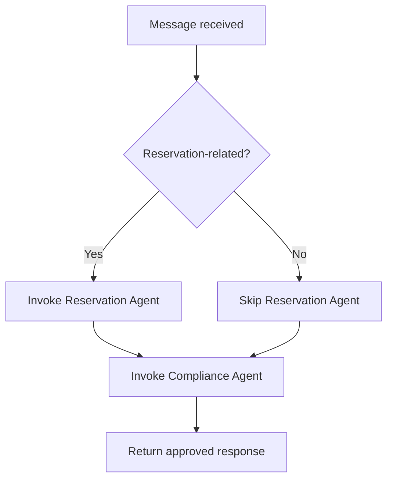

Conversation Agent Specification
Multi-Agent AI Hotel Support System
	
Companion Docs	`project_vision.md` v2.0 · `technology_decisions.md` v2.0 · `architecture.md` v2.0 · `workflow.md` v2.0
Component Type	Supervisor Agent (Python / LangGraph / Claude Sonnet, hosted within FastAPI)
Version	2.0
---
1. Introduction
The Conversation Agent is the Supervisor Agent of the Multi-Agent AI Hotel Support System and the only AI agent that communicates directly with hotel guests. It runs as a LangGraph node hosted inside the FastAPI backend service — there is no separate business API or AI microservice boundary to cross. It owns intent understanding, conversation memory, and delegation to the Reservation and Compliance Agents, then synthesizes their outputs into a single, approved response.
---
2. Responsibilities
Receive every guest message forwarded by FastAPI after JWT validation.
Understand guest intent and maintain conversation memory across turns.
Delegate booking-related tasks to the Reservation Agent.
Submit every candidate response to the Compliance Agent — with no exception.
Synthesize agent outputs into one coherent response and return it to FastAPI.
Handle ambiguous or out-of-domain input gracefully rather than guessing.
The Conversation Agent does not query PostgreSQL or pgvector directly — those are the Reservation and Compliance Agents' responsibilities respectively — and never returns a response that has not passed Compliance validation.
---
3. Architecture Position

All agent interaction is in-process (LangGraph graph edges within the FastAPI service), not a network call — the Conversation Agent is the graph's entry and exit point.
---
4. Inputs and Outputs
	Description
Input	Guest message text, session identifier, prior conversation memory, guest identity (JWT-verified by FastAPI)
Output	A single compliance-approved response, plus structured booking data where applicable
Message Format	`{ session_id, guest_context, message, conversation_history }` in; `{ response_text, structured_data?, status }` out
---
5. Conversation Lifecycle

---
6. Intent Detection and Routing

"Answering directly" only skips the Reservation Agent — the Compliance Agent runs on every path.
---
7. Conversation Memory and Context Management
Conversation history is retained per session and passed to the agent on every turn. Context includes prior intents, partially-completed reservation details, and previously delivered responses, scoped to the authenticated guest's JWT-verified session and not persisted across unrelated sessions.
---
8. Error Handling
Failure	Handling
Invalid/ambiguous request	Ask a clarifying question rather than guessing
Claude Sonnet failure	Bounded retry with backoff; safe fallback message on exhaustion
Reservation Agent failure/timeout	Inform the guest the action is temporarily unavailable
Compliance Agent failure/unavailable	Response is not released — fail closed
---
9. Security Considerations
Input validation: relies on FastAPI-level schema validation before receipt; treats message content as untrusted data.
Prompt injection prevention: no input can force a response to bypass the Compliance Agent gate.
Authentication awareness: trusts guest identity only as asserted by the FastAPI-validated JWT; performs no authentication itself.
Safe response generation: never fabricates booking confirmations or policy claims independent of the Reservation and Compliance Agents.
---
10. Summary
The Conversation Agent is the single, accountable point of contact between the guest and the system: it understands, remembers, delegates, and synthesizes, but authority over booking facts and policy claims always rests with the Reservation and Compliance Agents respectively — keeping the system's behavior governed and auditable.
End of Document — Conversation Agent Specification v2.0