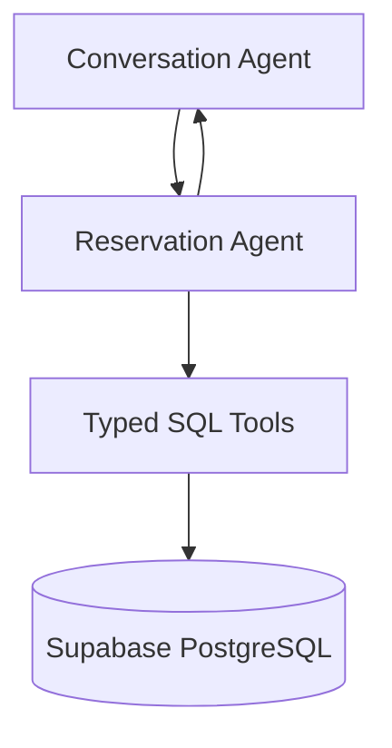

Reservation Agent Specification
Multi-Agent AI Hotel Support System
	
Companion Docs	`project_vision.md` v2.0 · `technology_decisions.md` v2.0 · `architecture.md` v2.0 · `workflow.md` v2.0 · `conversation_agent.md` v2.0 · `compliance_agent.md` v2.0 · `database_design.md` v2.0
Component Type	Specialist Agent (Python / LangGraph tools / Supabase PostgreSQL, hosted within FastAPI)
Version	2.0
---
## 1. Introduction

The Reservation Agent is the specialist responsible for all booking operations: availability, creation, modification, and cancellation. It is invoked by the Conversation Agent (Supervisor) when a guest message carries reservation intent, and it returns **structured booking data** — never guest-facing prose. As with every other path, its output is still submitted to the Compliance Agent before anything reaches the guest.

It runs as a **LangGraph node inside the FastAPI service**, so it holds **direct** (in-process) access to Supabase PostgreSQL through a fixed set of typed tools — there is no callback loop to a separate business API (`workflow.md` §5). This supersedes the v1.1 callback pattern in `architecture.md` §6, which assumed a split Node.js/Python topology.

---

## 2. Responsibilities

Turn a delegated reservation task into safe, parameterized database operations · Check availability for requested dates and room types · Create, modify, and cancel reservations for the **authenticated guest only** · Return structured results to the Conversation Agent · Never fabricate a booking, confirmation code, rate, or availability figure · Never emit guest-facing text or bypass the Compliance gate.

The Reservation Agent does not talk to the guest, does not query the policy store, and does not make policy claims — those belong to the Conversation and Compliance Agents respectively.

---

## 3. Architecture Position



All interaction is in-process (LangGraph edges within FastAPI). The guest's identity arrives as an authenticated `guest_id`, resolved by FastAPI from the verified Supabase JWT and passed into the agent's context (`api_design.md` §3).

---

## 4. Tools

The LLM never authors SQL. It selects a tool and supplies arguments; each tool is a Python function running a parameterized query. **FastAPI injects the authenticated `guest_id`**; the model cannot override it.

### `check_availability` — role `app_readonly`
```
in:  property_id, room_type_code, check_in, check_out, guests_count=1
out: { available, rooms_left, nightly_rate_cents, nights, total_cents }
```
```sql
select (avail.total_rooms - coalesce(booked.cnt,0)) as rooms_left,
       rt.base_rate_cents
from room_types rt
join v_room_type_availability avail on avail.room_type_id = rt.id
left join (
    select room_type_id, count(*) cnt
    from reservations
    where check_in < %(check_out)s and check_out > %(check_in)s
      and status not in ('cancelled','no_show')
    group by room_type_id
) booked on booked.room_type_id = rt.id
where rt.property_id = %(property_id)s and rt.code = %(room_type_code)s;
```

### `get_reservation` — role `app_readonly`
```
in:  confirmation_code?        (always additionally filtered by authenticated guest_id)
out: reservation record(s) for the authenticated guest only
```

### `create_reservation` — role `app_writer`
```
in:  property_id, room_type_code, check_in, check_out, guests_count
out: { confirmation_code, status:'confirmed', total_cents, ... }
```
Validates → re-checks availability **inside the same transaction** → inserts the reservation against the authenticated `guest_id` → writes a `reservation_status_history` row. The transactional re-check prevents a double-book race.

### `modify_reservation` — role `app_writer`
```
in:  confirmation_code, new_check_in?, new_check_out?, new_guests_count?
out: updated reservation record
```
Re-runs availability for the new dates; only succeeds if the reservation belongs to the authenticated guest.

### `cancel_reservation` — role `app_writer`
```
in:  confirmation_code
out: { confirmation_code, status:'cancelled' }
```
Sets `status='cancelled'` and appends history — **never deletes the row** (the `app_writer` role has no DELETE grant, so this is enforced at the database too).

---

## 5. Inputs and Outputs

| | Description |
|---|---|
| Input | Delegated task from the Conversation Agent + authenticated `guest_id` (from JWT) + validated arguments |
| Output (ok) | `{ ok:true, tool, data:{…} }` |
| Output (fail) | `{ ok:false, tool, error:{ code, message } }` |
| Error codes | `VALIDATION_ERROR`, `NOT_FOUND`, `NO_AVAILABILITY`, `DB_UNAVAILABLE`, `UNAUTHORIZED` |

Results are always structured; the Conversation Agent phrases them for the guest, and the Compliance Agent validates the final wording.

---

## 6. Reservation Lifecycle

```mermaid
sequenceDiagram
    participant C as Conversation Agent
    participant RA as Reservation Agent
    participant PG as Supabase PostgreSQL
    C->>RA: Delegate task + authenticated guest_id
    RA->>RA: Validate input (dates, occupancy, format)
    alt Check availability
        RA->>PG: Parameterized availability query (app_readonly)
    else Create / Modify
        RA->>PG: BEGIN; re-check availability; write; history; COMMIT (app_writer)
    else Cancel
        RA->>PG: UPDATE status='cancelled'; append history (app_writer)
    end
    PG-->>RA: Rows / result
    RA-->>C: Structured result
```

The result then proceeds to the Compliance Agent before release (`workflow.md` §5–6).

---

## 7. Safe Data Access

1. **No free-form SQL** — the model chooses among the five typed tools only.
2. **Parameterized queries** — every value is a bound parameter; primary SQL-injection defense.
3. **Guest scoping** — reads and writes are filtered by the FastAPI-injected `guest_id`; a supplied confirmation code for someone else's booking returns `NOT_FOUND`, not their data.
4. **Least privilege** — reads via `app_readonly`, writes via `app_writer`; neither can run DDL or write policy tables (`database_design.md` §8).
5. **Transactional writes** — availability re-check + insert/update in one transaction.
6. **Statement timeout** — per-connection `statement_timeout` (~3s) so a pathological query cannot stall the graph.

---

## 8. Input Validation

Reject before any query, with a message the Conversation Agent can relay: `check_in` today or later; `check_out > check_in`; stay length within a sane bound; `guests_count` between 1 and the room type's `max_occupancy`; `room_type_code` in the allowed set; `confirmation_code` well-formed. Values reaching SQL are the typed, validated Pydantic values — never the raw model string.

---

## 9. Account Requirement

Booking is an authenticated action (`project_vision.md`; account decision). A reservation tool runs only when FastAPI has verified the guest's Supabase JWT **and** the account's email is verified. Anonymous sessions may ask questions, but any `create_/modify_/cancel_reservation` (and guest-specific `get_reservation`) requires a verified guest identity; otherwise FastAPI returns `UNAUTHORIZED` before the agent is invoked (`api_design.md` §7).

---

## 10. Error Handling

| Failure | Handling |
|---|---|
| Invalid input | `VALIDATION_ERROR`; ask the guest to correct it |
| No availability | `NO_AVAILABILITY`; offer alternatives if known |
| Not found / not owned | `NOT_FOUND`; never reveal another guest's data |
| Database unavailable | Retry once with backoff → `DB_UNAVAILABLE`; fail closed; log to `audit_logs` |
| Any exception | Mapped to a code; raw SQL/exception text never surfaced (`security.md` §7) |

Chat memory is preserved across recovery so the guest never repeats themselves.

---

## 11. Hallucination Guard

If there is no tool result, there is no booking. The agent must not invent confirmation codes, rates, or availability, and the Compliance Agent independently verifies that every booking claim traces to Reservation Agent data (`compliance_agent.md` §2).

---

## 12. Security Considerations

Trusts guest identity only as asserted by the FastAPI-verified JWT · performs no authentication itself · exposes no bulk-export capability, so "show me all reservations" cannot escape the guest scope · treats delegated task text as untrusted data — a prompt-injection attempt cannot widen the tool surface or the DB grants.

---

## 13. Acceptance Criteria (A2)

Given a reservation request from an authenticated guest, the agent retrieves or updates the correct records and returns accurate structured results. Verified by the integration suite in `testing.md` §4: lookup, available vs. sold-out, create→confirm, modify, cancel (row persists as `cancelled`), past-date rejection, over-occupancy rejection, and cross-guest access denial.

End of Document — Reservation Agent Specification v2.0
