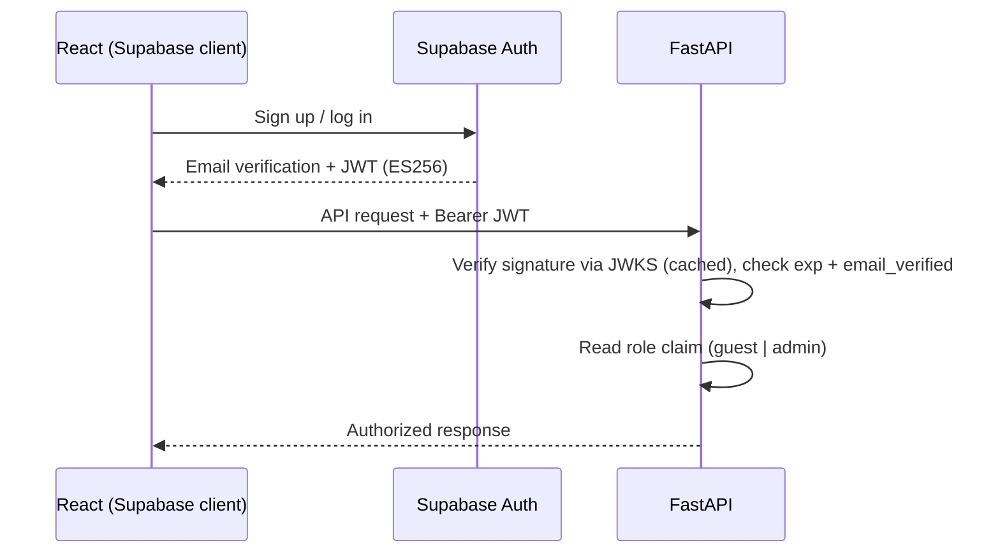

API Design Specification
Multi-Agent AI Hotel Support System
	
Companion Docs	`project_vision.md` v2.0 · `technology_decisions.md` v2.0 · `architecture.md` v2.0 · `workflow.md` v2.0 · `conversation_agent.md` v2.0 · `database_design.md` v2.0 · `security.md` v2.0
Component Type	API Layer Specification (FastAPI / REST + WebSocket / Supabase Auth JWT)
Version	2.0
---
## 1. Introduction

This document specifies the API surface of the FastAPI backend — the single service that authenticates requests, hosts the LangGraph multi-agent graph in-process, and exposes the system to the React frontend. It is the only network boundary between the guest and the agents (`conversation_agent.md` §3). Guest and admin identity is provided by **Supabase Auth**; FastAPI **verifies** the resulting JWT and enforces authorization.

Transport: REST for setup/admin/auth-adjacent calls; **WebSocket** for the chat itself, so assistant tokens and mid-run status can stream. FastAPI auto-generates OpenAPI at `/docs`.

---

## 2. Conventions

Base path `/api/v1`; JSON with `snake_case` keys · `Authorization: Bearer <supabase_jwt>` on authenticated calls · every response carries `X-Request-Id` (correlates with LangSmith traces and `audit_logs`) · uniform error envelope:

```json
{ "ok": false, "error": { "code": "NOT_FOUND", "message": "…" } }
```

---

## 3. Authentication & Authorization

Supabase Auth owns registration, password hashing, **email verification**, and token issuance. FastAPI verifies each JWT locally against Supabase's public keys — no round-trip to the Auth server.



Rules:
- **Verification via JWKS.** FastAPI fetches Supabase's public keys from `/auth/v1/.well-known/jwks.json` (asymmetric ES256), caches them (~10 min, respecting rotation), and verifies tokens with `PyJWT` + `PyJWKClient`. The legacy shared JWT secret is **not** used — mismatched-secret verification is the most common integration bug.
- **Roles.** `app_metadata.role` distinguishes `guest` from `admin`. Admin routes require `role == 'admin'`.
- **Email-verified gate.** Booking actions require `email_verified` / `email_confirmed_at` to be set (`reservation_agent.md` §9).
- FastAPI performs **no** authentication itself; it only verifies and authorizes.

> **Alignment note.** This supersedes `workflow.md` §3 ("FastAPI owns authentication directly… no separate identity-provider"). Supabase Auth is the identity provider; FastAPI verifies.

---

## 4. REST Endpoints

**Health & meta**
```
GET  /api/v1/health          -> { status, db, version }
```

**Sessions**
```
POST /api/v1/sessions        -> { conversation_id }
```
Creates a `conversations` row. Allowed anonymously (for Q&A) or authenticated; if a valid guest JWT is present, the conversation is linked to that `guest_id`.

**Chat (non-streaming fallback)**
```
POST /api/v1/chat
body: { conversation_id, message }
-> { reply, compliance:{ passed:true }, status }
```
Runs the full graph and returns the final, **compliance-approved** reply. WebSocket (§5) is preferred.

**Reservations (read, guest-scoped)**
```
GET  /api/v1/reservations/{confirmation_code}   (guest JWT)
-> reservation record (only if it belongs to the caller)
```

**Admin — policy management** (RAG corpus; `admin` role required)
```
POST   /api/v1/admin/policies       body: { title, category, text }
GET    /api/v1/admin/policies
DELETE /api/v1/admin/policies/{id}
```
Uploading a policy runs the offline pipeline (chunk → embed → insert into `policy_chunks`) — the only supported way to change compliance behavior (`rag_design.md` §4).

---

## 5. WebSocket Chat

```
WS /api/v1/ws/chat?conversation_id=…    (Bearer JWT sent on connect)
```
Client → server: `{ "type":"user_message", "content":"…" }`

Server → client (streamed):
```json
{ "type":"status", "stage":"routing" }
{ "type":"status", "stage":"checking_reservations" }
{ "type":"token",  "content":"We have " }
{ "type":"status", "stage":"compliance_check" }
{ "type":"final",  "content":"We have 2 suites available…", "compliance":{"passed":true} }
{ "type":"auth_required", "reason":"booking_requires_login" }
{ "type":"error",  "code":"DB_UNAVAILABLE", "message":"…" }
```

**Critical ordering:** the `final` event is emitted only **after** the Compliance Agent approves. On failure the graph regenerates or rejects and never emits an unapproved `final` — the golden rule enforced at the transport layer (`workflow.md` §2, `compliance_agent.md`).

---

## 6. Request Lifecycle

```mermaid
sequenceDiagram
    autonumber
    participant R as React
    participant F as FastAPI
    participant C as Conversation Agent
    participant RA as Reservation Agent
    participant CO as Compliance Agent
    R->>F: user_message (WS, JWT)
    F->>F: Verify JWT + input; resolve guest_id
    F->>C: Invoke Supervisor graph
    C->>C: Classify intent, update memory
    opt Reservation intent (auth + email-verified)
        C->>RA: Delegate + guest_id
        RA-->>C: Structured booking data
    end
    C->>CO: Submit draft
    CO-->>C: Approved / corrected
    C-->>F: Final response
    F-->>R: final event
```

---

## 7. Booking Authentication Gate

Anonymous guests may ask informational/FAQ questions (answered and still Compliance-checked). The moment intent classification routes to a **booking** action, FastAPI requires a verified guest identity:
- No/invalid JWT, or unverified email → the WS emits `auth_required`; the UI opens the Supabase login/signup flow (`frontend_spec.md` §7).
- After sign-in + verification, the guest retries and the reservation tools run scoped to their `guest_id`.

---

## 8. Rate Limiting & Abuse Control

Per-session and per-IP limits on `/chat` and the WebSocket (protecting Supabase and the cost-sensitive Claude Sonnet API) · maximum message length · one in-flight graph run per conversation (WS backpressure).

---

## 9. Versioning & Stable Contracts

The **database schema** (`database_design.md`), **reservation tool signatures** (`reservation_agent.md` §4), and **this contract** are the frozen interfaces between the data/API work and the agent work. Additive changes (new optional fields, new event `type`s) are safe within `/v1`; removals or renames require `/v2`.

End of Document — API Design Specification v2.0
