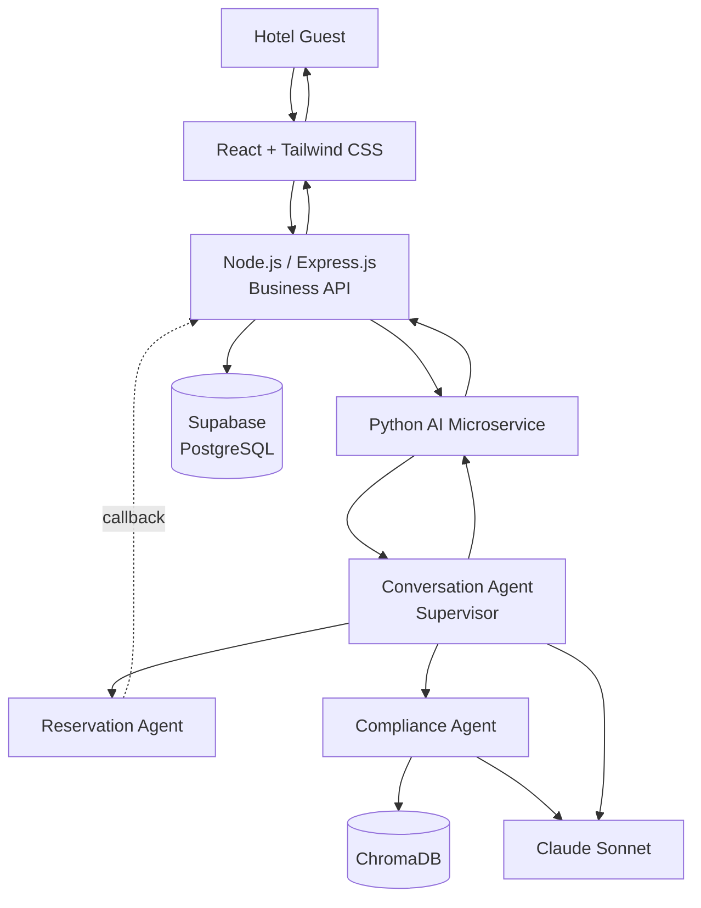
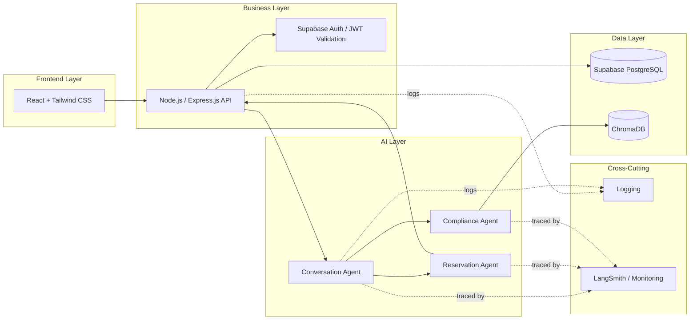
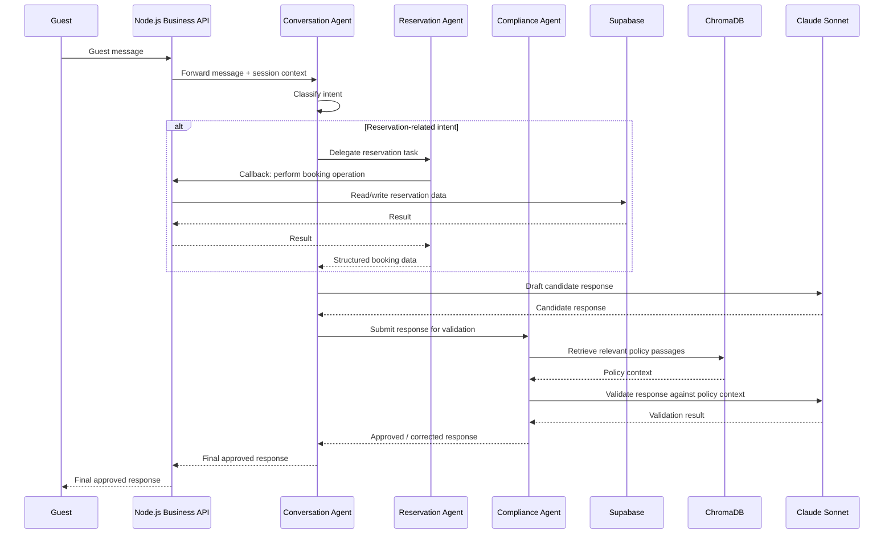
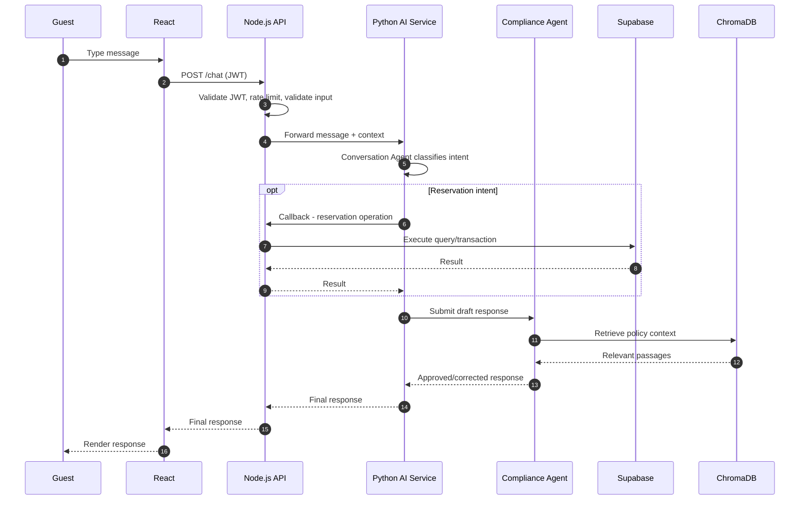
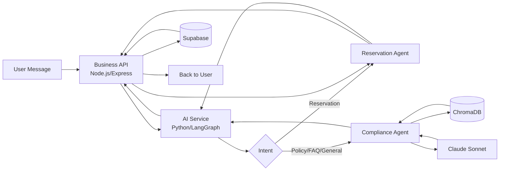
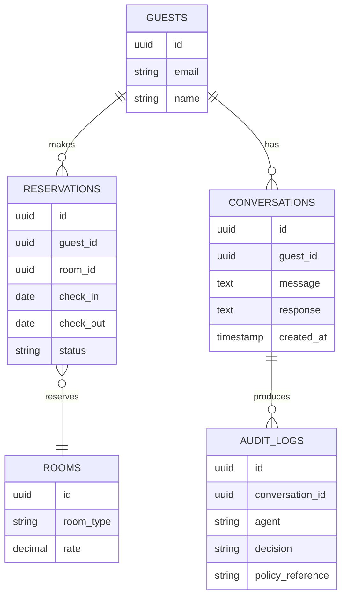
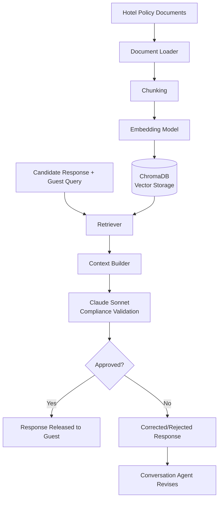
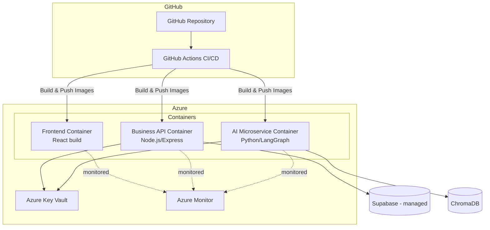

System Architecture Specification
Multi-Agent AI Hotel Support System
	
Document Type	Enterprise Architecture Specification — Software Design Documentation (SDD)
Companion Documents	`project_vision.md` v1.1 (business rationale, scope, objectives) · `technology_decisions.md` v1.0 (technology selection rationale)
Development Methodology	Spec-Driven Development (SDD)
Architecture Style	Hybrid Microservice Architecture · Supervisor-based Multi-Agent Architecture · Service-Oriented Design · Retrieval-Augmented Generation (RAG)
Status	Draft for Architecture Review
Version	1.0
---
1. Introduction
1.1 Purpose
This document specifies the system architecture of the Multi-Agent AI Hotel Support System: the components that make it up, how those components communicate, how data flows through the system end-to-end, and the non-functional mechanisms (security, observability, scalability, error handling) that make it operable in production. Where `project_vision.md` defines why the system exists and `technology_decisions.md` defines which technologies were chosen and why, this document defines how those technologies are assembled into a working system.
1.2 Architecture Goals
Enforce a strict Supervisor-based Multi-Agent Architecture in which the Conversation Agent is the sole point of contact with the guest, and every response is validated by the Compliance Agent before delivery.
Maintain a clean hybrid microservice boundary between guest-facing business logic (Node.js/Express.js) and AI orchestration (Python/LangGraph), so each can be built, deployed, and scaled independently.
Guarantee that no component bypasses its designated communication path — architectural rules (§1.4) are enforced structurally, not just by convention.
Provide a system that is observable, fault-isolated, and horizontally scalable from Version 1, without requiring re-architecture as guest volume grows.
1.3 Audience
Enterprise software architects, technical leads, AI/ML engineers, backend and frontend engineering teams, DevOps/Cloud Operations, QA, and engineering management responsible for reviewing, implementing, or operating this system.
1.4 Relationship with Other SDD Documents
Document	Relationship to This Document
`project_vision.md`	Defines the business problem, scope, and functional/non-functional requirements this architecture must satisfy. Any architectural decision here must trace back to a requirement there.
`technology_decisions.md`	Justifies each technology named in this architecture. This document assumes those choices as fixed and shows how they are assembled.
(Future) Agent Specifications	Will define the internal prompt/tool contracts for each agent described at a component level here.
(Future) Database Schema Specification	Will formalize the Supabase schema outlined at a conceptual level in §9.
1.5 Binding Architectural Rules
The following rules are structural constraints on every diagram and section in this document:
The React frontend never communicates directly with the Python AI Microservice.
React communicates only with the Node.js Business API.
The Node.js Business API communicates with the Python AI Microservice via internal REST APIs.
The Python AI Microservice never directly serves frontend requests.
The Reservation Agent does not access Supabase directly — it communicates with the Node.js Business API's Reservation endpoints, which perform the actual database operations.
The Business API is the sole component that communicates with Supabase.
The Compliance Agent retrieves policy information from ChromaDB and is the only agent that queries it.
Every AI-generated response must pass through the Compliance Agent before it is returned to the guest.
The Conversation Agent is the only AI agent that communicates directly with the guest (via the Node.js/React path).
---
2. Architecture Principles
Principle	Application in This System
Separation of Concerns	Business logic/auth (Node.js), AI orchestration (Python), transactional data (Supabase), and policy retrieval (ChromaDB) are each owned by exactly one layer/component.
Loose Coupling	Every cross-component call is a versioned REST contract, not a shared library or shared database connection — any component can be replaced without touching its callers, provided the contract is honored.
High Cohesion	Each agent (Conversation, Reservation, Compliance) has one clearly bounded responsibility; each service (React, Node.js, Python) owns one architectural concern.
Scalability	Every container (frontend, Business API, AI Microservice) is independently replicable behind a load balancer, so each layer scales to its own demand curve.
Security	Authentication (JWT/Supabase Auth), transport encryption (HTTPS), and data isolation (Row Level Security) are enforced at multiple layers, not a single perimeter.
Reliability	Reservation operations are ACID-transactional; every AI response is gated by compliance validation before reaching a guest.
Maintainability	Clear component boundaries and a single internal REST contract per boundary keep any one team's changes from requiring coordinated changes elsewhere.
Extensibility	New agents attach to the existing Supervisor graph as new LangGraph nodes; new front-end channels attach to the existing Node.js Business API without touching the AI Microservice.
Observability	Every agent decision, tool call, and retrieved document is traceable (LangSmith); every API request is logged (Python Logging / Node.js logging).
Fault Isolation	A failure in the AI Microservice (e.g., LLM timeout) cannot corrupt Supabase state, because only the Business API writes to Supabase; a failure in ChromaDB cannot silently produce an unvalidated response, because the Compliance Agent gate blocks it.
---
3. High-Level System Architecture
At the highest level, a guest interacts only with the React interface; the React interface talks only to the Node.js Business API; the Business API is the sole bridge into the Python AI Microservice, which hosts the three-agent Supervisor system. The Conversation Agent orchestrates the Reservation Agent (which calls back into the Business API for any data operation) and the Compliance Agent (which grounds and validates responses using ChromaDB and Claude Sonnet) before a final, approved response is returned back up the same chain to the guest.

Reading the diagram: solid arrows represent the primary forward request path; the dashed arrow represents the Reservation Agent's callback into the Business API to perform an actual database operation (Rule 5, §1.5) — the Reservation Agent itself holds no direct Supabase connection. Claude Sonnet is shown attached to both the Conversation Agent (for intent understanding, routing, and final response generation) and the Compliance Agent (for RAG-grounded validation), since both agents perform LLM reasoning, just for different purposes.
---
4. Component Architecture
Component	Responsibility
Frontend (React + Tailwind CSS)	Renders the guest chat interface, authentication screens, and booking/confirmation UI; holds no business logic beyond client-side validation and state rendering.
Business API (Node.js + Express.js)	Authenticates guests (JWT/Supabase Auth), exposes REST endpoints for chat and reservation operations, enforces request validation and rate limiting, is the sole caller of Supabase, and is the sole caller of the Python AI Microservice.
AI Microservice (Python + LangGraph + LangChain + Claude Sonnet)	Hosts the three-agent Supervisor system; receives a guest message + context from the Business API, returns a single compliance-approved response.
Database (Supabase / PostgreSQL)	System of record for reservations, guest accounts, conversation history, and audit logs; enforces ACID transactions and Row Level Security.
Vector Database (ChromaDB)	Stores embedded hotel policy documents; serves similarity-search retrieval exclusively to the Compliance Agent.
Authentication (Supabase Auth + JWT)	Issues and validates signed tokens consumed by the Business API on every request.
Logging (Python Logging + Node.js logging)	Structured, timestamped application-level logs across both services.
Monitoring (LangSmith + Azure Monitor)	Agent-level tracing (LangSmith) and infrastructure-level health/metrics (Azure Monitor).
Deployment (Docker + Azure + GitHub Actions)	Containerized, independently deployable services running on Azure, built and released via automated CI/CD pipelines.

---
5. Service Communication
Path	Protocol	Direction	Purpose
React → Node.js	HTTPS / REST (JSON)	Guest-initiated	Chat messages, login, booking actions
Node.js → Python	Internal REST (JSON)	Business API-initiated	Forward guest message + session context to the AI Microservice
Python → Node.js	Internal REST (JSON)	Reservation Agent-initiated (callback)	Perform an actual reservation read/write via the Business API's Reservation endpoints
Node.js → Supabase	PostgREST / DB client (TLS)	Business API-initiated	All reads/writes to reservation, guest, conversation-history, and audit data
Compliance Agent → ChromaDB	Internal client call	Compliance Agent-initiated	Similarity search over embedded policy documents
AI Microservice → Claude Sonnet	HTTPS / Anthropic API	Conversation Agent & Compliance Agent-initiated	LLM reasoning, routing, response generation, and compliance validation
Request/response flow summary: Every guest-facing call is synchronous request/response over REST. The Business API is a synchronous pass-through with authority — it authenticates the request, forwards it to the AI Microservice, and, if the AI Microservice's Reservation Agent needs a database operation performed mid-conversation, receives a callback request from the AI Microservice using the same internal REST contract, executes it against Supabase, and returns the result back to the AI Microservice, which continues its agent graph execution before returning the final response to the Business API and then to React. This callback pattern preserves Rule 5/6 (§1.5): only the Business API ever touches Supabase, even though the decision to read/write reservation data originates inside the AI Microservice.
---
6. AI Agent Architecture
6.1 Conversation Agent (Supervisor)
Receives the guest message and conversation context from the Business API.
Maintains conversation memory across turns within a session.
Classifies guest intent and determines which specialist agent(s) to invoke.
Synthesizes specialist agent outputs into a single natural-language response.
Is the only agent that returns a payload to the Business API.
6.2 Reservation Agent
Invoked by the Conversation Agent for availability, booking, modification, or cancellation intents.
Has no direct database connection — every data operation is issued as a callback REST request to the Business API's Reservation endpoints.
Returns structured booking data (booking ID, dates, room type, rate, status) back to the Conversation Agent.
6.3 Compliance Agent
Invoked by the Conversation Agent for any response containing policy-sensitive content, and as a mandatory final gate on every response regardless of intent.
Retrieves relevant policy passages from ChromaDB via similarity search.
Uses Claude Sonnet to validate that the proposed response is consistent with retrieved policy content.
Approves the response for delivery, or returns a corrected/rejected response with a reason, which the Conversation Agent must incorporate before responding to the guest.
6.4 Agent Collaboration Sequence

---
7. Request Lifecycle
The guest submits a message through the React chat interface.
React sends an authenticated HTTPS request to the Node.js Business API, including the guest's JWT.
The Business API validates the JWT (Supabase Auth), applies rate limiting and input validation, and forwards the message plus session context to the Python AI Microservice over an internal REST call.
The Conversation Agent receives the message, updates conversation memory, and classifies intent.
If the intent involves reservations, the Conversation Agent delegates to the Reservation Agent, which issues a callback REST request to the Business API's Reservation endpoints; the Business API executes the operation against Supabase and returns the result.
The Conversation Agent drafts a candidate response (using Claude Sonnet) incorporating any reservation results.
The Conversation Agent submits the candidate response to the Compliance Agent, which retrieves relevant policy passages from ChromaDB and uses Claude Sonnet to validate the response against them.
The Compliance Agent either approves the response or returns a corrected version; the Conversation Agent incorporates the final, approved response.
The AI Microservice returns the final response to the Business API, which returns it to React, which renders it to the guest.
Every step above is logged (Python Logging / Node.js logging) and traced (LangSmith) for audit and observability purposes.

---
8. Data Flow Architecture

Data entering the system as an unstructured guest message is progressively structured as it moves right: the Business API attaches authenticated identity/session context; the AI Service attaches an intent classification; the Reservation Agent attaches structured booking data (sourced, ultimately, from Supabase via the Business API callback); the Compliance Agent attaches policy grounding (sourced from ChromaDB) and an approval/correction decision. The response flowing back to the guest is therefore always a compliance-approved, intent-resolved, and (where relevant) transactionally-confirmed payload — never a raw LLM completion.
---
9. Database Architecture
Supabase (PostgreSQL) is the system of record for all persistent, transactional, and auditable state. Conceptual table groups:
Table Group	Purpose
Guests / Accounts	Guest identity, contact details, linked to Supabase Auth user records.
Reservations	Booking ID, guest reference, room type, dates, rate, status (confirmed/modified/cancelled).
Rooms / Inventory	Room types, rate plans, availability constraints enforced via database constraints.
Conversation History	Per-session message log (guest input, final approved response, timestamps), linked to the guest/account.
Audit Logs	Structured record of agent decisions, compliance validation outcomes, and policy sources cited, linked to the conversation history entry that produced them.

Row Level Security (RLS) policies ensure a guest's session can only read/write rows tied to their own `guest_id`, enforced at the database layer independent of Business API-level authorization checks (defense in depth, per `technology_decisions.md` §7/§9).
---
10. RAG Architecture
The Compliance Agent's Retrieval-Augmented Generation pipeline:

Ingestion path (offline/batch): hotel policy documents are loaded, split into retrieval-sized chunks, embedded, and stored in ChromaDB — this is a one-time or periodic administrative process, not part of the guest-facing request path.
Retrieval + validation path (online, per request): for every candidate response, the Compliance Agent retrieves the most relevant policy passages given the guest's query and the candidate response, builds a grounding context, and asks Claude Sonnet to validate the candidate response strictly against that retrieved context — never against the model's unaided training knowledge. A response that cannot be grounded in retrieved content is corrected or rejected rather than released, structurally preventing hallucinated policy claims from reaching a guest.
---
11. Security Architecture
Layer	Control
Transport	HTTPS/TLS on every hop — Guest↔React, React↔Node.js, Node.js↔Python, Node.js↔Supabase.
Authentication	Supabase Authentication issues signed JWTs on login; every Business API request is validated against the token's signature and expiry.
Authorization	Role-Based Access Control (RBAC) at the API layer, reinforced by Supabase Row Level Security at the database layer — a guest's session cannot read or modify another guest's data even if an API-layer check were bypassed.
Secrets	Environment variables for local/config-level secrets; Azure Key Vault for centrally-managed, rotatable credentials (Claude Sonnet API key, Supabase service credentials).
Input Validation	Every guest input is schema-validated at the Business API boundary before reaching Supabase or the AI Microservice.
Prompt Injection Protection	The mandatory Compliance Agent gate (Rule 8, §1.5) structurally prevents a manipulated guest input from producing a policy-violating or fabricated response, regardless of what the Conversation Agent is induced to generate.
SQL Injection Protection	All Supabase access uses parameterized queries/query builders; no raw string-concatenated SQL anywhere in the Business API.
Rate Limiting	Enforced at the Business API to protect Supabase and the (cost-sensitive) Claude Sonnet API from abusive or runaway request volume.
---
12. Logging and Monitoring
Concern	Mechanism	Coverage
Application Logs	Python Logging (AI Microservice), structured Node.js logging (Business API)	Requests, responses, errors, business-logic decisions
AI Agent Logs / Tracing	LangSmith	Every LangGraph node transition, tool call, retrieved document, and prompt/response pair
Performance Metrics	LangSmith + Azure Monitor	Per-agent and end-to-end latency, error rates, throughput
Audit Logs	Supabase `AUDIT_LOGS` table + LangSmith trace export	Full reconstruction of any guest interaction, including which policy passage grounded a given answer
Health Checks	Liveness/readiness endpoints on each container (React static host, Node.js API, Python AI Microservice)	Container-level uptime monitoring for Azure's orchestration layer
---
13. Deployment Architecture

Each container is built and deployed independently by its own GitHub Actions pipeline stage; a change to the AI Microservice's Docker image does not require rebuilding or redeploying the Business API or Frontend containers, satisfying the independent-deployability principle from §2.
---
14. Scalability Strategy
Horizontal Scaling: Each of the three containers (Frontend, Business API, AI Microservice) runs as multiple replicas behind an Azure load balancer, scaled independently according to its own demand profile.
Independent Service Scaling: The AI Microservice, being the most latency/compute-sensitive layer (LLM calls), can be scaled up faster or further than the Business API during peak conversational load, without over-provisioning the lighter-weight API layer.
Caching Opportunities: Frequently-repeated availability queries or FAQ-style policy answers are candidates for a future caching layer (Redis, semantic cache — see §16), reducing redundant Supabase queries and Claude Sonnet calls.
Future Kubernetes Deployment: If replica counts, deployment frequency, or multi-region requirements exceed what Azure's simpler container hosting can manage cleanly, migrating the three containers to Kubernetes provides finer-grained auto-scaling, self-healing, and rolling-deployment capability without changing the container images themselves.
---
15. Error Handling Strategy
Failure Mode	Handling Strategy
Business API failures	Return a structured error response to React with a guest-safe message; log the underlying error; do not forward a partial/undefined request to the AI Microservice.
AI Microservice failures (agent exception, LangGraph error)	Business API catches the failure, returns a graceful "unable to process this request right now" response rather than exposing an internal error to the guest; incident logged for engineering review.
Claude Sonnet API failures / timeouts	Retried with exponential backoff up to a bounded limit; on exhaustion, the Conversation/Compliance Agent returns a safe fallback message rather than blocking indefinitely.
Database (Supabase) failures	Reservation operations fail closed (no partial writes — ACID transactions roll back); guest is informed the operation could not be completed rather than receiving an ambiguous confirmation.
Vector Database (ChromaDB) failures	If policy retrieval is unavailable, the Compliance Agent cannot ground a response and must reject the response rather than approve an ungrounded one — favoring safety over availability for policy-sensitive answers.
Timeouts	Defined per external call (Claude Sonnet, Supabase, ChromaDB); a timed-out call is treated as a failure of that dependency, triggering the corresponding fallback above.
Retries	Applied to idempotent, transient-failure-prone calls (LLM calls, read-only ChromaDB queries); not applied to non-idempotent write operations without an explicit idempotency key.
Graceful Degradation	The system always prefers a clear, honest "I can't complete that right now" response over a silent failure or an unvalidated/hallucinated response — consistent with the compliance-first design mandate in `project_vision.md`.
---
16. Future Architecture
Direction	Rationale
Additional AI Agents (Sentiment Analysis, Translation, Payment, Recommendation)	Attach as new LangGraph nodes under the existing Supervisor without re-architecting the Conversation Agent.
Model Context Protocol (MCP)	Standardizes how agents discover and invoke external tools/data sources, easing future PMS/OTA integrations.
Redis	Shared cache for availability lookups and session state, reducing repeated Supabase/AI Microservice round-trips.
Azure AI Search	Natural production successor to ChromaDB once the policy corpus or query volume outgrows a self-hosted vector store.
Event-Driven Architecture / Kafka	Introduces asynchronous event notification (e.g., booking-confirmation workflows, cross-agent events) as the system scales beyond simple synchronous request/response.
Kubernetes	Finer-grained orchestration, auto-scaling, and self-healing once container/replica management outgrows Azure's simpler hosting model.
Multi-Property Hotel Support	Extends the Supabase schema and ChromaDB corpus to be property-scoped, with the same three-agent architecture serving multiple properties from a shared platform.
---
17. Architecture Summary
This architecture delivers a Supervisor-based Multi-Agent AI system wrapped in a hybrid microservice topology that keeps guest-facing business logic (Node.js/Express.js), AI orchestration (Python/LangGraph/LangChain/Claude Sonnet), transactional data (Supabase), and policy retrieval (ChromaDB) as cleanly separated, independently scalable, and independently deployable components — connected exclusively through well-defined internal REST contracts, with the Reservation Agent's callback pattern preserving a single point of database access even though the decision to act on data originates inside the AI layer.
It is suitable for enterprise deployment because every non-functional requirement in `project_vision.md` is structurally, not incidentally, satisfied: compliance validation is a mandatory gate rather than an optional check; guest data is protected by authentication, RBAC, and database-level Row Level Security in combination; every agent decision is traceable and auditable; and each service can be scaled, redeployed, or replaced independently as the platform grows toward the multi-agent, multi-property future described in §16 — without requiring a rewrite of the architecture established here.
---
End of Document — System Architecture Specification: Multi-Agent AI Hotel Support System, v1.0