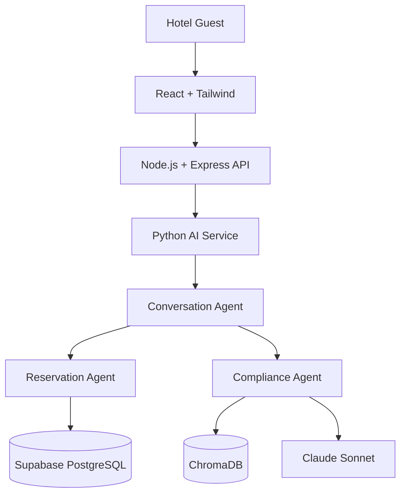

Project Vision Document
Multi-Agent AI Hotel Support System
	
Document Type	Software Requirements Specification (SRS) — Project Vision
Development Methodology	Spec-Driven Development (SDD)
Architecture Pattern	Supervisor-based Multi-Agent Architecture
Document Status	Draft for Architecture Review
Version	1.1 (Revised: Hybrid Node.js/Express + Python AI Microservice Architecture; Supabase adopted as database layer)
Classification	Internal — Enterprise Architecture Review Board
---
Document Purpose
This document defines the business vision and project objectives for the Multi-Agent AI Hotel Support System.
It serves as the foundational specification for all subsequent architecture, workflow, agent, database, and implementation specifications produced under the Spec-Driven Development (SDD) methodology. Every downstream artifact — including the System Architecture Document, agent-level functional specifications (Conversation, Reservation, Compliance), workflow and state-machine definitions, database schemas, API contracts, and implementation work itself — must trace back to, and remain consistent with, the business rationale, scope, objectives, and constraints established here.
This document is the source of truth for understanding why the system exists and what business problems it solves. Where any subsequent specification appears to conflict with the intent captured in this document, this document takes precedence, and the conflict must be resolved through formal review before implementation proceeds.
---
Table of Contents
Executive Summary
Business Problem
Proposed Solution
Business Objectives
Project Objectives
Scope
Out of Scope
Stakeholders
User Personas
Functional Goals
Non-Functional Goals
Business Benefits
Success Criteria
Risks
Assumptions
Constraints
Deliverables
Future Roadmap
Conclusion
---
1. Executive Summary
The Multi-Agent AI Hotel Support System is an enterprise-grade, AI-powered customer engagement platform designed to automate and elevate the hotel guest support experience. The system replaces fragmented, labor-intensive, first-line support processes with a coordinated network of specialized artificial intelligence agents operating under a Supervisor-based Multi-Agent Architecture.
At its core, the platform is built around three cooperating AI agents — a Conversation Agent acting as the supervisor and single point of customer contact, a Reservation Agent responsible for all booking-related transactional operations against the hotel's Supabase (PostgreSQL) system of record, and a Compliance Agent that grounds every outbound response in verified hotel policy documentation using Retrieval-Augmented Generation (RAG). This architecture deliberately separates conversational reasoning, transactional execution, and policy governance into independently scalable, independently testable components — a design principle borrowed from microservices architecture and applied to agentic AI systems.
The project is executed using Spec-Driven Development (SDD), meaning that every capability of the system — agent behavior, tool contracts, data schemas, guardrails, and acceptance criteria — is first formally specified, reviewed, and agreed upon before implementation begins. This mitigates the principal risk of generative AI systems in production: unbounded, unpredictable behavior. By anchoring agent behavior to explicit specifications and a compliance-verification layer, the system is designed to be deterministic in governance while remaining flexible in conversation.
The platform is intended to serve as the digital front door for hotel guest support: available continuously, consistent in the answers it gives, accurate in every booking it creates or modifies, and fully auditable for compliance and quality assurance purposes. It is designed from inception to be cloud-native, containerized, and horizontally scalable, deployed on Microsoft Azure using Docker-based container orchestration. The system follows a hybrid service architecture: a React + Tailwind CSS guest-facing interface, a Node.js/Express.js business API layer that owns authentication, guest-facing REST endpoints, and general business logic, and a dedicated Python-based AI microservice (LangGraph, LangChain, Claude Sonnet) that hosts the multi-agent system itself. This separation lets each layer be built, scaled, and evolved using the tooling best suited to its job — JavaScript/Node.js for I/O-bound business APIs, Python for AI/ML orchestration — rather than forcing a single language or runtime to do both well.
This document defines the business rationale, functional and non-functional requirements, scope boundaries, stakeholder landscape, and success criteria for Version 1 of the system, and establishes the architectural vision that will guide all subsequent specification, design, and implementation activities.
---
2. Business Problem
Hotel guest support today, across a large proportion of independent and mid-market hotel operators, remains a largely manual, human-mediated function. This creates a set of well-documented, industry-wide operational and financial problems:
Problem Area	Description	Business Impact
Manual Customer Support	Guest inquiries — availability checks, booking changes, policy questions — are handled by front-desk or call-center staff, often manually cross-referencing property management systems (PMS), spreadsheets, or policy binders.	High labor cost, inconsistent service quality, staff fatigue, limited coverage outside business hours.
Long Response Times	Guests routed through phone queues, email tickets, or shift-dependent staff availability frequently wait minutes to hours for a simple answer (e.g., "is a room available on these dates").	Guest dissatisfaction, booking abandonment, negative reviews, lost direct-booking revenue to OTAs (Online Travel Agencies) with faster digital experiences.
Booking Mistakes	Manual entry of dates, room types, rate codes, and guest counts into reservation systems is error-prone, leading to double-bookings, incorrect room assignments, or mispriced reservations.	Revenue leakage, guest complaints, operational firefighting, compensation costs (comps, upgrades, refunds) to resolve errors.
Policy Inconsistency	Different staff members, shifts, or properties within the same brand frequently give different answers to the same policy question (cancellation windows, pet policy, check-in age, refund conditions), because policy knowledge is undocumented, outdated, or memorized inconsistently.	Guest trust erosion, legal/compliance exposure, brand reputation risk, inconsistent guest experience across properties.
High Operational Costs	24/7 human coverage for front-desk, phone, and digital channels requires significant staffing overhead, especially for routine, repetitive queries that do not require human judgment.	Support cost scales linearly with guest volume and channel count; limited ability to absorb demand spikes (peak season, events) without proportional cost increases.
Fragmented Channels	Guests interact via phone, email, hotel website chat, WhatsApp, and OTA messaging — each often staffed and answered independently, with no shared conversational memory or unified system of record for the interaction.	Duplicated effort, inconsistent guest history, missed follow-ups, poor omni-channel experience.
Lack of Auditability	Verbal or ad hoc written responses given by staff are rarely logged in a structured, queryable, policy-traceable format.	Difficulty investigating guest disputes, no data-driven way to identify recurring policy confusion or training gaps.
Collectively, these problems place hotel operators at a structural disadvantage: guests increasingly expect the instant, accurate, always-available digital experience they receive from airlines, banks, and e-commerce platforms, while most hotel support operations remain dependent on manual processes that do not scale economically or reliably.
---
3. Proposed Solution
The Multi-Agent AI Hotel Support System addresses each of the problems above through a coordinated, specialized multi-agent architecture rather than a single monolithic chatbot. The rationale for this design choice — validated architectural practice in enterprise agentic AI systems — is that a single general-purpose LLM agent, when made responsible for conversation, transactional data operations, and policy grounding simultaneously, is significantly more prone to hallucination, inconsistent tool use, and compliance drift. Separating these concerns into distinct agents, coordinated by a supervisor, produces a system that is easier to specify, test, govern, and scale independently.
Business Problem	System Capability That Solves It
Manual customer support	The Conversation Agent provides an always-on, natural-language front door that autonomously resolves the majority of guest inquiries without human intervention.
Long response times	LangGraph-orchestrated agent routing and Supabase (PostgreSQL)-backed real-time availability checks return answers in seconds, not minutes or hours.
Booking mistakes	The Reservation Agent performs all booking, modification, and cancellation operations through structured, validated tool calls directly against Supabase (PostgreSQL) — eliminating manual re-keying errors.
Policy inconsistency	The Compliance Agent, grounded via Retrieval-Augmented Generation (RAG) over the hotel's official policy corpus (stored in ChromaDB), validates every guest-facing response against source-of-truth policy documents before it is delivered — guaranteeing a single, consistent answer regardless of channel, time, or shift.
High operational costs	Automation of first-line, repetitive inquiries reduces dependency on human staff for routine volume, allowing staff to be redirected to higher-value, judgment-intensive guest interactions.
Fragmented channels	The Conversation Agent maintains persistent conversational memory and can be exposed through a unified Node.js/Express.js business API layer (backed by the Python AI microservice) to multiple guest-facing channels (starting with a React + Tailwind CSS web interface in V1).
Lack of auditability	Every agent decision, tool invocation, retrieved policy citation, and final response is logged in a structured, queryable format, creating a full audit trail for compliance review and continuous improvement.
3.1 Architectural Approach
The system implements a Supervisor Pattern, a well-established multi-agent orchestration pattern in which one agent (the Conversation Agent) owns the customer relationship and conversation state, while delegating well-defined sub-tasks to specialist agents and synthesizing their outputs into a single, coherent, policy-compliant response.
High-level architecture flow:

Detailed component diagram:
```
                     ┌─────────────────────────┐
                     │        Guest / User      │
                     └────────────┬─────────────┘
                                  │  (React + Tailwind CSS UI)
                     ┌────────────▼─────────────┐
                     │  Node.js / Express.js      │
                     │  Business API Layer        │
                     │  - Authentication (JWT)    │
                     │  - Guest/session endpoints │
                     │  - Business logic & routing│
                     └────────────┬─────────────┘
                                  │  (internal service call)
                     ┌────────────▼─────────────┐
                     │  PYTHON AI MICROSERVICE    │
                     │  CONVERSATION AGENT        │
                     │  (Supervisor - LangGraph)  │
                     │  - Intent understanding    │
                     │  - Conversation memory     │
                     │  - Agent routing           │
                     │  - Final response synthesis│
                     └──────┬──────────────┬──────┘
                            │              │
              ┌─────────────▼───┐   ┌──────▼───────────────┐
              │ RESERVATION AGENT │   │  COMPLIANCE AGENT      │
              │ - Availability    │   │  - RAG over policy docs│
              │ - Create booking  │   │  - Response validation │
              │ - Modify booking  │   │  - Hallucination guard │
              │ - Cancel booking  │   │  (ChromaDB + LangChain)│
              │ (Supabase/Postgres│   └────────────────────────┘
              └───────────────────┘
```
This orchestration is implemented using LangGraph, which models the interaction as a directed graph of agent states and transitions, giving the system explicit, inspectable control flow rather than opaque prompt chaining. The underlying language model powering agent reasoning is Claude Sonnet, selected for its strong instruction-following, tool-use reliability, and reasoning quality — all essential properties in a supervisor-coordinated agentic system. The Node.js/Express.js layer is deliberately kept free of AI orchestration logic: it is responsible for authentication, request validation, and general business operations, and delegates all conversational/agentic work to the Python AI microservice over an internal service boundary — preserving a clean separation between business API concerns and AI orchestration concerns.
---
4. Business Objectives
The following measurable business goals define the commercial rationale for the investment and will be used by hotel operator stakeholders to evaluate return on investment.
#	Business Objective	Target Metric (Illustrative, to be finalized with hotel operator)
BO-1	Reduce first-line human support labor cost	≥ 40% reduction in human-handled routine inquiries (availability, FAQs, policy questions) within 6 months of go-live
BO-2	Reduce guest response latency	Average first-response time reduced from minutes/hours to under 5 seconds for automatable inquiries
BO-3	Reduce booking error rate	≥ 90% reduction in booking-entry errors attributable to manual re-keying
BO-4	Improve policy answer consistency	100% of policy-related answers traceable to a specific source document/section, eliminating conflicting verbal answers
BO-5	Increase direct-booking conversion	Measurable uplift in direct bookings completed via the AI assistant vs. abandoned inquiries
BO-6	Improve guest satisfaction (CSAT/NPS)	Target improvement in guest satisfaction scores for support interactions handled by the system
BO-7	Enable 24/7 guest support coverage	100% uptime coverage for automatable inquiries, independent of staff shift schedules
BO-8	Establish a reusable AI platform foundation	Architecture extensible to future agents (Section 18) without re-architecture, protecting the initial technology investment
---
5. Project Objectives
While Section 4 defines business goals, this section defines what the software system itself must achieve to enable those business outcomes.
Deliver a working, production-deployable multi-agent conversational system capable of autonomously resolving room availability inquiries, reservations, modifications, cancellations, hotel information requests, FAQs, and policy questions.
Implement a Supervisor-based Multi-Agent Architecture using LangGraph, with clearly separated agent responsibilities (conversation orchestration, transactional execution, compliance validation).
Ensure that no guest-facing response bypasses compliance validation, structurally preventing policy-inconsistent or hallucinated answers from reaching the guest.
Provide a reliable, transactional integration with Supabase (PostgreSQL) for all reservation data, ensuring ACID-compliant booking operations, database-enforced Row Level Security, and integrated authentication.
Provide a Retrieval-Augmented Generation (RAG) pipeline over hotel policy documentation using ChromaDB as the vector store and LangChain for retrieval orchestration, ensuring policy answers are grounded in authoritative source material.
Expose guest-facing capabilities through a well-documented Node.js/Express.js business API layer, which handles authentication (JWT/Supabase Auth) and general business logic, and which delegates all conversational and agentic processing to a dedicated Python AI microservice (LangGraph, LangChain, Claude Sonnet), keeping AI orchestration and business API concerns cleanly separated.
Containerize all system components (React front-end, Node.js/Express.js API, Python AI microservice) using Docker and deploy on Microsoft Azure, ensuring the system is portable, horizontally scalable, and operable using standard cloud-native practices.
Establish comprehensive logging, tracing, and observability (Python Logging, LangSmith) across all agents and tool invocations to support debugging, quality assurance, and compliance audit requirements.
Follow Spec-Driven Development: every agent behavior, tool contract, and system boundary must be formally specified and reviewed prior to implementation, producing a traceable chain from business requirement → specification → implementation → test.
---
6. Scope
6.1 In Scope for Version 1
Domain	Included Capability
Conversational AI	Natural-language understanding of guest intent; multi-turn conversation with contextual memory within a session; routing of intents to the correct specialist agent; synthesis of a single, coherent final response.
Reservations	Real-time room availability lookup; creation of new bookings; modification of existing bookings (dates, room type, guest count where policy-permitted); cancellation of bookings; structured confirmation details (booking ID, dates, room type, rate, cancellation terms).
Hotel Information & FAQs	Answering general hotel information queries (amenities, check-in/check-out times, location, facilities) and frequently asked questions sourced from curated hotel content.
Policy Compliance	RAG-based retrieval and validation against official hotel policy documents (cancellation policy, refund policy, pet policy, age policy, house rules, etc.) for every relevant response.
User Interface	A React + Tailwind CSS web chat interface for guests to interact with the assistant.
Backend Services	A Node.js/Express.js business API layer (authentication, guest/session endpoints, business logic) exposed to the front-end; a dedicated Python AI microservice (LangGraph, LangChain, Claude Sonnet) hosting the multi-agent system, invoked internally by the business API layer; Supabase (PostgreSQL) as the reservation system of record; ChromaDB as the policy document vector store.
Deployment	Dockerized services deployed to Microsoft Azure, including containerized agents, API layer, and supporting data stores.
Observability	Structured logging of agent decisions, tool calls, retrieved policy sources, and final responses for a single hotel property or a defined pilot property set.
6.2 Version 1 Boundary Statement
Version 1 targets a single-property (or small, defined multi-property pilot) deployment, focused on text-based conversational interaction via a web channel, covering the core guest support lifecycle: ask → check availability → book/modify/cancel → confirm, with every policy-sensitive response validated by the Compliance Agent. Payment processing, multi-language support, voice channels, and advanced personalization are explicitly deferred (see Section 7).
---
7. Out of Scope
The following capabilities are intentionally excluded from Version 1 to maintain a focused, deliverable-quality release. They represent candidate future roadmap items (see Section 18) but are not committed deliverables of this phase.
Payment processing of any kind (deposits, full payment, refunds) — Version 1 manages booking records, not financial transactions.
Multi-language / translation support — Version 1 operates in a single configured language (e.g., English).
Voice channel support (IVR, voice assistants, phone integration).
Sentiment analysis or emotion-aware response adaptation.
Personalized recommendations (room upgrades, local attractions, upsell offers) based on guest history or preferences.
Third-party OTA (Online Travel Agency) channel integration (Booking.com, Expedia, Airbnb, etc.).
Property Management System (PMS) integration beyond the project's own Supabase (PostgreSQL) reservation store (e.g., Opera, Cloudbeds) — treated as a future integration concern.
Mobile native applications (iOS/Android) — Version 1 is web-based only.
Human agent hand-off / live chat escalation workflow — while the architecture anticipates this, the actual escalation-to-human workflow and staff-facing tooling is out of scope for V1.
Multi-property, cross-brand policy federation — V1 assumes a single policy corpus per deployment.
Web search / external internet retrieval by any agent (see Future Roadmap, Web Search Agent).
Advanced analytics dashboards for hotel management (beyond raw structured logs).
---
8. Stakeholders
Stakeholder Group	Role / Interest
Hotel Guests	End users of the system; interact directly with the Conversation Agent to get support, make or manage bookings, and get policy information. Primary beneficiaries of improved response time and consistency.
Hotel Staff (Front Desk / Reservations / Guest Services)	Indirect beneficiaries; offloaded from repetitive inquiries, expected to handle escalations and exceptions the system cannot resolve. Also a source of domain knowledge and policy content during specification.
Hotel Administrators / Management	Own the business outcomes (Section 4); responsible for policy document maintenance, pricing/availability data accuracy, and evaluating system ROI. Primary approvers of go-live readiness.
Developers / Engineering Team	Responsible for translating specifications into implementation across agents, backend services, data layer, and front-end; own code quality, testing, and technical architecture adherence.
Project Managers	Own delivery timeline, scope control, stakeholder communication, and risk management across the SDD lifecycle from specification through deployment.
Compliance / Legal (Advisory)	Reviews and approves the policy documents ingested by the Compliance Agent; ensures the system's guardrails meet legal and brand-standard requirements.
IT / Cloud Operations	Responsible for Azure infrastructure provisioning, Docker deployment pipelines, security configuration, and ongoing operational support.
Quality Assurance / Testing Team	Validates functional correctness, response accuracy, policy-compliance behavior, and non-functional requirements prior to release.
---
9. User Personas
9.1 Persona: "The Prospective Guest" (Priya)
Profile: A traveler researching and planning to book a stay; may be comparing options across properties.
Goals: Quickly check room availability and rates for specific dates; understand cancellation and refund policies before committing; complete a booking without friction.
Pain Points Today: Long hold times on the phone; inconsistent answers from different staff about cancellation terms; slow email responses.
System Interaction: Uses the React web chat to ask availability questions, receives instant structured answers from the Reservation Agent, and a compliance-validated policy summary from the Compliance Agent before booking.
9.2 Persona: "The Existing Guest with a Change" (Marcus)
Profile: A guest with an existing confirmed reservation who needs to modify or cancel it due to a change in travel plans.
Goals: Modify dates or room type; understand if a modification incurs a fee; cancel a reservation and understand refund eligibility.
Pain Points Today: Uncertainty about whether a change is even possible; inconsistent staff answers on refund eligibility; slow processing of the change request.
System Interaction: Provides booking reference, requests a change; the Conversation Agent routes to the Reservation Agent for feasibility and the Compliance Agent for policy validation (e.g., cancellation window), then confirms the outcome in one coherent response.
9.3 Persona: "The Policy-Focused Guest" (Aisha)
Profile: A guest with specific requirements (e.g., traveling with a pet, traveling with children, needing accessibility accommodations) who needs authoritative policy answers before booking.
Goals: Get accurate, trustworthy answers to nuanced policy questions without being redirected or given conflicting information.
Pain Points Today: Policy information is scattered across a hotel website, hard to find, or contradicted by front-desk staff.
System Interaction: Asks a policy question; the Compliance Agent retrieves and grounds the answer directly in the official policy document via RAG, and the Conversation Agent delivers it in natural language with source traceability logged internally.
9.4 Persona: "The Hotel Administrator" (David)
Profile: Hotel operations manager responsible for the accuracy of policy documents, oversight of the AI system's performance, and business outcomes.
Goals: Ensure the AI system reflects up-to-date, correct policy; monitor system performance and guest satisfaction; reduce operational cost.
Pain Points Today: No visibility into what guests are told; inconsistent staff training; high support overhead.
System Interaction: Maintains the source-of-truth policy document set ingested by the Compliance Agent's RAG pipeline; reviews structured logs and outcome metrics to assess system performance.
9.5 Persona: "The Engineering / Platform Team" (Internal)
Profile: Developers and architects responsible for building, specifying, and maintaining the multi-agent system.
Goals: Build a maintainable, testable, well-specified system; ensure each agent's behavior is independently verifiable; extend the platform over time with new agents (Section 18) without destabilizing existing behavior.
System Interaction: Works from formal specifications (SDD artifacts), implements agents and tools against defined contracts, and maintains observability tooling to monitor system health in production.
---
10. Functional Goals
The system shall provide the following functional capabilities in Version 1:
10.1 Conversation Agent (Supervisor) Functions
Accept natural-language guest input via the web chat interface.
Classify and understand guest intent (reservation inquiry, booking modification, cancellation, hotel information, FAQ, policy question, or a combination).
Maintain conversational memory/context across multiple turns within a session, so guests are not required to repeat information already provided.
Determine which specialist agent(s) — Reservation Agent, Compliance Agent, or both — must be invoked to fulfill a given request.
Aggregate and synthesize outputs from specialist agents into a single, coherent, natural-language response.
Ensure that any response involving policy-sensitive content is validated by the Compliance Agent before being returned to the guest.
Gracefully handle ambiguous, incomplete, or out-of-domain guest requests (e.g., ask clarifying questions, or clearly state when a request is outside system capability).
10.2 Reservation Agent Functions
Query real-time room availability by date range, room type, and occupancy.
Create a new reservation given validated guest and stay details, persisting it to Supabase (PostgreSQL).
Retrieve details of an existing reservation given a booking reference and/or guest-identifying information.
Modify an existing reservation (dates, room type, occupancy) where availability and policy allow.
Cancel an existing reservation and return structured cancellation confirmation details.
Return all booking data in a structured, machine-readable format consumable by the Conversation Agent (booking ID, status, dates, room type, rate, policy terms reference).
Enforce data-level validation (e.g., valid date ranges, room existence, no double-booking) prior to committing any transactional change, backed by Supabase Row Level Security policies restricting data access by guest/session identity.
10.3 Compliance Agent Functions
Ingest and index official hotel policy documents (cancellation policy, refund policy, house rules, pet policy, age/ID policy, etc.) into a vector store (ChromaDB) using an embedding pipeline.
Retrieve the most relevant policy passages for a given guest query or a given Conversation/Reservation Agent output requiring validation.
Validate that a proposed guest-facing response is consistent with retrieved policy content before it is approved for delivery.
Flag and prevent delivery of any response that cannot be grounded in retrieved policy content (hallucination prevention).
Provide the source policy reference(s) supporting a given answer, for internal logging and auditability.
10.4 Cross-Agent / Platform Functions
Log every agent invocation, tool call, retrieved document, and final response in a structured, queryable format (Python Logging, LangSmith tracing).
Expose guest-facing conversational and transactional capabilities through a documented Node.js/Express.js business API layer, backed internally by the Python AI microservice hosting the multi-agent system.
Authenticate and authorize guest sessions using JWT-based authentication (Supabase Auth).
Support session-based conversation state so a guest's multi-turn conversation is coherent and context-aware.
Provide a React + Tailwind CSS guest-facing chat interface consuming the Node.js/Express.js business API layer.
---
11. Non-Functional Goals
Category	Requirement
Performance	Typical conversational response latency (end-to-end, including the Node.js/Express.js API hop, agent routing, and any single tool call) shall target under 3–5 seconds under normal load. Availability lookups and booking operations against Supabase (PostgreSQL) shall complete within standard OLTP latency expectations (sub-second for the database operation itself).
Scalability	The system shall be designed for horizontal scalability: the React front-end, the Node.js/Express.js business API layer, and the Python AI microservice shall each be independently containerized (Docker) and independently deployable as multiple replicas behind a load balancer on Azure, allowing each layer to scale according to its own demand profile without architectural change.
Reliability	Reservation operations (create/modify/cancel) shall be transactional and consistent (ACID-compliant via Supabase/PostgreSQL), ensuring no partial or corrupted booking states. The system shall handle specialist agent failures gracefully (e.g., Reservation Agent unavailable) without producing an incorrect or hallucinated response to the guest.
Availability	The platform shall target high availability suitable for 24/7 guest-facing operation (target: 99.9% uptime for the conversational and reservation services, to be formally defined in a Service Level Agreement).
Security	All guest data (personal information, booking details) shall be encrypted in transit (HTTPS/TLS) and at rest. Guest sessions shall be authenticated and authorized via JWT (Supabase Auth), with database-level access further restricted via Supabase Row Level Security (RLS) policies. Access to the Reservation Agent's data operations and the Compliance Agent's policy corpus shall be governed by least-privilege, role-based access controls (RBAC). Secrets (API keys, database credentials) shall be managed via environment variables and a managed secrets store (e.g., Azure Key Vault), never hard-coded or committed to source control.
Maintainability	The hybrid architecture shall maintain clear separation of concerns (guest-facing business API vs. AI orchestration vs. transactional logic vs. compliance validation), such that any individual layer or agent can be modified, retrained, or re-specified with minimal impact on the others. All agent and API behavior shall trace back to a versioned specification artifact (Spec-Driven Development).
Observability	The system shall provide structured, centralized logging (Python Logging on the AI microservice) and distributed tracing (LangSmith) of every agent decision, tool invocation, retrieved policy document, and final response, sufficient to reconstruct and audit any guest interaction end-to-end. Key operational metrics (latency, error rate, escalation rate, compliance-validation failure rate) shall be measurable.
Compliance & Auditability	Every policy-sensitive response shall be traceable to the specific policy document/section that grounded it, supporting compliance review and dispute resolution.
Portability	All services (front-end, business API, AI microservice) shall be fully containerized (Docker), avoiding hard dependencies on host-specific configuration, to support consistent behavior across development, staging, and production environments on Azure, with GitHub as the source-of-truth repository and GitHub Actions driving CI/CD.
---
12. Business Benefits
Benefit	Description
Reduced Support Cost	Automation of routine, high-volume guest inquiries reduces the staffing burden required to maintain acceptable response times, lowering the marginal cost of each additional guest interaction.
Faster Guest Response	Instant, always-available responses improve the guest experience relative to phone/email channels, particularly outside staffed hours.
Reduced Revenue Leakage	Fewer manual booking errors directly reduces lost revenue from mispriced or incorrectly configured reservations, and reduces comp/refund costs issued to resolve such errors.
Consistent Brand Experience	A single, policy-grounded source of truth for guest-facing answers eliminates the reputational and trust risk of conflicting information across staff, shifts, or channels.
Improved Guest Trust and Retention	Faster, more accurate, more consistent support increases guest confidence, encouraging repeat direct bookings rather than reliance on third-party OTAs.
Operational Scalability Without Linear Cost Growth	The platform can absorb demand spikes (peak season, promotional events) without a proportional increase in human staffing costs.
Data-Driven Operational Insight	Structured logs of every interaction give hotel management visibility into common guest questions, policy pain points, and support volume trends — informing both policy revision and staffing decisions.
Strategic AI Platform Investment	The multi-agent architecture is designed to be extensible (Section 18), meaning this investment establishes a reusable foundation for future automation (payments, personalization, multi-language support) rather than a single-purpose tool.
---
13. Success Criteria
Version 1 will be considered successful upon meeting the following criteria, to be formally validated during User Acceptance Testing (UAT):
#	Success Criterion
SC-1	The Conversation Agent correctly identifies guest intent and routes to the appropriate specialist agent(s) in at least [target]% of test conversations (target to be finalized with QA against a representative test conversation set).
SC-2	The Reservation Agent correctly performs availability checks, bookings, modifications, and cancellations against Supabase (PostgreSQL) with zero data integrity errors in UAT test scenarios.
SC-3	The Compliance Agent successfully blocks or corrects 100% of intentionally-injected hallucinated or policy-inconsistent test responses during validation testing.
SC-4	End-to-end response latency for a standard conversational turn (through the Node.js/Express.js API and the Python AI microservice) meets the performance target defined in Section 11 under expected concurrent load.
SC-5	Every response involving policy content is traceable, in system logs, to the specific source policy document and passage used.
SC-6	The system successfully completes a full guest journey (inquire → check availability → book → modify → cancel) without human intervention in UAT scenarios.
SC-7	The system is successfully deployed via Docker containers on Azure, with GitHub Actions CI/CD pipelines, meeting the defined availability and scalability targets under a representative load test.
SC-8	Hotel Administrator stakeholders formally sign off that the system's policy answers match the current, approved hotel policy documentation.
SC-9	Structured logs and observability tooling allow a QA or compliance reviewer to fully reconstruct any given guest interaction, including agent routing decisions and retrieved policy sources.
---
14. Risks
Risk	Likelihood	Impact	Mitigation Strategy
LLM hallucination in guest-facing responses	Medium	High	Mandatory Compliance Agent validation gate on every policy-sensitive response; RAG grounding over authoritative documents; automated hallucination-detection test suite as part of QA.
Incorrect or outdated policy documents ingested into RAG corpus	Medium	High	Formal document governance process with Hotel Administrator sign-off before ingestion; versioned policy corpus with change tracking; periodic re-validation cycles.
Reservation Agent producing incorrect booking data (race conditions, double-booking)	Low–Medium	High	Transactional (ACID) operations against Supabase (PostgreSQL); database-level constraints and Row Level Security policies (e.g., unique/availability constraints); concurrency testing under load.
Multi-agent coordination failure (e.g., Conversation Agent misroutes, or a specialist agent times out)	Medium	Medium	Explicit LangGraph state machine with defined fallback/error-handling transitions; circuit-breaker patterns for specialist agent calls; graceful degradation messaging to the guest rather than silent failure.
Scope creep during Spec-Driven Development	Medium	Medium	Strict adherence to the Section 6/7 scope boundary; formal change-control process for any addition to Version 1 scope.
Data privacy / guest PII exposure	Low	High	Encryption in transit (HTTPS/TLS) and at rest; least-privilege data access via Supabase RLS and RBAC; Azure-native secrets and identity management; compliance review of data handling practices.
Model/API dependency risk (Claude Sonnet availability, pricing, rate limits)	Low–Medium	Medium	Architecture designed with an abstraction layer (LangChain/LangGraph) to allow model substitution if required; monitoring of API usage and cost.
Underestimated integration complexity between the Node.js business API and the Python AI microservice, or with Supabase/legacy hotel systems	Medium	Medium	Early technical spike/proof-of-concept on the inter-service contract and data integration; clear data-contract specification prior to implementation (SDD principle).
Stakeholder misalignment on policy content or booking rules	Medium	Medium	Structured stakeholder review cycles with Hotel Administrators and Compliance/Legal during specification phase.
User adoption resistance (guests preferring human contact)	Low–Medium	Medium	Clear, transparent AI-assistant framing in the UI; well-scoped escalation path for cases the system cannot resolve (future roadmap item).
---
15. Assumptions
The hotel operator will provide accurate, complete, and up-to-date policy documents (cancellation, refund, house rules, etc.) in a digital format suitable for ingestion into the Compliance Agent's RAG pipeline.
The hotel operator will provide (or the project will establish) a Supabase (PostgreSQL)-compatible data schema representing room inventory, rates, and reservations, or grant access to an existing compatible system.
Version 1 targets a single hotel property or a small, clearly defined pilot set of properties sharing a common policy corpus and reservation schema.
Guests will interact with the system primarily via a web-based chat interface in a single supported language for Version 1.
Claude Sonnet (or an equivalent LLM accessible via the chosen provider) will remain available, accessible, and within acceptable cost/performance parameters throughout the project lifecycle.
The organization has (or will provision) an Azure subscription with sufficient quota for the containerized services, a Supabase project (or equivalent managed PostgreSQL), and the vector database component.
Business stakeholders (Hotel Administrators) will be available for iterative review cycles during the Spec-Driven Development process, particularly for policy content validation.
The scope of "booking modification" in Version 1 covers standard changes (dates, room type, occupancy) and does not require handling of complex multi-room or group-booking scenarios unless explicitly specified.
Payment processing is handled outside this system (Section 7); Version 1 assumes bookings may be created without an integrated payment capture step, or that payment is handled by an existing, separate process.
---
16. Constraints
16.1 Technical Constraints
Constraint	Detail
Fixed Technology Stack	The system must be built using: React + Tailwind CSS (guest-facing front-end); Node.js + Express.js (business API layer — authentication, guest/session endpoints, business logic); Python with LangGraph (agent orchestration), LangChain (RAG orchestration), and Claude Sonnet (LLM) for the AI microservice; Supabase (PostgreSQL) (transactional reservation data, authentication, Row Level Security); ChromaDB (policy vector store); JWT (session authentication); Docker (containerization); Microsoft Azure (cloud platform); GitHub / GitHub Actions (source control and CI/CD); and Python Logging / LangSmith (observability) — as defined by this project's architecture mandate.
Hybrid Service Boundary Mandate	The business API layer (Node.js/Express.js) and the AI orchestration layer (Python/LangGraph) must remain distinct, independently deployable services communicating over a defined internal service contract; AI orchestration logic must not be implemented inside the Node.js layer, and general business/auth logic must not be duplicated inside the Python AI microservice.
Supervisor-based Architecture Mandate	The three-agent, supervisor-coordinated design (Conversation, Reservation, Compliance) is a fixed architectural constraint for Version 1; alternative architectures (e.g., single monolithic agent) are out of scope for consideration.
RAG Grounding Requirement	All policy-related answers must be grounded via retrieval from the ChromaDB-indexed policy corpus; the Compliance Agent may not answer policy questions from unaided LLM knowledge.
Data Residency / Cloud Provider	Deployment is constrained to Microsoft Azure, which may affect data residency options and available managed services compared to other cloud providers.
Containerization Requirement	All services must be deliverable as Docker containers, constraining deployment topology to container-orchestration-compatible infrastructure.
16.2 Business Constraints
The project follows Spec-Driven Development, meaning implementation cannot begin on a given capability until its specification has been formally reviewed and approved — this is a process constraint that affects delivery sequencing.
Version 1 scope is bounded as defined in Section 6/7; any expansion requires formal change control and stakeholder re-approval.
Policy content used by the Compliance Agent must be formally approved by Hotel Administrators / Compliance-Legal stakeholders prior to production ingestion.
Budget and timeline for Version 1 are assumed to cover a single-property (or small pilot) deployment; multi-property scaling is a future-phase budget consideration.
---
17. Deliverables
#	Deliverable	Description
D-1	Project Vision Document (this document)	Formal SRS-style vision artifact defining business rationale, scope, and requirements.
D-2	Functional & Technical Specifications	Detailed Spec-Driven Development artifacts for each agent (Conversation, Reservation, Compliance), including tool contracts, state machine definitions, and data schemas.
D-3	System Architecture Document	Detailed architecture diagrams and design decisions covering LangGraph orchestration, service topology, data flow, and deployment architecture.
D-4	Conversation Agent (Supervisor)	Implemented, tested LangGraph-based supervisor agent with intent understanding, memory, and routing logic, hosted within the Python AI microservice.
D-5	Reservation Agent	Implemented, tested agent integrated with Supabase (PostgreSQL) for availability, booking, modification, and cancellation operations.
D-6	Compliance Agent	Implemented, tested RAG-based agent integrated with ChromaDB and the hotel's ingested policy corpus, with response-validation logic.
D-7	Node.js/Express.js Business API Layer	Documented REST API handling authentication (JWT), guest/session endpoints, and business logic, exposing the multi-agent system (via the Python AI microservice) to the front-end and future channel consumers.
D-7a	Python AI Microservice	Documented internal service hosting the LangGraph-orchestrated multi-agent system, invoked by the Node.js/Express.js business API layer.
D-8	React + Tailwind CSS Web Chat Interface	Guest-facing conversational UI consuming the Node.js/Express.js business API layer.
D-9	Supabase (PostgreSQL) Data Schema & Row Level Security Policies	Formalized reservation/inventory data model, migrations, and RLS policies supporting the Reservation Agent and guest data isolation.
D-10	Policy Document Ingestion Pipeline	Repeatable process/tooling for ingesting, embedding, and indexing hotel policy documents into ChromaDB.
D-11	Dockerized Deployment Package	Containerized services for all system components, with Azure deployment configuration.
D-12	Observability & Logging Framework	Structured logging, tracing, and metrics dashboards covering all agent decisions and interactions.
D-13	Test Suite & QA Report	Functional, non-functional, and compliance-validation test suites, with UAT sign-off documentation against Section 13 success criteria.
D-14	Operations & Runbook Documentation	Deployment, monitoring, incident-response, and maintenance documentation for IT/Cloud Operations.
D-15	Stakeholder Training Materials	Documentation/training for Hotel Administrators on policy document maintenance and system oversight.
---
18. Future Roadmap
The Version 1 architecture is deliberately designed to be extensible, allowing new specialist agents to be introduced under the existing Supervisor-based Multi-Agent Architecture without re-architecting the Conversation Agent's core orchestration logic. Candidate future enhancements include:
Future Agent / Capability	Description
Sentiment Analysis Agent	Analyzes guest tone/sentiment in real time to detect frustration or dissatisfaction, enabling proactive escalation to human staff or adaptive response tone.
Translation Agent	Enables multi-language guest support by translating guest input and system responses, extending the platform to international guests without duplicating agent logic per language.
Web Search Agent	Provides grounded, real-time external information retrieval (e.g., local events, weather, transportation options) to augment hotel-specific responses with relevant contextual information.
Payment Agent	Introduces secure, PCI-compliant payment capture and processing for deposits, full payments, and refunds directly within the conversational flow.
Recommendation Agent	Provides personalized recommendations (room upgrades, packages, local attractions, dining) based on guest history, preferences, and stay context, supporting upsell and guest-experience objectives.
Human Hand-off / Escalation Workflow	Formalized workflow and staff-facing tooling for seamless escalation from AI agents to human staff for complex or sensitive cases.
Multi-Property / Multi-Brand Support	Extension of the architecture to support multiple properties or brands with property-specific policy corpora and reservation data, coordinated through a shared platform.
Voice Channel Integration	Extension of the Conversation Agent to support voice-based guest interaction (IVR or voice assistant integration).
Advanced Analytics & Business Intelligence	Dashboards and reporting built on the structured interaction logs, surfacing trends in guest inquiries, policy pain points, and operational KPIs for hotel management.
PMS / OTA Integrations	Direct integration with third-party Property Management Systems and Online Travel Agency channels for unified inventory and booking management.
Each future capability will follow the same Spec-Driven Development discipline established in Version 1: formal specification and stakeholder review precede implementation, ensuring the platform's growth remains governed, testable, and aligned to business objectives.
---
19. Conclusion
The Multi-Agent AI Hotel Support System represents a deliberate architectural and business commitment to solving the structural inefficiencies of traditional hotel guest support — not through a single, general-purpose chatbot, but through a disciplined, specification-driven, multi-agent platform in which conversation, transactional execution, and policy compliance are each owned by a purpose-built, independently governable agent.
By combining a Supervisor-based Multi-Agent Architecture with Retrieval-Augmented Generation for compliance validation, the system is designed to deliver the operational benefits hotel operators need — reduced cost, faster response, fewer errors, consistent policy communication — without sacrificing the governance, auditability, and predictability that enterprise-grade AI systems require in production.
Version 1 establishes a focused, achievable foundation: a single-property (or small pilot) deployment covering the core guest support lifecycle, built on a modern, cloud-native hybrid technology stack — React + Tailwind CSS (front-end), Node.js + Express.js (business API layer), a Python AI microservice (LangGraph, LangChain, Claude Sonnet), Supabase/PostgreSQL (transactional data + auth), ChromaDB (policy vector store), Docker, Azure, and GitHub Actions (CI/CD) — and delivered through the rigor of Spec-Driven Development. Just as importantly, the architecture is intentionally extensible — positioning this initial investment not as a point solution, but as the foundation of a broader AI-driven guest experience platform, ready to incorporate sentiment analysis, translation, payments, personalization, and beyond as the roadmap in Section 18 is realized.
This document serves as the authoritative vision reference against which all subsequent specifications, architectural decisions, and implementation work will be evaluated, ensuring that the system delivered ultimately fulfills the business problem it was conceived to solve.
---
End of Document — Project Vision: Multi-Agent AI Hotel Support System, v1.0