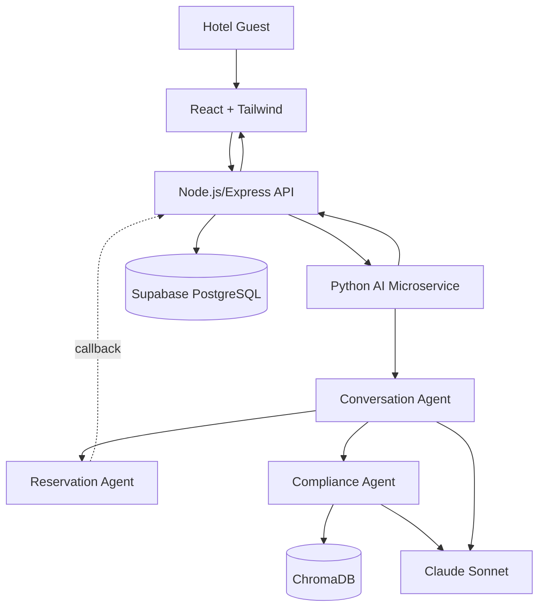
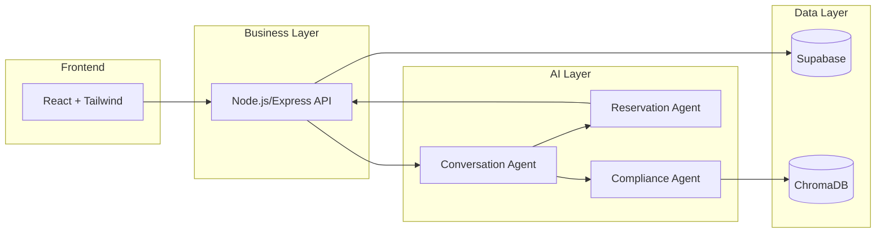
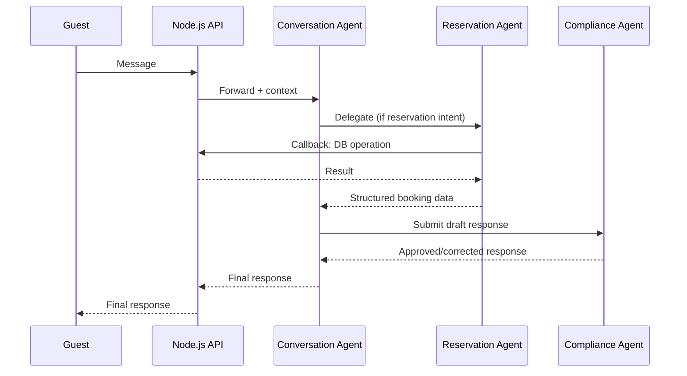
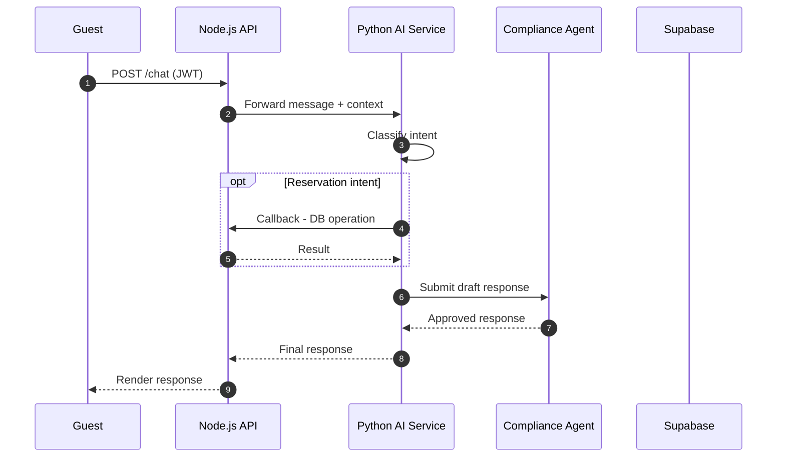
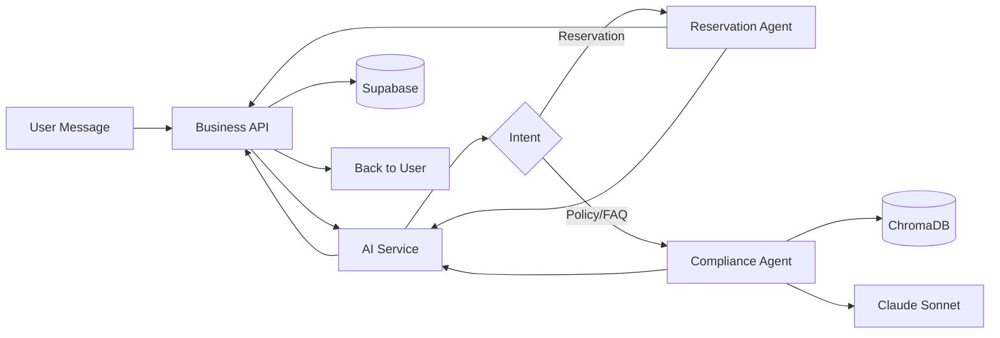
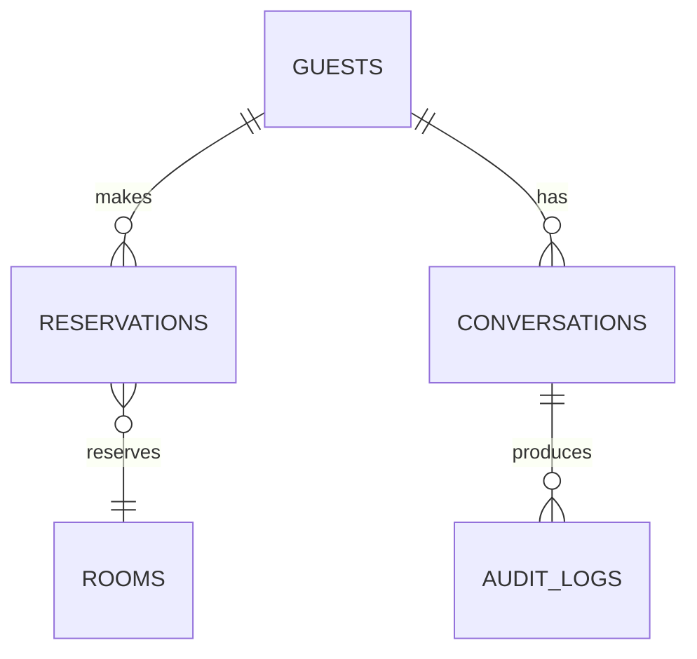
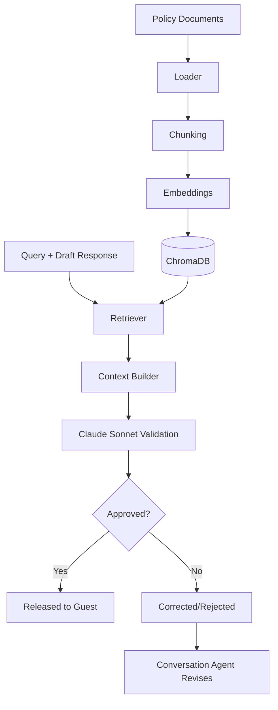
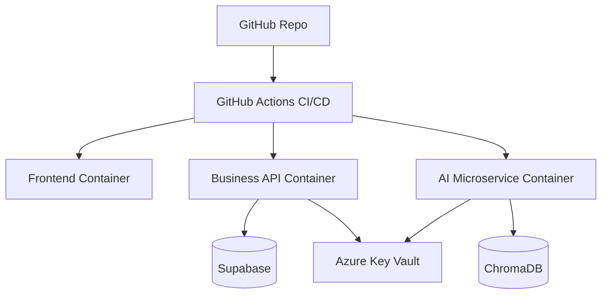

# System Architecture Specification

## Multi-Agent AI Hotel Support System

| | |
|---|---|
| **Companion Docs** | `project_vision.md` v1.2 · `technology_decisions.md` v1.1 |
| **Architecture Style** | Hybrid Microservice · Supervisor-based Multi-Agent · RAG · REST |
| **Version** | 1.1 (Condensed) |

---

## 1. Introduction

This document specifies **how** the system's components are assembled and communicate. `project_vision.md` defines *why*; `technology_decisions.md` defines *which technologies*; this document defines *how they fit together*. **Audience:** architects, tech leads, engineering/DevOps/QA management. **Binding rules:** React never talks to the AI microservice directly (only via Node.js); Node.js↔Python is internal REST; the Reservation Agent has no direct Supabase access — it calls back through Node.js's Reservation endpoints; the Compliance Agent is the only ChromaDB caller; every AI response must pass Compliance validation; the Conversation Agent is the only agent that faces the guest.

---

## 2. Architecture Principles

Separation of Concerns (business/auth vs. AI orchestration vs. data vs. retrieval, one owner each) · Loose Coupling (versioned REST contracts, no shared DB connections) · High Cohesion (one responsibility per agent/service) · Scalability (every container independently replicable) · Security (auth + encryption + RLS layered) · Reliability (ACID transactions, mandatory compliance gate) · Maintainability (clear boundaries, single contract per boundary) · Extensibility (new agents = new LangGraph nodes) · Observability (LangSmith + structured logs) · Fault Isolation (an AI Microservice failure can't corrupt Supabase; a ChromaDB failure blocks release rather than allowing an unvalidated answer).

---

## 3. High-Level System Architecture

Solid arrows: primary forward path. Dashed arrow: Reservation Agent's **callback** into Node.js to perform the actual DB operation — it holds no direct Supabase connection. Claude Sonnet serves both the Conversation Agent (routing/response generation) and the Compliance Agent (RAG validation).

---

## 4. Component Architecture

| Component | Responsibility |
|---|---|
| Frontend (React/Tailwind) | Chat, auth screens, booking UI; no business logic |
| Business API (Node.js/Express) | Auth, REST endpoints, validation, rate limiting; sole caller of Supabase and the AI Microservice |
| AI Microservice (Python/LangGraph/LangChain/Claude Sonnet) | Hosts the 3-agent Supervisor system |
| Database (Supabase/PostgreSQL) | Reservations, accounts, conversation history, audit logs; ACID + RLS |
| Vector DB (ChromaDB) | Embedded policy documents; served only to Compliance Agent |
| Auth (Supabase Auth/JWT) | Issues/validates signed tokens |
| Logging (Python Logging/Node logs) | Structured app-level logs |
| Monitoring (LangSmith/Azure Monitor) | Agent tracing + infra health/metrics |
| Deployment (Docker/Azure/GitHub Actions) | Containerized, independently deployable, CI/CD-driven |

---

## 5. Service Communication

| Path | Protocol | Purpose |
|---|---|---|
| React → Node.js | HTTPS/REST | Chat, login, booking actions |
| Node.js → Python | Internal REST | Forward message + session context |
| Python → Node.js | Internal REST (callback) | Reservation Agent performs DB reads/writes |
| Node.js → Supabase | PostgREST/TLS | All reservation/guest/history/audit data access |
| Compliance Agent → ChromaDB | Internal client call | Policy passage similarity search |
| AI Microservice → Claude Sonnet | HTTPS/Anthropic API | Reasoning, routing, response generation, validation |

Every guest-facing call is synchronous REST request/response. The Business API is a synchronous pass-through with authority: it forwards to the AI Microservice and, on a Reservation Agent callback, executes the DB operation and returns the result — preserving single-point database access even though the *decision* to act originates in the AI layer.

---

## 6. AI Agent Architecture

**Conversation Agent:** receives message + context, maintains memory, classifies intent, routes to specialists, synthesizes final response — the only agent returning a payload to the Business API.
**Reservation Agent:** invoked for booking-related intents; no direct DB access — issues callback REST requests to Node.js; returns structured booking data.
**Compliance Agent:** invoked for policy-sensitive content and as a mandatory final gate on every response; retrieves ChromaDB passages, validates via Claude Sonnet, approves or corrects.

---

## 7. Request Lifecycle

1. Guest sends message via React. 2. React → Node.js (HTTPS, JWT). 3. Node.js validates token/input, forwards to Python AI Microservice. 4. Conversation Agent classifies intent, updates memory. 5. If reservation-related, Reservation Agent calls back to Node.js → Supabase → result returned. 6. Conversation Agent drafts response via Claude Sonnet. 7. Compliance Agent retrieves ChromaDB context, validates via Claude Sonnet. 8. Approved/corrected response returned up the chain. 9. Node.js → React → guest. 10. Every step logged (Python Logging/Node logs) and traced (LangSmith).

---

## 8. Data Flow Architecture

Data is progressively structured left-to-right: raw message → authenticated context → classified intent → structured booking data and/or policy-grounded validation → a compliance-approved, never-raw-LLM response.

---

## 9. Database Architecture

| Table Group | Purpose |
|---|---|
| Guests/Accounts | Identity, linked to Supabase Auth |
| Reservations | Booking ID, dates, room, rate, status |
| Rooms/Inventory | Room types, rates, availability constraints |
| Conversation History | Per-session message/response log |
| Audit Logs | Agent decisions, compliance outcomes, policy citations |

Row Level Security restricts each guest session to its own `guest_id`-scoped rows, enforced at the database layer independent of API-level checks.

---

## 10. RAG Architecture

Ingestion (offline): documents loaded, chunked, embedded, stored. Retrieval+validation (online, per request): Compliance Agent retrieves grounding context and validates the candidate response strictly against it — never against unaided model knowledge — correcting or rejecting ungrounded answers.

---

## 11. Security Architecture

HTTPS/TLS on every hop · Supabase Auth-issued JWT validated per request · RBAC at API layer + Supabase RLS at DB layer (defense in depth) · Secrets in environment variables / Azure Key Vault · Input validation at the API boundary · Prompt injection protection via the mandatory Compliance gate · Parameterized queries only (SQL injection protection) · Rate limiting to protect Supabase and the Claude Sonnet API.

---

## 12. Logging and Monitoring

Application Logs (Python Logging/Node logs) · AI Agent Tracing (LangSmith — every node transition, tool call, retrieval) · Performance Metrics (LangSmith + Azure Monitor) · Audit Logs (Supabase `AUDIT_LOGS` + trace export) · Health Checks (liveness/readiness per container).

---

## 13. Deployment Architecture

Each container is built/deployed independently by its own pipeline stage; changing the AI Microservice never requires rebuilding the Frontend or Business API.

---

## 14. Scalability Strategy

Horizontal scaling per container behind an Azure load balancer · independent scaling (AI Microservice scales faster under conversational load than the lighter API layer) · caching candidates (Redis/semantic cache for repeated availability/FAQ queries) · future Kubernetes migration if replica/multi-region complexity outgrows Azure's simpler hosting.

---

## 15. Error Handling Strategy

| Failure | Strategy |
|---|---|
| Business API failure | Guest-safe error response; no partial request forwarded |
| AI Microservice failure | Graceful fallback message; incident logged |
| Claude Sonnet timeout | Bounded exponential-backoff retry, then safe fallback |
| Supabase failure | Fail closed (ACID rollback); guest informed, no ambiguous confirmation |
| ChromaDB failure | Compliance Agent **rejects** rather than approves an ungrounded response |
| Timeouts/Retries | Per-dependency timeouts; retries only on idempotent calls |
| Graceful Degradation | Always prefer an honest "can't complete this now" over silent failure or an unvalidated response |

---

## 16. Future Architecture

Additional AI Agents (new LangGraph nodes) · Model Context Protocol (standardized tool discovery) · Redis (shared cache) · Azure AI Search (ChromaDB successor at scale) · Event-Driven Architecture/Kafka (async workflows) · Kubernetes (finer orchestration) · Multi-Property Support (property-scoped schema/corpus, same 3-agent architecture).

---

## 17. Architecture Summary

This architecture delivers a Supervisor-based Multi-Agent system inside a hybrid microservice topology that keeps business logic, AI orchestration, transactional data, and policy retrieval cleanly separated and independently deployable — connected only through defined internal REST contracts, with a Reservation Agent callback pattern preserving single-point database access. It is enterprise-ready because compliance validation, authentication, RLS, and observability are structural guarantees, not optional add-ons, and every layer can scale or be replaced independently as the platform grows toward the roadmap in §16.

*End of Document — System Architecture Specification v1.1*
