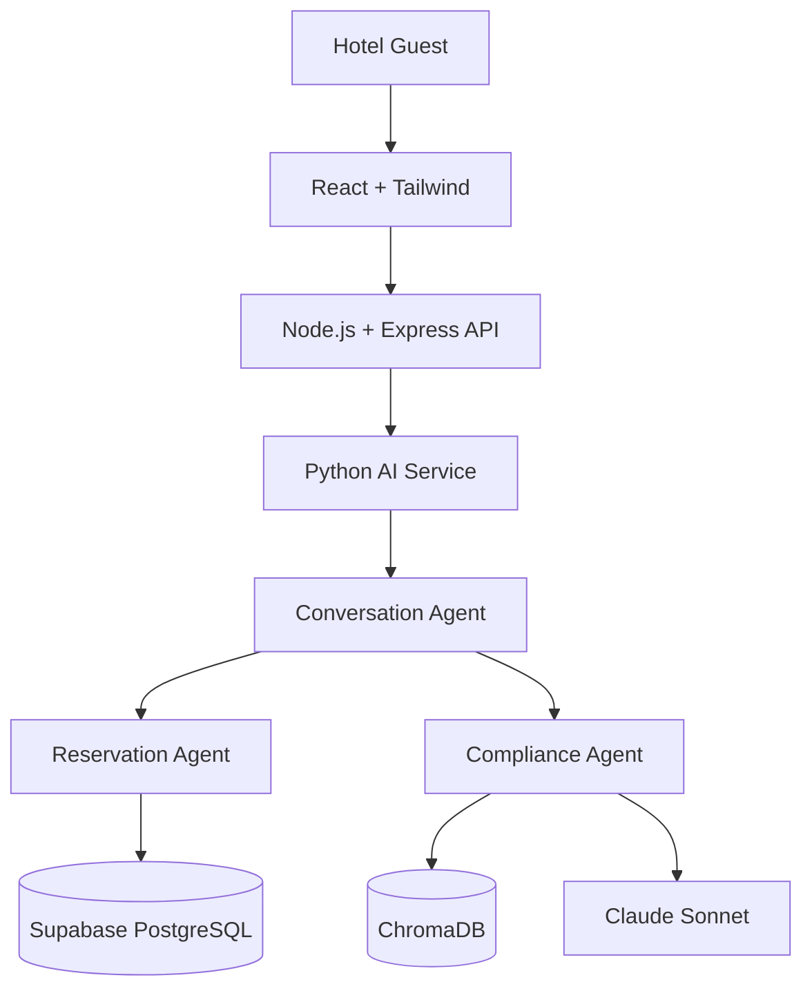

# Technology Decision Record (TDR)

## Multi-Agent AI Hotel Support System

| | |
|---|---|
| **Document Type** | Technology Decision Record (TDR) — Software Design Documentation (SDD) artifact |
| **Companion Document** | `project_vision.md` v1.1 (source of truth for scope, objectives, and architecture mandate) |
| **Development Methodology** | Spec-Driven Development (SDD) |
| **Architecture** | Supervisor-based Multi-Agent Architecture, Hybrid Service Topology |
| **Status** | Draft for Architecture Review |
| **Version** | 1.0 |

---

## Architecture Reference

Every technology decision recorded in this document maps directly onto a node or edge in this diagram: the front-end (§4), the business API layer (§5), the AI orchestration layer (§6), the reservation data store (§7), and the vector/RAG store (§8).

---

## 1. Introduction

This document records **why** each technology in the Multi-Agent AI Hotel Support System was selected, which alternatives were evaluated, and what trade-offs were accepted. It does not describe *how* to implement anything — it exists so that architecture, workflow, agent, and database specifications that follow can build on a fixed, justified technology foundation rather than re-litigating tool choices project-wide.

Documenting technology decisions is not optional in an enterprise AI system: agentic systems built on LLMs introduce non-deterministic behavior that must be offset by deterministic, well-justified infrastructure choices elsewhere in the stack. A TDR gives reviewers, new engineers, and auditors a single place to understand *why* the stack looks the way it does, and gives future architects a documented baseline to challenge when circumstances change.

Under **Spec-Driven Development (SDD)**, this TDR sits directly beneath `project_vision.md` in the specification hierarchy: the vision document defines *what* must be true of the system and *why* it exists; this document defines *which technologies* satisfy those requirements and *why those and not others*. Every technology named here traces back to a requirement in the vision document (Sections 10, 11, and 16), and every subsequent architecture/agent/database specification must build on the decisions recorded here rather than introducing new, undocumented tools.

---

## 2. Technology Selection Principles

Each technology in this stack was evaluated against ten consistent criteria, rather than chosen ad hoc:

| Principle | What It Means Here |
|---|---|
| **Scalability** | Can the component scale horizontally/independently as guest volume grows, without a rewrite? |
| **Maintainability** | Does the technology keep concerns cleanly separated and readable for a multi-year-lived enterprise codebase? |
| **Performance** | Does it meet the latency targets in `project_vision.md` §11 (sub-5-second conversational turns, sub-second OLTP)? |
| **Developer Productivity** | Is there a large, hireable talent pool and a mature ecosystem to build and maintain this quickly? |
| **Enterprise Adoption** | Is it proven in production at scale by other enterprises, not just early-adopter projects? |
| **AI Ecosystem Compatibility** | Does it integrate natively with LLM/agent tooling (LangChain, LangGraph, vector stores)? |
| **Cloud Readiness** | Does it containerize cleanly and deploy natively on Microsoft Azure? |
| **Security** | Does it support enterprise-grade auth, encryption, and access-control primitives out of the box? |
| **Community Support** | Is there active maintenance, documentation, and a healthy issue-resolution cadence? |
| **Future Growth** | Does choosing it today foreclose or keep open the roadmap items in `project_vision.md` §18? |

No single technology in this stack was chosen on the strength of one criterion alone; each selection in Sections 4–12 is justified against the subset of these principles most relevant to that layer.

---

## 3. Overall Technology Stack

| Technology | Purpose | Reason Selected | Version (Recommended) |
|---|---|---|---|
| React | Guest-facing UI framework | Component model, largest ecosystem, easiest to hire for | 18.x |
| Tailwind CSS | UI styling | Utility-first, no context-switching to separate CSS files, fast iteration | 3.x |
| Node.js | Business API runtime | Non-blocking I/O ideal for high-concurrency REST APIs; same language as front-end | 20.x LTS |
| Express.js | Business API framework | Minimal, unopinionated, industry-standard on Node.js | 4.x |
| Python | AI microservice language | De facto standard language for LLM/agent tooling | 3.11+ |
| LangGraph | Agent orchestration | Explicit graph-based state machine, native Supervisor Pattern support | latest stable |
| LangChain | RAG orchestration | Standardized retrieval, embedding, and document-loading abstractions | latest stable |
| Claude Sonnet | LLM reasoning engine | Strong instruction-following and reliable tool-use for agentic workflows | Claude Sonnet (current) |
| Supabase | Database + Auth platform | Managed PostgreSQL with built-in Auth and Row Level Security | latest managed release |
| PostgreSQL | Underlying relational engine (via Supabase) | ACID transactions required for reservation integrity | 15.x |
| ChromaDB | Vector store for policy RAG | Lightweight, open-source, fast to stand up for V1 scale | latest stable |
| JWT | Session authentication | Stateless, standard, verifiable by both Node.js and Python layers | RFC 7519 |
| Docker | Containerization | Uniform packaging across all three services | 24.x+ |
| Microsoft Azure | Cloud platform | Enterprise mandate; native container, identity, and secrets tooling | N/A |
| GitHub / GitHub Actions | Source control & CI/CD | Industry-standard SCM with integrated pipelines | N/A |
| Python Logging | Structured application logs | Standard library, zero added dependency, sufficient for V1 | stdlib |
| LangSmith | AI agent tracing/observability | Purpose-built tracing for LangChain/LangGraph agent runs | latest stable |

---

## 4. Frontend Technology Decisions

| Criterion | React | Angular | Vue | Bootstrap | Material UI |
|---|---|---|---|---|---|
| Type | UI library | Full framework | Progressive framework | CSS framework | React component library |
| Learning Curve | Moderate | Steep | Low | Low | Moderate |
| Enterprise Adoption | Very high | High (enterprise-heavy) | Growing, mid-tier | Ubiquitous | High (paired with React) |
| Flexibility | High (unopinionated) | Low (opinionated, batteries-included) | Moderate | Low (pre-styled components) | Moderate |
| Talent Pool | Largest | Large | Smaller than React | N/A | N/A |
| Fit for chat-style, real-time UI | Excellent | Good but heavier | Good | Not a UI library | Good, but adds a design-system opinion |

**React — Why Selected:** React's component model maps naturally onto a conversational UI (message list, input box, booking cards, streaming responses) and has the deepest hiring pool and library ecosystem of any front-end option evaluated. **Advantages:** unopinionated (fits alongside Tailwind without conflict), mature streaming/state libraries, largest community. **Disadvantages:** requires more manual architectural decisions (routing, state management) than Angular's batteries-included approach. **Angular** was rejected for its steeper learning curve and heavier opinionation, which adds overhead not justified by this project's UI scope. **Vue** was rejected only for its smaller enterprise talent pool relative to React, not for any technical deficiency. **Future Scalability:** React scales cleanly from a single chat widget (V1) to a full guest portal (future roadmap) without a framework change.

**Tailwind CSS — Why Selected:** Utility-first styling keeps design decisions co-located with components, which matters for a UI that will grow booking cards, forms, and status indicators quickly. **Advantages:** no separate stylesheet sprawl, highly consistent design tokens, fast prototyping. **Disadvantages:** verbose class names in markup; requires discipline to avoid duplication. **Bootstrap** was rejected because its pre-built component look works against a custom hotel-brand chat experience. **Material UI** was rejected as a default because its opinionated Material Design language would need to be overridden brand-wide; it remains a viable *supplementary* component library if velocity is prioritized over brand customization later.

---

## 5. Backend Technology Decisions

| Criterion | Node.js/Express | NestJS | FastAPI | Spring Boot | Django |
|---|---|---|---|---|---|
| Language | JavaScript/TypeScript | JavaScript/TypeScript | Python | Java | Python |
| Concurrency Model | Event loop (non-blocking I/O) | Event loop (non-blocking I/O) | ASGI (async) | Thread-per-request (or reactive) | WSGI (sync-first) |
| Enterprise Usage | Very high | High, growing | High in AI/ML shops | Very high (large enterprises) | High |
| Ease of Development | High | Moderate (more structure/boilerplate) | High | Moderate–Low (verbose) | High |
| Best Fit | High-concurrency REST APIs | Large, structured enterprise Node apps | Python-native AI services | Large monoliths, JVM shops | Python web apps with batteries-included ORM/admin |

**Why Node.js + Express for the Business API:** The business API layer's job is I/O-bound: authenticate a guest, validate a request, call Supabase, call the Python AI microservice, and return JSON — none of this is CPU-bound work, which is exactly where Node's non-blocking event loop outperforms thread-per-request models. Using the same language (JavaScript/TypeScript) as the React front-end also reduces context-switching cost for the engineering team maintaining both layers. **NestJS** was considered as a more structured alternative but rejected for V1 as unnecessary architectural overhead given the API surface is intentionally small (auth, session, reservation pass-through); it remains a credible future migration if the API surface grows substantially. **FastAPI, Spring Boot, and Django** were all rejected specifically for the *business API* role — not because they are inferior technologies, but because introducing a second general-purpose web framework alongside the Python AI microservice's own runtime would blur the deliberate boundary between "business API" and "AI orchestration" this architecture depends on.

**Why AI Processing Is NOT Done Inside Node.js:** Node.js has no first-class LLM-orchestration ecosystem comparable to LangGraph/LangChain; recreating agent state machines, RAG pipelines, and prompt/tool-call management in JavaScript would mean either reimplementing mature Python tooling or bolting on immature ports. Isolating AI orchestration into a dedicated Python microservice keeps the business API thin, keeps the AI runtime on the language its ecosystem is built for, and lets each layer be scaled, deployed, and iterated on independently (see §2 Architecture Philosophy in `project_vision.md`).

---

## 6. AI Technology Decisions

**Why Python:** Python is the de facto standard for LLM application development — LangChain, LangGraph, embedding libraries, and virtually every major LLM SDK ship Python-first, with the richest documentation and community support of any language for this domain.

**Why AI Orchestration Is an Isolated Microservice:** Keeping LangGraph/LangChain/Claude Sonnet in their own service (rather than embedded as a library inside the Node.js API) enforces the architectural boundary from `project_vision.md`: the business API layer never needs to understand agent internals, and the AI microservice can be redeployed, rescaled, or even reimplemented without touching guest-facing auth or booking endpoints.

### LangGraph vs. CrewAI vs. AutoGen

| Criterion | LangGraph | CrewAI | AutoGen |
|---|---|---|---|
| Orchestration Model | Explicit directed graph of states/transitions | Role-based "crew" of agents with implicit hand-off | Conversational multi-agent message passing |
| Control Flow Visibility | Explicit, inspectable, testable per-node | Higher-level, less granular control | Conversation-driven, harder to constrain deterministically |
| Fit for Supervisor Pattern | Native — a supervisor node routing to specialist nodes is the canonical LangGraph use case | Possible, but "crew" abstraction is oriented around peer collaboration, not strict supervision | Possible, but requires custom conversation-termination and routing logic |
| Maturity/Ecosystem | Backed by LangChain ecosystem, widest enterprise adoption | Newer, smaller ecosystem | Research-oriented origin, less enterprise-proven |
| Debuggability | High — each state transition is a discrete, loggable unit | Moderate | Lower — free-form agent conversation is harder to bound/audit |

**Why LangGraph:** This project's Supervisor-based Multi-Agent Architecture requires *explicit, auditable control* over which agent runs when and what state is passed between them — exactly what a directed-graph orchestration model provides. CrewAI's role-based abstraction is better suited to peer-agent collaboration than to a strict supervisor-delegates-to-specialists topology; AutoGen's open conversational routing makes it harder to guarantee the Compliance Agent is *always* invoked before a guest-facing response is released, a non-negotiable requirement in `project_vision.md`. LangGraph's node-level observability also integrates directly with LangSmith (§11).

**Why LangChain:** LangChain supplies the standardized building blocks LangGraph nodes are composed from — document loaders, text splitters, embedding interfaces, and retriever abstractions — specifically needed by the Compliance Agent's RAG pipeline. Without it, the Compliance Agent would require a hand-rolled retrieval stack with no community-tested defaults.

**Why Claude Sonnet over GPT and Gemini:** Claude Sonnet was selected for its strong instruction-following consistency and reliable structured tool-use — both critical when a supervisor agent must reliably decide *whether* to call the Reservation Agent, the Compliance Agent, both, or neither, without drifting from its routing instructions over long conversations. GPT-class and Gemini-class models remain credible alternatives and are kept viable via LangChain's model-agnostic interface (see Risk table, §14), but Claude Sonnet's behavior under the strict supervisor-routing and compliance-gating requirements of this project was the deciding factor for V1.

---

## 7. Database Decisions

**Why a Relational Database for Reservations:** Hotel reservations are inherently relational (guests ↔ bookings ↔ rooms ↔ rate plans) and require ACID transactions to prevent double-booking under concurrent requests — a guarantee document/NoSQL stores provide only with additional application-level effort.

| Criterion | Supabase (PostgreSQL) | Firebase | MongoDB | MySQL |
|---|---|---|---|---|
| Data Model | Relational | Document/Realtime DB (NoSQL) | Document (NoSQL) | Relational |
| Transactions | Full ACID, multi-table | Limited multi-document transactions | Multi-document transactions supported but less mature | Full ACID |
| Native Auth | Yes (Supabase Auth) | Yes (Firebase Auth) | No (requires external service) | No |
| Row/Record-Level Security | Yes — Postgres Row Level Security (RLS) | Rule-based security (different model) | No native equivalent | No native equivalent |
| Real-time Subscriptions | Yes | Yes (core strength) | Via change streams | No |
| Relational Integrity (FKs, joins) | Native, enforced | Not applicable | Manual, application-enforced | Native, enforced |
| Open Source / Portability | Yes (Postgres underneath, self-hostable) | No (proprietary, Google-only) | Yes | Yes |

**Why Supabase (PostgreSQL) over MongoDB specifically:** A reservation record's correctness depends on cross-entity constraints — a room cannot be double-booked, a cancellation must reverse an availability count, a rate must join correctly to a room type. Enforcing this in MongoDB pushes referential-integrity logic into application code and increases the risk of the exact "booking mistakes" `project_vision.md` §2 identifies as a core business problem. PostgreSQL enforces these constraints at the database layer. **Why Supabase over Firebase:** Firebase's proprietary, Google-only NoSQL model does not fit the relational reservation domain and offers weaker guarantees for the transactional consistency this system depends on. **Why Supabase over MySQL:** MySQL is a credible relational alternative, but Supabase was selected specifically because it packages PostgreSQL with **built-in Authentication and Row Level Security**, removing the need to stand up and integrate a separate identity provider — directly satisfying the "why authentication is separated from AI, not from the data layer" principle in §9.

**Row Level Security & Scalability:** Supabase's RLS policies allow guest-level data isolation to be enforced *in the database*, independent of the Node.js API's own authorization logic — a defense-in-depth layer that protects guest data even if an API-layer bug were to occur. Supabase's managed PostgreSQL also scales vertically (compute/storage tier upgrades) and supports read replicas as guest volume grows, without requiring a data-model migration.

---

## 8. Vector Database Decisions

| Criterion | ChromaDB | Pinecone | Weaviate | Azure AI Search | FAISS |
|---|---|---|---|---|---|
| Deployment Model | Self-hosted / embedded, open source | Fully managed SaaS | Self-hosted or managed | Fully managed (Azure-native) | Library only (no server) |
| Setup Complexity | Very low | Low (managed) | Moderate | Low (if already on Azure) | Low, but no persistence/metadata layer out of the box |
| Cost at V1 Scale | Free/self-hosted | Paid, scales with usage | Free (self-hosted) or paid (managed) | Paid, Azure-billed | Free (compute only) |
| Metadata Filtering | Yes | Yes | Yes | Yes | Manual, requires extra tooling |
| Azure-Native Integration | No | No | No | Yes (first-party) | No |
| Enterprise Scale Track Record | Growing, newer | Strong at large scale | Strong, hybrid search focus | Strong (Microsoft-backed) | Library-level only, no ops layer |

**Why ChromaDB for Version 1:** For a single-property (or small pilot) hotel policy corpus — a few dozen documents, not millions of vectors — ChromaDB's zero-infrastructure, embedded/self-hosted footprint lets the Compliance Agent's RAG pipeline stand up quickly without committing to a managed vector-database billing relationship before the platform has proven its value. It integrates directly with LangChain's retriever interface, requiring no custom adapter work.

**Future Migration Path:** As policy corpora grow (multi-property, multi-brand — see `project_vision.md` §18) or as the platform standardizes on Azure-native services, **Azure AI Search** is the most natural upgrade path given its first-party Azure integration and hybrid (vector + keyword) search; **Pinecone** or **Weaviate** remain viable if scale outgrows Azure AI Search's fit or if multi-cloud portability becomes a requirement. **FAISS** is not planned as a production target — it is a library, not a service, and lacks the metadata filtering and persistence layer this project depends on. Because retrieval is accessed exclusively through LangChain's abstraction, swapping the underlying vector store in the future is a configuration change, not a rewrite of the Compliance Agent.

---

## 9. Authentication Decisions

**Supabase Authentication + JWT:** Guest sessions are authenticated via Supabase Auth, which issues a signed JWT after login/registration. This JWT is passed to the Node.js/Express.js business API on every request and validated there; the same token can be independently verified by the Python AI microservice if it is ever exposed to additional consumers, without a shared session store.

| Property | Benefit |
|---|---|
| **Session Management** | Stateless — no server-side session store to scale or fail over; the JWT itself carries identity/claims. |
| **Security** | Signed and time-limited tokens; short-lived access tokens paired with refresh tokens reduce the exposure window of a leaked credential. |
| **Scalability** | Any replica of the Node.js API (or the AI microservice) can validate a token independently — no shared session affinity required, which is essential for the horizontal scaling mandated in `project_vision.md` §11. |
| **Role-Based Access** | JWT claims carry role/permission data consumed by RBAC checks (§12) and by Supabase RLS policies, so authorization is enforced consistently at both the API and database layers. |

**Why Authentication Is Separated from AI:** The Conversation Agent and its specialist agents have no need to know *how* a guest was authenticated — only *that* a request is authenticated and *which guest/booking* it concerns. Keeping identity verification entirely in the Node.js/Supabase boundary means the AI microservice's contract stays simple (an already-authorized guest/session identifier is handed to it), and any future authentication change (e.g., adding SSO) never touches agent code.

---

## 10. Deployment Decisions

**Docker:** All three services — React build artifacts (served via a static/edge layer), the Node.js/Express.js API, and the Python AI microservice — are containerized independently. This guarantees each layer runs identically across development, staging, and production, and lets each be scaled to its own demand curve (the AI microservice, being the most compute/latency-sensitive layer, can be scaled independently of the business API).

**Azure:** Selected as the enterprise-mandated cloud platform, providing managed container hosting, Azure Key Vault for secrets (§12), and native identity tooling, avoiding the operational overhead of self-managed infrastructure.

**GitHub / GitHub Actions:** GitHub serves as the single source-of-truth repository; GitHub Actions provides CI/CD — running the automated test suite, building Docker images, and deploying to Azure on merge, ensuring changes to any one service cannot reach production without passing the same automated gate.

| Capability | How It's Achieved |
|---|---|
| **Independent Service Deployment** | Each of the three containers has its own image, its own pipeline stage, and can be redeployed without redeploying the others. |
| **Horizontal Scaling** | Each container can be run as multiple replicas behind a load balancer; the AI microservice and business API scale independently based on their own load. |
| **CI/CD** | GitHub Actions enforces automated testing and build validation before any Azure deployment, directly supporting the SDD principle that nothing reaches production without passing its specified acceptance criteria. |

---

## 11. Logging and Observability

| Concern | Technology | What It Covers |
|---|---|---|
| **Application Logs** | Python Logging (AI microservice), standard Node.js logging (business API) | Request/response events, errors, business-logic decisions |
| **AI Agent Tracing** | LangSmith | Every LangGraph node transition, tool call, retrieved document, and prompt/response pair, per conversation |
| **Performance Monitoring** | LangSmith + application logs | Per-agent and end-to-end latency, enabling the performance targets in `project_vision.md` §11 to be measured, not assumed |
| **Error Tracking** | Structured error logs across both services | Rapid root-cause identification when a specialist agent or API call fails |
| **Audit Logs** | Combined Python Logging + LangSmith trace export | Full reconstruction of any guest interaction, including which policy passage grounded a given answer — required for `project_vision.md` Success Criteria SC-5 and SC-9 |

**Why Observability Is Critical for AI Agents Specifically:** Unlike deterministic business logic, an LLM-driven agent's behavior cannot be fully predicted from its code alone — the only way to verify *what actually happened* in a given guest interaction (which agent was invoked, what it retrieved, what it decided) is to trace it after the fact. LangSmith provides this at the agent-orchestration level; Python Logging provides it at the infrastructure level. Together they give compliance reviewers and engineers the ability to reconstruct, debug, and audit every conversation — not just observe that "an error occurred."

---

## 12. Security Decisions

| Control | Purpose |
|---|---|
| **HTTPS** | All client↔API and API↔AI-microservice traffic encrypted in transit; no plaintext transport anywhere in the request path. |
| **JWT** | Stateless, verifiable session/identity claims consumed by both the business API and, where needed, the AI microservice. |
| **Supabase Row Level Security (RLS)** | Database-enforced guest-data isolation, independent of and in addition to API-layer authorization checks (defense in depth). |
| **Environment Variables** | Configuration and credentials injected at runtime, never hard-coded or committed to source control. |
| **Secrets Management / Azure Key Vault** | Centralized, access-controlled storage for API keys (Claude Sonnet, Supabase, ChromaDB) and database credentials, with rotation support. |
| **Prompt Injection Protection** | The Compliance Agent's mandatory validation gate (see `project_vision.md` §3, §10.3) structurally prevents a manipulated guest input from producing a policy-violating or fabricated response, regardless of what the Conversation Agent is tricked into generating. |
| **SQL Injection Protection** | All Supabase/PostgreSQL access goes through parameterized queries/ORM-level query builders; no raw string-concatenated SQL. |
| **Input Validation** | Every guest input is schema-validated at the Node.js API boundary before it reaches either Supabase or the AI microservice. |
| **Rate Limiting** | Applied at the Node.js/Express.js API layer to protect both Supabase and the (cost-sensitive) Claude Sonnet API from abusive or runaway request volume. |
| **OWASP Best Practices** | The API layer follows OWASP API Security Top 10 guidance (broken auth, excessive data exposure, lack of rate limiting, etc.) as a baseline review checklist prior to each release. |

---

## 13. Architecture Decision Records (ADR)

### ADR-001 — React (Frontend Framework)
- **Status:** Accepted
- **Context:** Need a maintainable, componentized UI for a conversational, booking-capable guest interface.
- **Decision:** Adopt React 18.x as the front-end framework.
- **Alternatives Considered:** Angular, Vue.
- **Trade-offs:** More manual architectural decisions than Angular; requires disciplined state-management choices.
- **Consequences:** Largest hiring pool and library ecosystem available; integrates cleanly with Tailwind CSS.
- **Future Review:** Reassess if the UI scope grows into a large, multi-module guest portal where Angular's structure may offer more out-of-the-box consistency.

### ADR-002 — Node.js (Business API Runtime)
- **Status:** Accepted
- **Context:** Need an I/O-bound-optimized runtime for the guest-facing business API, sharing a language with the front-end team.
- **Decision:** Adopt Node.js 20.x LTS.
- **Alternatives Considered:** Python (FastAPI/Django), Java (Spring Boot).
- **Trade-offs:** Not suited to CPU-bound workloads (acceptable — none exist at this layer).
- **Consequences:** Enables a single-language front-end/API team; strong non-blocking I/O performance for high-concurrency API traffic.
- **Future Review:** Reassess only if the business API layer takes on CPU-intensive responsibilities it does not have today.

### ADR-003 — Express.js (Business API Framework)
- **Status:** Accepted
- **Context:** Need a minimal, well-understood HTTP framework on Node.js.
- **Decision:** Adopt Express.js 4.x.
- **Alternatives Considered:** NestJS.
- **Trade-offs:** Less architectural scaffolding than NestJS; more manual project-structure discipline required.
- **Consequences:** Lower overhead for the currently small API surface (auth, session, reservation pass-through).
- **Future Review:** Migrate to NestJS if the API surface grows substantially and needs enforced modular structure.

### ADR-004 — Python (AI Microservice Language)
- **Status:** Accepted
- **Context:** Need the language with the deepest LLM/agent ecosystem for the AI microservice.
- **Decision:** Adopt Python 3.11+.
- **Alternatives Considered:** JavaScript/Node.js AI libraries (immature by comparison), Java.
- **Trade-offs:** Introduces a second language/runtime into the overall system (mitigated by strict service isolation).
- **Consequences:** Full access to LangGraph, LangChain, and the broader Python AI ecosystem.
- **Future Review:** Not expected to change; core to the AI ecosystem compatibility principle (§2).

### ADR-005 — LangGraph (Agent Orchestration)
- **Status:** Accepted
- **Context:** Need explicit, auditable multi-agent orchestration for a strict Supervisor Pattern.
- **Decision:** Adopt LangGraph for all agent state/routing logic.
- **Alternatives Considered:** CrewAI, AutoGen.
- **Trade-offs:** More explicit graph definition work upfront vs. CrewAI's higher-level abstractions.
- **Consequences:** Every routing decision is inspectable and testable; integrates natively with LangSmith tracing.
- **Future Review:** Reassess if the agent count/topology grows to the point a different orchestration paradigm is warranted (see §15).

### ADR-006 — LangChain (RAG Orchestration)
- **Status:** Accepted
- **Context:** Need standardized retrieval/embedding abstractions for the Compliance Agent.
- **Decision:** Adopt LangChain for document loading, embedding, and retrieval interfaces.
- **Alternatives Considered:** Hand-rolled retrieval pipeline, LlamaIndex.
- **Trade-offs:** Adds a dependency layer between the application and the vector store.
- **Consequences:** Vector-store-agnostic retrieval code; ChromaDB can be swapped later (§8) without rewriting the Compliance Agent.
- **Future Review:** Revisit only if LangChain's abstraction proves insufficient for advanced retrieval strategies.

### ADR-007 — Claude Sonnet (LLM)
- **Status:** Accepted
- **Context:** Need a reliable reasoning/tool-use model for supervisor routing and compliance-gated responses.
- **Decision:** Adopt Claude Sonnet as the primary LLM.
- **Alternatives Considered:** GPT-class models, Gemini-class models.
- **Trade-offs:** Single-vendor LLM dependency (mitigated by LangChain's model-agnostic interface, see §14).
- **Consequences:** Strong instruction-following consistency for supervisor routing behavior.
- **Future Review:** Periodically benchmark against GPT/Gemini releases; model swap is a configuration change, not an architecture change.

### ADR-008 — Supabase (Database & Auth Platform)
- **Status:** Accepted
- **Context:** Need a relational, transactional database with built-in authentication and row-level access control.
- **Decision:** Adopt Supabase (managed PostgreSQL) for reservation data and guest authentication.
- **Alternatives Considered:** Firebase, MongoDB, MySQL (self-managed, without built-in auth).
- **Trade-offs:** Ties the project to Supabase's managed platform (mitigated: underlying engine is standard PostgreSQL, portable if needed).
- **Consequences:** ACID transactions, native RLS, and built-in Auth eliminate an entire integration surface (a separate identity provider).
- **Future Review:** Reassess only if multi-region or extreme-scale requirements exceed Supabase's managed tier offerings.

### ADR-009 — ChromaDB (Vector Store)
- **Status:** Accepted (Version 1 scope)
- **Context:** Need a low-overhead vector store for a small, single-property policy corpus.
- **Decision:** Adopt ChromaDB for the Compliance Agent's RAG pipeline.
- **Alternatives Considered:** Pinecone, Weaviate, Azure AI Search, FAISS.
- **Trade-offs:** Less enterprise-scale track record than Pinecone/Azure AI Search.
- **Consequences:** Fast, zero-infrastructure setup for V1; migration path to Azure AI Search preserved via LangChain's retriever abstraction.
- **Future Review:** Re-evaluate at multi-property scale or Azure-native standardization (§8, §15).

### ADR-010 — Docker (Containerization)
- **Status:** Accepted
- **Context:** Need consistent, portable packaging across three independently deployable services.
- **Decision:** Containerize the React build, Node.js API, and Python AI microservice independently.
- **Alternatives Considered:** Bare-metal/VM deployment without containers.
- **Trade-offs:** Adds container-build/maintenance overhead vs. no containerization.
- **Consequences:** Environment parity across dev/staging/production; each service independently scalable.
- **Future Review:** Natural predecessor to Kubernetes adoption if orchestration complexity grows (§15).

### ADR-011 — Microsoft Azure (Cloud Platform)
- **Status:** Accepted
- **Context:** Enterprise cloud-platform mandate; need managed container hosting, identity, and secrets tooling.
- **Decision:** Deploy all containerized services to Microsoft Azure.
- **Alternatives Considered:** AWS, Google Cloud Platform.
- **Trade-offs:** Cloud-provider lock-in for managed services (mitigated by container-based portability of the workloads themselves).
- **Consequences:** Native integration with Azure Key Vault, Azure AI Search (future), and Azure-native identity tooling.
- **Future Review:** Not expected to change absent an organization-wide cloud-strategy shift.

---

## 14. Technology Risks

| Risk | Description | Mitigation |
|---|---|---|
| **LLM Vendor Lock-in** | Deep reliance on Claude Sonnet's specific behavior for supervisor routing. | LangChain's model-agnostic interface keeps model substitution a configuration change, not a rewrite; periodic benchmarking against alternatives. |
| **LLM Dependency (availability/pricing/rate limits)** | Claude Sonnet API outages or pricing changes directly affect system availability and unit economics. | Rate limiting at the API layer; monitoring of usage/cost; contractual/tier planning with the model provider. |
| **Cloud Cost Growth** | Azure compute, Supabase, and LLM API costs scale with guest volume and could outpace savings from automation. | Usage monitoring (LangSmith + Azure cost tools); right-sizing container replicas; caching strategies considered in §15. |
| **Scaling Beyond ChromaDB's Comfort Zone** | Multi-property/multi-brand policy corpora may exceed what a self-hosted ChromaDB instance comfortably serves. | Documented migration path to Azure AI Search/Pinecone/Weaviate (§8), abstracted behind LangChain's retriever interface. |
| **Model Behavior Drift on Provider Updates** | A silent model version update from the LLM provider could change routing or response behavior. | Pin model versions where the provider allows; regression-test supervisor routing and compliance-gating behavior on any model update. |
| **Database Growth / Query Performance** | Reservation and interaction-log volume grows over time, risking query slowdowns. | Supabase managed scaling tiers, read replicas, and standard PostgreSQL indexing/partitioning practices as volume grows. |
| **Two-Language Operational Overhead** | Maintaining both a Node.js and a Python codebase increases the skill-set surface area required of the engineering team. | Strict service-boundary documentation (this TDR + `project_vision.md`) so each team only needs deep expertise in its own layer. |

---

## 15. Future Evolution

| Direction | Why It May Be Needed |
|---|---|
| **Kubernetes** | If replica counts, deployment frequency, or multi-region requirements outgrow what Azure's simpler container hosting can manage cleanly, Kubernetes provides finer-grained orchestration, auto-scaling, and self-healing. |
| **Redis** | Introduces a shared cache for frequently-accessed availability data or session state, reducing repeated Supabase/AI-microservice round-trips as concurrency grows. |
| **Semantic Cache** | Caching LLM responses for repeated/similar policy questions (via embedding similarity) to reduce Claude Sonnet API cost and latency at scale. |
| **Azure AI Search** | The natural production successor to ChromaDB once the policy corpus or query volume outgrows a self-hosted vector store (§8). |
| **Model Context Protocol (MCP)** | Standardizes how agents discover and call external tools/data sources, easing future integration of PMS/OTA systems or additional agents without custom per-integration glue code. |
| **Additional AI Agents** | Sentiment Analysis, Translation, Payment, and Recommendation agents (per `project_vision.md` §18) can be added as new LangGraph nodes under the existing Supervisor without re-architecting the Conversation Agent. |
| **Event-Driven Architecture** | Introducing a message broker (e.g., for asynchronous booking-confirmation workflows or cross-agent event notification) as the system scales beyond simple synchronous request/response. |

Each of these remains **optional and demand-driven** — Version 1 does not require any of them, and adopting them prematurely would violate the "no unjustified complexity" principle underlying every decision in this document.

---

## 16. Final Technology Summary

| Technology | Role | Reason Selected | Future Alternative |
|---|---|---|---|
| React | Guest-facing UI | Largest ecosystem/talent pool, ideal for componentized chat UI | — |
| Tailwind CSS | UI styling | Utility-first, fast iteration, no stylesheet sprawl | Material UI (if design-system speed is prioritized) |
| Node.js | Business API runtime | Non-blocking I/O, shared language with front-end | NestJS (if API surface grows) |
| Express.js | Business API framework | Minimal, industry-standard, fits small API surface | NestJS |
| Python | AI microservice language | De facto standard for LLM/agent tooling | — |
| LangGraph | Agent orchestration | Explicit graph model, native Supervisor Pattern fit | — (re-evaluate only at extreme agent-count scale) |
| LangChain | RAG orchestration | Standardized retrieval/embedding abstractions | LlamaIndex |
| Claude Sonnet | LLM reasoning engine | Reliable instruction-following/tool-use for routing | GPT-class / Gemini-class (via LangChain abstraction) |
| Supabase (PostgreSQL) | Database + Auth | ACID transactions, native RLS, built-in Auth | Self-managed PostgreSQL + external IdP |
| ChromaDB | Vector store | Zero-infrastructure fit for V1 policy corpus scale | Azure AI Search / Pinecone / Weaviate |
| JWT | Authentication | Stateless, verifiable across services | — |
| Docker | Containerization | Uniform packaging, independent service scaling | — |
| Microsoft Azure | Cloud platform | Enterprise mandate, native identity/secrets tooling | — |
| GitHub / GitHub Actions | SCM & CI/CD | Industry standard, integrated pipelines | — |
| Python Logging | Application logging | Zero-dependency, sufficient for V1 | Structured logging service (e.g., ELK) |
| LangSmith | AI agent observability | Purpose-built LangGraph/LangChain tracing | — |

---

*End of Document — Technology Decision Record: Multi-Agent AI Hotel Support System, v1.0*
