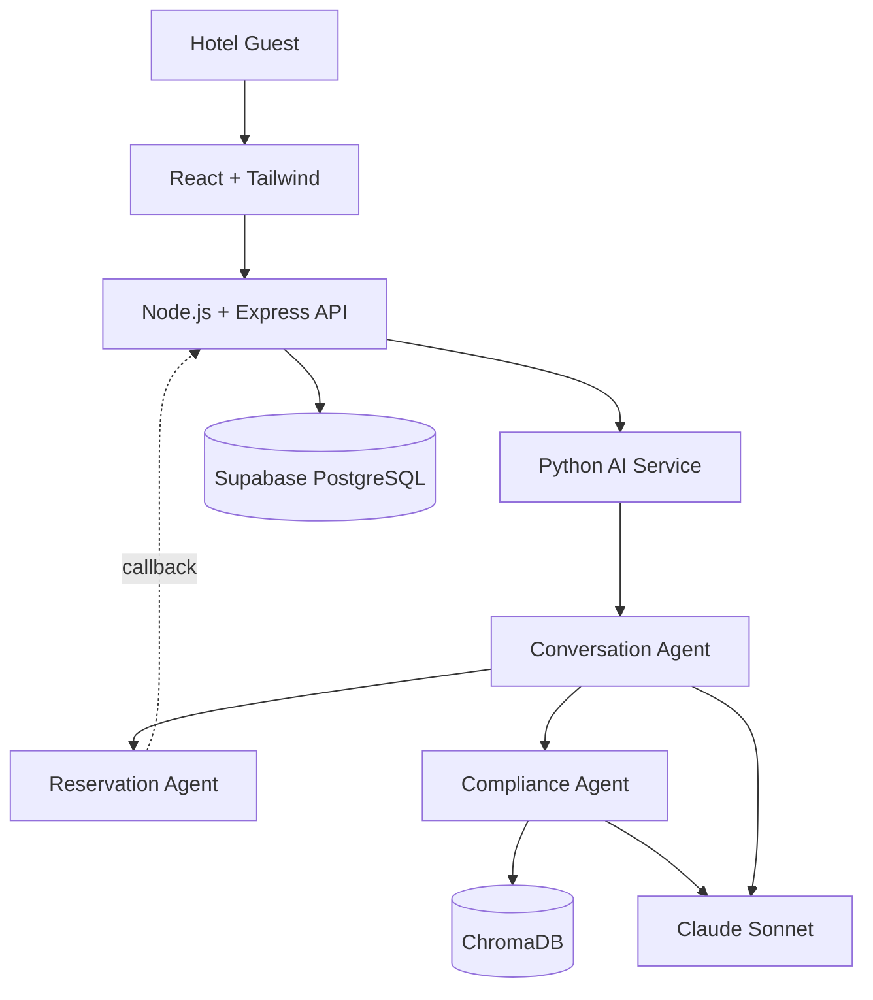

# Technology Decision Record (TDR)

## Multi-Agent AI Hotel Support System

| | |
|---|---|
| **Companion Docs** | `project_vision.md` v1.2 · `architecture.md` v1.1 |
| **Methodology** | Spec-Driven Development (SDD) |
| **Version** | 1.1 (Condensed) |

## Architecture Reference

---

## 1. Introduction

This document records **why** each technology was selected, what alternatives were evaluated, and what trade-offs were accepted — so downstream specs build on a fixed, justified foundation instead of re-litigating tool choices. It sits beneath `project_vision.md` (defines *what*/*why*) and above `architecture.md` (defines *how assembled*) in the SDD hierarchy.

---

## 2. Technology Selection Principles

Scalability · Maintainability · Performance · Developer Productivity · Enterprise Adoption · AI Ecosystem Compatibility · Cloud Readiness · Security · Community Support · Future Growth. Each selection below is justified against the subset most relevant to its layer.

---

## 3. Overall Technology Stack

| Technology | Purpose | Reason Selected | Version |
|---|---|---|---|
| React | Frontend UI | Component model fits chat UI; largest ecosystem | 18.x |
| Tailwind CSS | Styling | Utility-first, fast iteration | 3.x |
| Node.js | Business API runtime | Non-blocking I/O for high-concurrency APIs | 20.x LTS |
| Express.js | Business API framework | Minimal, industry-standard | 4.x |
| Python | AI microservice language | De facto standard for LLM/agent tooling | 3.11+ |
| LangGraph | Agent orchestration | Explicit graph state machine, native Supervisor fit | latest |
| LangChain | RAG orchestration | Standardized retrieval/embedding abstractions | latest |
| Claude Sonnet | LLM | Reliable instruction-following/tool-use | current |
| Supabase (PostgreSQL) | DB + Auth | ACID + native RLS + built-in Auth | latest |
| ChromaDB | Vector store | Zero-infra fit for V1 policy corpus | latest |
| JWT | Session auth | Stateless, cross-service verifiable | RFC 7519 |
| Docker | Containerization | Uniform packaging, independent scaling | 24.x+ |
| Azure | Cloud platform | Enterprise mandate, native secrets/identity | — |
| GitHub / Actions | SCM & CI/CD | Standard, integrated pipelines | — |
| Python Logging | App logs | Zero-dependency, sufficient for V1 | stdlib |
| LangSmith | Agent tracing | Purpose-built LangGraph/LangChain observability | latest |

---

## 4. Frontend Decisions

| Criterion | React | Angular | Vue | Bootstrap | Material UI |
|---|---|---|---|---|---|
| Flexibility | High | Low (opinionated) | Moderate | Low | Moderate |
| Talent Pool | Largest | Large | Smaller | N/A | N/A |
| Fit for chat UI | Excellent | Heavier | Good | Not a UI lib | Adds design opinion |

**React** selected for its component model and hiring pool; unopinionated fit alongside Tailwind. **Angular** rejected — steeper curve, unneeded opinionation. **Vue** rejected only on smaller enterprise talent pool. **Tailwind CSS** selected for utility-first speed; **Bootstrap** rejected (pre-styled look conflicts with custom hotel branding); **Material UI** viable future supplement if velocity beats brand customization.

---

## 5. Backend Decisions

| Criterion | Node.js/Express | NestJS | FastAPI | Spring Boot | Django |
|---|---|---|---|---|---|
| Concurrency | Event loop | Event loop | ASGI async | Thread-per-request | Sync-first |
| Best Fit | High-concurrency REST | Large structured apps | Python AI services | JVM monoliths | Batteries-included Python apps |

**Node.js + Express** selected: the business API's work is I/O-bound (auth, validate, call Supabase, call AI service) — exactly where Node's event loop wins, and it shares a language with the frontend. **NestJS** deferred (unneeded structure for current API surface). **FastAPI/Spring Boot/Django** rejected for this *role* specifically — introducing a second general-purpose framework would blur the Business API / AI orchestration boundary.

**Why AI is not in Node.js:** Node lacks a mature LangGraph/LangChain-equivalent ecosystem; isolating orchestration in Python keeps the API thin and each layer independently scalable.

---

## 6. AI Technology Decisions

**Python** — de facto LLM/agent-tooling standard, richest documentation.

| Criterion | LangGraph | CrewAI | AutoGen |
|---|---|---|---|
| Model | Directed graph of states | Role-based "crew" | Conversational message-passing |
| Supervisor fit | Native | Peer-collaboration oriented | Requires custom routing/termination |
| Debuggability | High, per-node | Moderate | Lower |

**LangGraph** selected: explicit, auditable control matches the strict Supervisor Pattern and guarantees Compliance is always invoked; integrates with LangSmith. **LangChain** selected for standardized document loading/embedding/retrieval — required by the Compliance Agent's RAG pipeline. **Claude Sonnet over GPT/Gemini:** strongest instruction-following consistency for reliable supervisor routing over long conversations; model-agnostic LangChain interface keeps future substitution low-cost (see Risks, §14).

---

## 7. Database Decisions

Reservations are inherently relational (guests↔bookings↔rooms↔rates) and need ACID transactions to prevent double-booking.

| Criterion | Supabase (Postgres) | Firebase | MongoDB | MySQL |
|---|---|---|---|---|
| Transactions | Full ACID | Limited | Supported, less mature | Full ACID |
| Native Auth | Yes | Yes | No | No |
| Row-level Security | Yes (RLS) | Rule-based | No equivalent | No equivalent |
| Relational Integrity | Native | N/A | App-enforced | Native |

**Supabase (PostgreSQL)** selected over MongoDB (referential integrity enforced at the DB, not application code — directly reduces "booking mistakes" per `project_vision.md` §2), over Firebase (NoSQL doesn't fit relational domain), and over MySQL (Supabase adds built-in Auth + RLS, removing a separate identity-provider integration). RLS gives guest-level data isolation independent of API-layer checks; managed scaling tiers/read replicas support growth.

---

## 8. Vector Database Decisions

| Criterion | ChromaDB | Pinecone | Weaviate | Azure AI Search | FAISS |
|---|---|---|---|---|---|
| Deployment | Self-hosted/embedded | Managed SaaS | Self-hosted/managed | Azure-native managed | Library only |
| Setup Complexity | Very low | Low | Moderate | Low (if on Azure) | Low, no persistence layer |

**ChromaDB** selected for V1: a small, single-property policy corpus needs zero-infrastructure setup, not a managed billing commitment; integrates directly with LangChain's retriever interface. **Migration path:** Azure AI Search is the natural upgrade (first-party Azure integration, hybrid search) as corpora grow multi-property; Pinecone/Weaviate remain viable alternatives. FAISS is not a production target (no ops/persistence layer). Retrieval is accessed only via LangChain's abstraction, so swapping stores later is configuration, not a rewrite.

---

## 9. Authentication Decisions

**Supabase Auth + JWT:** guest sessions authenticate via Supabase Auth, issuing a signed JWT validated by the Node.js API on every request.

| Property | Benefit |
|---|---|
| Session Management | Stateless — no shared session store to scale/fail over |
| Security | Signed, time-limited tokens; refresh-token pattern limits leak exposure |
| Scalability | Any API replica validates independently — no session affinity needed |
| RBAC | JWT claims drive role checks and align with Supabase RLS policies |

**Why separated from AI:** agents only need "this request is authorized for guest X" — not *how* that was established — so auth changes (e.g., SSO) never touch agent code.

---

## 10. Deployment Decisions

**Docker:** React build, Node.js API, and Python AI microservice containerized independently — environment parity across dev/staging/prod, independent scaling. **Azure:** enterprise-mandated platform; managed container hosting, Key Vault, native identity. **GitHub/GitHub Actions:** single source-of-truth repo; CI/CD builds/tests/deploys each container independently, enforcing the SDD gate that nothing reaches production without passing its specified checks. Result: independent service deployment and horizontal scaling per container, without shared-infrastructure bottlenecks.

---

## 11. Logging and Observability

| Concern | Technology | Covers |
|---|---|---|
| Application Logs | Python Logging / Node.js logs | Requests, errors, business decisions |
| AI Agent Tracing | LangSmith | Every node transition, tool call, retrieval, prompt/response |
| Performance Monitoring | LangSmith + logs | Per-agent and end-to-end latency |
| Error Tracking | Structured logs | Rapid root-cause identification |
| Audit Logs | Logging + LangSmith trace export | Full reconstruction of any guest interaction |

**Why critical for AI agents:** LLM-driven behavior can't be fully predicted from code — only tracing reveals what an agent actually did, retrieved, and decided in a given conversation, which is required for compliance audit (SC-5, SC-9 in `project_vision.md`).

---

## 12. Security Decisions

HTTPS (all hops encrypted) · JWT (stateless identity) · Supabase RLS (DB-enforced guest isolation) · Environment Variables (no hard-coded config) · Azure Key Vault (centralized, rotatable secrets) · Prompt Injection Protection (mandatory Compliance gate structurally blocks manipulated/hallucinated output) · SQL Injection Protection (parameterized queries only) · Input Validation (schema-checked at the API boundary) · Rate Limiting (protects Supabase and the cost-sensitive Claude Sonnet API) · OWASP API Security Top 10 (release-gate checklist).

---

## 13. Architecture Decision Records (ADR)

| ADR | Technology | Decision | Key Alternative(s) | Trade-off | Future Review |
|---|---|---|---|---|---|
| 001 | React | Adopt as frontend framework | Angular, Vue | More manual architecture vs. Angular | If UI grows into large multi-module portal |
| 002 | Node.js | Adopt for Business API runtime | Python, Java | Not CPU-bound optimized (n/a here) | If API takes on CPU-heavy work |
| 003 | Express.js | Adopt as API framework | NestJS | Less scaffolding | If API surface grows substantially |
| 004 | Python | Adopt for AI microservice | JS AI libs, Java | Second runtime (isolated by design) | Not expected to change |
| 005 | LangGraph | Adopt for agent orchestration | CrewAI, AutoGen | More upfront graph definition | If agent count/topology grows large |
| 006 | LangChain | Adopt for RAG orchestration | Hand-rolled, LlamaIndex | Added abstraction layer | If retrieval needs exceed abstraction |
| 007 | Claude Sonnet | Adopt as primary LLM | GPT-class, Gemini-class | Single-vendor dependency | Periodic benchmarking |
| 008 | Supabase | Adopt for DB + Auth | Firebase, MongoDB, MySQL | Managed-platform tie-in (Postgres portable) | If extreme multi-region scale needed |
| 009 | ChromaDB | Adopt for V1 vector store | Pinecone, Weaviate, Azure AI Search | Less enterprise track record | At multi-property scale |
| 010 | Docker | Containerize all services | Bare-metal/VM | Container build/maintain overhead | Predecessor to Kubernetes |
| 011 | Azure | Adopt as cloud platform | AWS, GCP | Cloud lock-in (workloads containerized/portable) | Org-wide cloud-strategy shift only |

*(All ADRs status: Accepted.)*

---

## 14. Technology Risks

| Risk | Mitigation |
|---|---|
| LLM vendor lock-in | LangChain model-agnostic interface; periodic benchmarking |
| LLM dependency (availability/cost/rate limits) | Rate limiting, usage monitoring, tier planning |
| Cloud cost growth | Usage monitoring, right-sizing replicas, caching (§15) |
| Scaling beyond ChromaDB | Documented migration to Azure AI Search/Pinecone/Weaviate |
| Model behavior drift on provider updates | Pin versions where possible; regression-test routing/compliance behavior |
| Database growth/query performance | Supabase scaling tiers, read replicas, indexing/partitioning |
| Two-language operational overhead | Strict boundary documentation (this TDR + architecture.md) |

---

## 15. Future Evolution

Kubernetes (finer orchestration at scale) · Redis (shared cache) · Semantic Cache (reduce repeated LLM cost/latency) · Azure AI Search (ChromaDB successor) · Model Context Protocol/MCP (standardized tool discovery for future PMS/OTA integration) · Additional AI Agents (new LangGraph nodes under the existing Supervisor) · Event-Driven Architecture (async booking/notification workflows). All optional and demand-driven — none required for Version 1.

---

## 16. Final Technology Summary

| Technology | Role | Reason Selected | Future Alternative |
|---|---|---|---|
| React | Frontend | Ecosystem/talent fit for chat UI | — |
| Tailwind CSS | Styling | Fast, utility-first | Material UI |
| Node.js/Express.js | Business API | Non-blocking I/O, shared language | NestJS |
| Python | AI microservice | LLM/agent ecosystem standard | — |
| LangGraph | Orchestration | Explicit Supervisor-fit graph model | — |
| LangChain | RAG orchestration | Standardized retrieval abstractions | LlamaIndex |
| Claude Sonnet | LLM | Reliable routing/tool-use | GPT/Gemini via LangChain |
| Supabase (PostgreSQL) | DB + Auth | ACID + RLS + built-in Auth | Self-managed Postgres + IdP |
| ChromaDB | Vector store | Zero-infra V1 fit | Azure AI Search/Pinecone/Weaviate |
| JWT | Auth | Stateless, cross-service | — |
| Docker | Containerization | Uniform, independently scalable | — |
| Azure | Cloud | Enterprise mandate | — |
| GitHub/Actions | SCM & CI/CD | Standard, integrated | — |
| Python Logging | App logs | Zero-dependency | Structured log service (ELK) |
| LangSmith | Agent observability | Purpose-built tracing | — |

*End of Document — Technology Decision Record v1.1*
