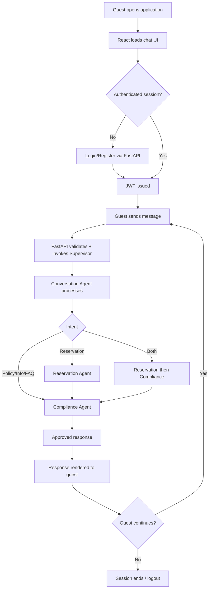
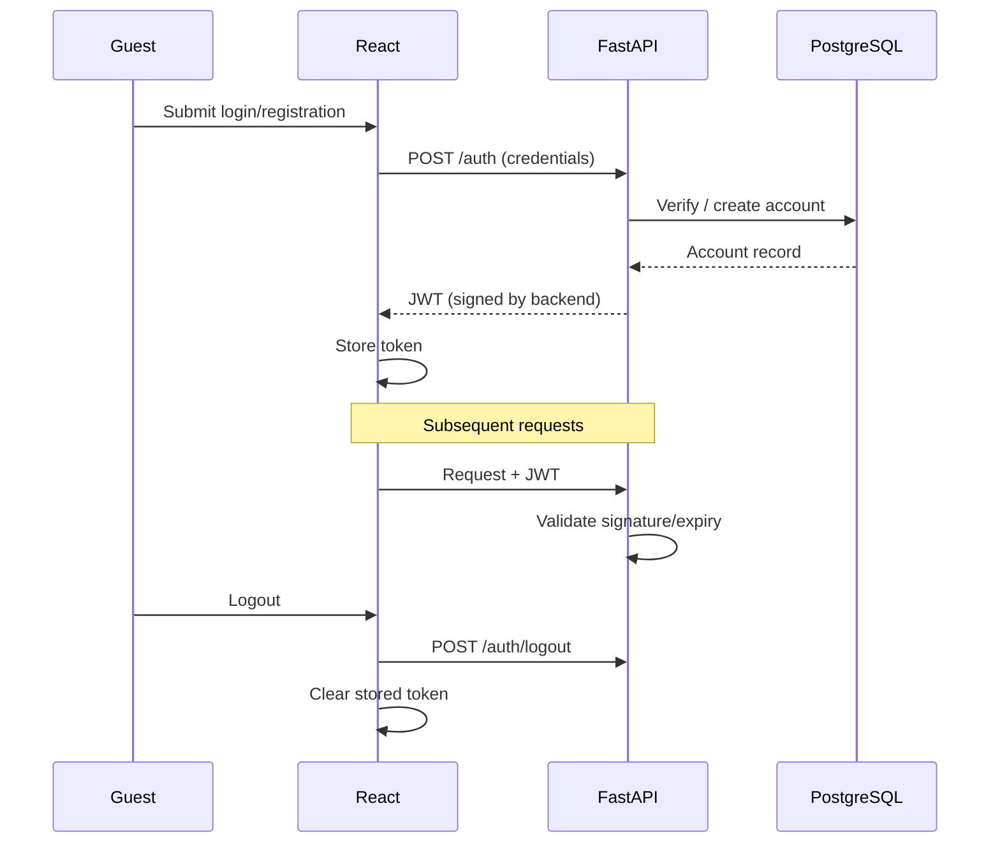
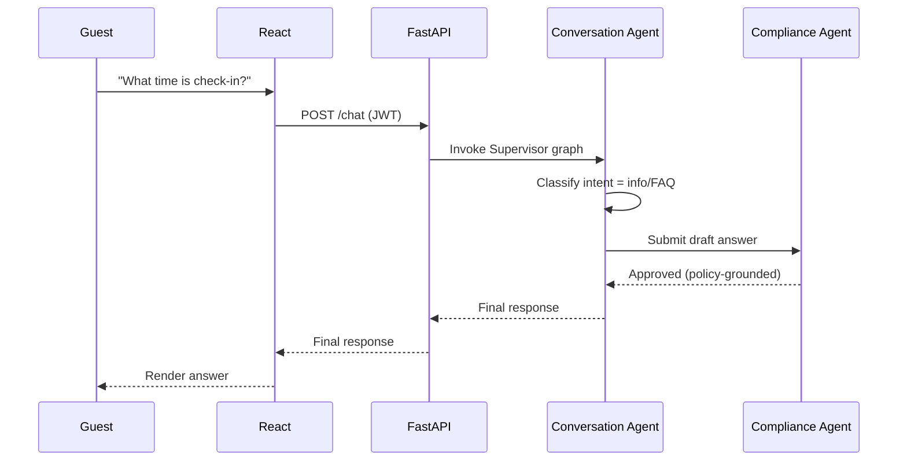
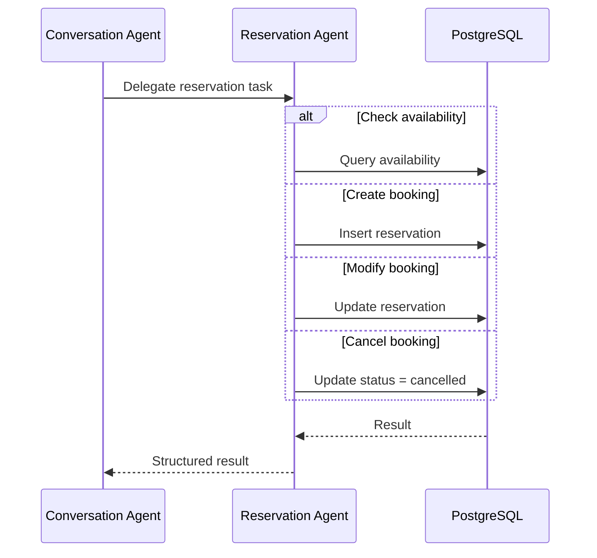
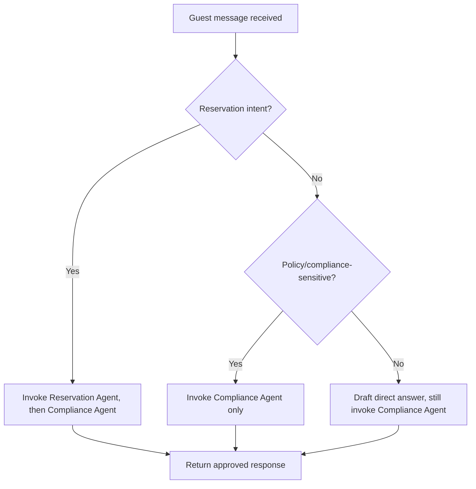
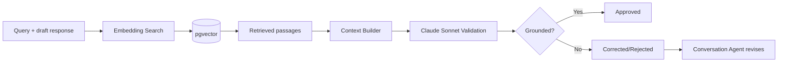
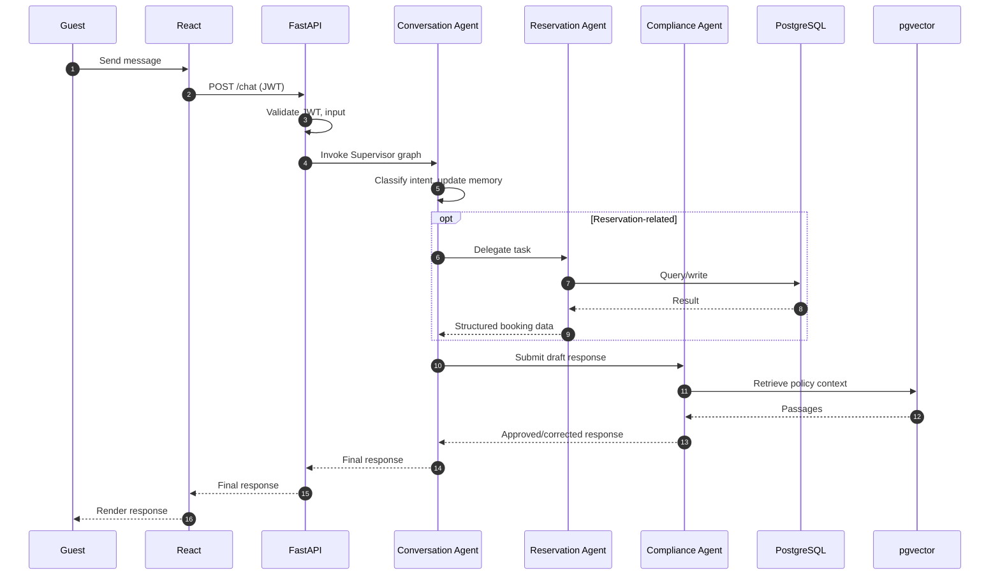

Workflow Specification
Multi-Agent AI Hotel Support System
	
Companion Docs	`project_vision.md` v2.0 · `technology_decisions.md` v2.0 · `architecture.md` v2.0
Version	2.0
---
1. Introduction
This document specifies the operational workflows — step-by-step interaction sequences — across the system defined by the companion documents. Objectives: make every guest-facing and internal workflow explicit and auditable; guarantee the mandatory Compliance Agent gate is followed on every path; give engineering and QA a shared reference for expected sequencing. All actors below (React, FastAPI, Conversation/Reservation/Compliance Agents, PostgreSQL, pgvector, Claude Sonnet) are defined in `architecture.md` §4.
---
2. Overall Business Workflow

The Compliance Agent (K) is never skipped, even for pure information/FAQ turns.
---
3. User Authentication Workflow
FastAPI owns authentication directly: guest credentials are validated against the Guests/Accounts table in PostgreSQL, and FastAPI issues a signed JWT — there is no separate identity-provider service.

---
4. Conversation Workflow

---
5. Reservation Workflow
The Reservation Agent has direct database access (no callback loop, since it runs in-process within the FastAPI/LangGraph service).

The result then proceeds to the Compliance Agent (§4) before release.
---
6. AI Decision Workflow

The Compliance Agent runs on every path — "answer directly" only means the Reservation Agent is skipped.
---
7. RAG Workflow

Document ingestion into pgvector is a separate, offline administrative workflow.
---
8. Error Handling Workflow
Failure	Workflow Response
PostgreSQL failure	Operation fails closed; guest told the action couldn't complete; incident logged
Claude Sonnet timeout	Bounded retry, then graceful fallback message
pgvector retrieval failure	Compliance Agent rejects rather than approves an ungrounded response
Invalid user input	Rejected at FastAPI's validation boundary before reaching any agent
Reservation Agent internal error	Guest informed reservation actions are temporarily unavailable
---
9. Logging Workflow
Every FastAPI request is logged (structured JSON: method, guest/session id, timestamp, outcome). Every agent invocation, tool call, retrieval, and prompt/response pair is traced via LangSmith. Reservation operations and compliance decisions are additionally written to the `AUDIT_LOGS` table, linked to the originating conversation, giving a single reconstructable trail per interaction.
---
10. Security Workflow
Every request is authenticated (JWT issued/validated by FastAPI) and authorized (role checks at the API layer). Input is schema-validated before reaching any agent or the database. Rate limiting protects PostgreSQL and the Claude Sonnet API. Prompt injection is mitigated structurally: the Compliance Agent validates every response against retrieved policy content regardless of how the guest's input was phrased.
---
11. End-to-End Request Lifecycle

---
12. Future Workflow Enhancements
Payment Workflow (Payment Agent between confirmation and approval) · Recommendation Workflow (post-booking upsell suggestions, still compliance-gated) · Translation Workflow (input/output wrapping, single-language internal logic) · Sentiment Analysis Workflow (parallel, non-blocking escalation flagging) · each attaching as a new LangGraph node without disturbing existing workflows.
---
13. Workflow Summary
Every workflow converges on the same guarantees: the Conversation Agent is the sole guest-facing agent; the Reservation Agent's data access is direct but confined to its own responsibility; the Compliance Agent validates every response without exception; and every step is logged and traceable. Consolidating the backend into a single FastAPI/LangGraph service removes cross-service failure modes present in a split architecture, while preserving the same routing, delegation, and compliance-gate pattern that makes the system scalable, maintainable, and enterprise-ready.
End of Document — Workflow Specification v2.0