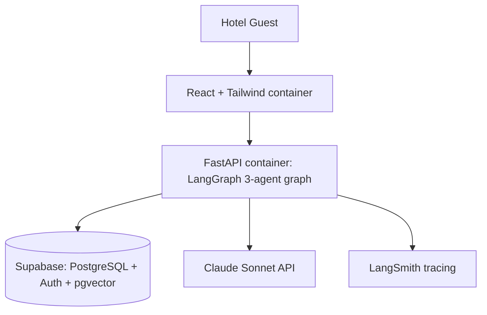

Deployment & Observability Specification
Multi-Agent AI Hotel Support System
	
Companion Docs	`project_vision.md` v2.0 · `technology_decisions.md` v2.0 · `architecture.md` v2.0 · `workflow.md` v2.0 · `database_design.md` v2.0 · `security.md` v2.0
Component Type	Deployment & Observability Specification (Docker / Supabase / Azure / GitHub Actions / LangSmith)
Version	2.0
---
## 1. Introduction

This document specifies how the system is packaged, deployed, observed, and migrated. The v2.0 topology is deliberately small: two application containers (frontend, backend) plus **Supabase** as the managed data-and-identity platform. There is no Node.js business API and no ChromaDB service — both were removed in the consolidation from v1.1 (`architecture.md` §3, `workflow.md` §13).

---

## 2. Topology



Supabase provides the managed PostgreSQL (reservations + conversation/audit + pgvector policy store) **and** Auth (registration, email verification, JWT). The FastAPI container hosts all three agents in-process.

---

## 3. Local Development

```yaml
services:
  db:
    image: pgvector/pgvector:pg16     # offline parity; or use the Supabase CLI
    environment: { POSTGRES_DB: postgres, POSTGRES_PASSWORD: ${DB_PASSWORD} }
    ports: ["5432:5432"]
    volumes: ["dbdata:/var/lib/postgresql/data", "./db/init:/docker-entrypoint-initdb.d"]
    healthcheck: { test: ["CMD-SHELL","pg_isready -U postgres"], interval: 5s }
  backend:
    build: ./backend
    env_file: .env
    depends_on: { db: { condition: service_healthy } }
    ports: ["8000:8000"]
  frontend:
    build: ./frontend
    depends_on: [backend]
    ports: ["5173:80"]
volumes: { dbdata: {} }
```

- `./db/init` holds the DDL + seed SQL from `database_design.md`, applied on first boot.
- For full Auth parity locally, use the **Supabase CLI** (`supabase start`) which runs Auth, Postgres, and Studio in containers; the plain `pgvector` image is the lighter offline option when Auth isn't exercised.
- One `supabase start` + `docker compose up` gives a teammate the whole system.

---

## 4. Containers

**backend** — slim Python base, install deps, run `uvicorn app.main:app`; multi-stage build; non-root user; only port 8000 exposed. **frontend** — Vite build stage (`npm run build`) → nginx stage serving `/dist`. Pin base-image digests.

---

## 5. Configuration

All config via environment variables / Azure Key Vault (`security.md` §8):

```
SUPABASE_URL                 https://<ref>.supabase.co
SUPABASE_JWKS_URL            https://<ref>.supabase.co/auth/v1/.well-known/jwks.json
SUPABASE_SERVICE_ROLE_KEY    (server-side only; never shipped to the client)
DATABASE_URL / DATABASE_URL_RO   (app_writer / app_readonly roles)
ANTHROPIC_API_KEY / LLM_MODEL    claude-sonnet
EMBEDDING_MODEL              text-embedding-3-small
LANGSMITH_API_KEY
RATE_LIMIT_PER_MIN
```

---

## 6. Observability

Set this up in phase 1, not at the end (`technology_decisions.md` §11) — it makes testing and error-handling far easier.

- **Tracing:** LangSmith captures every node transition, tool call, retrieval, and prompt/response pair; correlate with `X-Request-Id`.
- **Structured logs:** JSON with request id, conversation id, agent, latency, token counts; PII redacted.
- **Audit trail:** reservation operations and compliance decisions written to `audit_logs`, linked to the conversation, giving one reconstructable trail (`workflow.md` §9, `database_design.md` §10).
- **Metrics:** end-to-end and per-agent latency, tool error rate, **compliance-fail rate**, token cost per conversation.
- **Health probes:** `/api/v1/health` for liveness/readiness.

---

## 7. CI/CD

GitHub Actions (`technology_decisions.md` §10):

1. **On PR:** lint → unit tests → integration tests (ephemeral Postgres) → RAG + e2e eval gate (`testing.md`) → build images. A regression below threshold blocks merge.
2. **On merge to main:** push images to a registry → deploy to staging → smoke test (`/health` + one scripted chat) → promote to production.

---

## 8. Hosting

- **Compute:** the frontend and backend containers deploy to **Azure Container Apps** (enterprise mandate; managed hosting, Key Vault, native identity — `technology_decisions.md` §10).
- **Data + Auth:** **Supabase** (managed Postgres + pgvector + Auth). Compute-on-Azure with data-on-Supabase is a standard split and keeps ops minimal.
- **Scale path:** the backend is stateless (state in Postgres + LangGraph checkpoints), so it scales horizontally behind the Azure load balancer; the AI layer scales independently of the lighter frontend (`architecture.md` §14).

---

## 9. Data Migration Plan

Moving off local storage (`workflow.md` §12 / `architecture.md` §16):

1. **Reservation + conversation data** → `pg_dump` local → restore into the Supabase project; point `DATABASE_URL` at it.
2. **RAG data** → embeddings live in the same database, so they migrate with the **same dump** — no separate vector-store export. (Direct payoff of the pgvector decision; a standalone ChromaDB/Pinecone would need its own migration.)
3. **Auth users** → seeded via the Supabase CLI / Admin API for test accounts; real users self-register.
4. **Verify** row counts, run the eval suite against the migrated DB, then cut over; keep the prior dump until smoke + eval pass (rollback).
5. **Future scale** → Azure AI Search is the documented successor for the policy store at multi-property scale (`rag_design.md` §7).

---

## 10. Definition of Done (deploy slice)

- [ ] `supabase start` + `docker compose up` brings up the full system locally.
- [ ] Images build in CI; non-root; pinned bases.
- [ ] LangSmith tracing live; structured logs with request ids; `audit_logs` populated.
- [ ] `/health` probe wired to the orchestrator.
- [ ] Backend + frontend on Azure Container Apps; data + Auth on Supabase.
- [ ] Documented migration + rollback path.

End of Document — Deployment & Observability Specification v2.0
