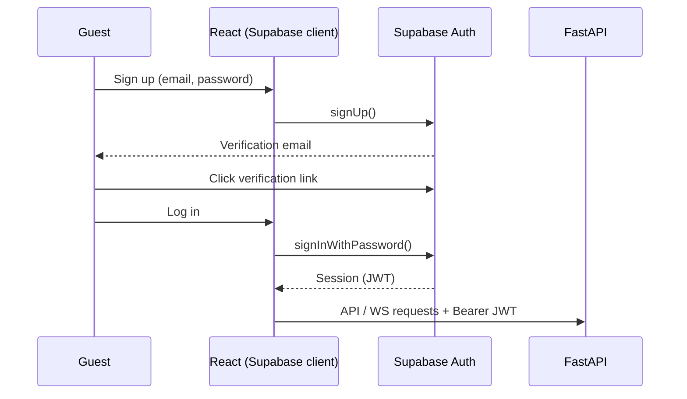

Frontend Specification
Multi-Agent AI Hotel Support System
	
Companion Docs	`project_vision.md` v2.0 · `technology_decisions.md` v2.0 · `architecture.md` v2.0 · `workflow.md` v2.0 · `api_design.md` v2.0
Component Type	Frontend Specification (React / Vite / Tailwind / Supabase Auth client)
Version	2.0
---
## 1. Introduction

The frontend is a lightweight, guest-facing conversational interface — the handbook and `project_vision.md` are explicit that no heavy front-end work is required. **React (Vite) + Tailwind CSS**, talking to the FastAPI backend over WebSocket (streaming) with a REST fallback (`api_design.md`). Registration, login, and email verification are handled through the **Supabase Auth client**; the resulting JWT is attached to every backend call.

---

## 2. Screens

A single chat screen is the core. Supporting surfaces: auth screens (signup / login / email-verification notice / password reset — mostly provided by the Supabase Auth UI), a booking-confirmation view, and an optional admin **Policies** page (behind the `admin` role) for managing the compliance corpus.

---

## 3. Component Tree

```
<App>
 ├─ <AuthProvider>            // wraps Supabase client + session
 │   └─ <ChatProvider>        // messages, connection, conversation_id
 │       ├─ <ChatWindow>
 │       │   ├─ <MessageList role="log" aria-live="polite">
 │       │   │   └─ <MessageBubble role="user|assistant" />
 │       │   ├─ <StatusIndicator />   // "checking reservations…", "checking policy…"
 │       │   └─ <Composer />          // textarea + send; locked while in-flight
 │       ├─ <AuthGateModal />         // opens on auth_required
 │       └─ <BookingConfirmation />
 └─ (optional) <AdminPolicies />
```

---

## 4. State

React hooks only (no Redux needed at this size):

```ts
type ChatState = {
  conversationId: string | null;
  session: SupabaseSession | null;      // from the Supabase client
  messages: Message[];                  // {id, role, content, streaming?, compliance?}
  status: 'idle'|'connecting'|'thinking'|'checking_reservations'|'compliance_check';
  connection: 'open'|'closed'|'reconnecting';
  authRequired: boolean;
  error: { code: string; message: string } | null;
};
```

---

## 5. Authentication Flow (Supabase Auth)



The frontend uses the Supabase client **only** for identity (signup, login, email verification, refresh). It never talks to Postgres directly; all data flows through FastAPI, which verifies the JWT (`api_design.md` §3).

---

## 6. Connection Lifecycle

1. On mount → `POST /api/v1/sessions` → store `conversation_id`.
2. Open `WS /api/v1/ws/chat?conversation_id=…` with the Bearer JWT (if signed in).
3. Send `{type:"user_message", content}` on submit.
4. Handle inbound events: `status` → indicator; `token` → append to streaming bubble; `final` → finalize bubble + show a subtle "policy-checked ✓"; `auth_required` → open `<AuthGateModal>`; `error` → friendly message, keep input usable.
5. **Reconnect** with backoff on drop; `conversation_id` preserves memory server-side so the guest never repeats themselves.

---

## 7. Booking Authentication Gate

Anonymous guests can ask informational/FAQ questions freely. When the backend routes to a booking action without a verified identity, it emits `auth_required`; the UI opens the Supabase signup/login flow inline, and — critically — **does not let an unverified account complete a booking**. After verification, the pending message is retried automatically and the booking proceeds scoped to the guest (`api_design.md` §7).

---

## 8. Key UX Rules

- **Stream tokens** so replies feel live; show a thinking indicator between turns.
- **Never show a reply before it is final.** A bubble is promoted to "assistant answer" only on the `final` event — the compliance-before-response guarantee mirrored client-side.
- **Lock the composer while a run is in flight** (one message per conversation).
- **Optimistic user bubble**; roll back only on send failure.
- **Human-readable errors** mapped from error codes; never dump raw server errors (also a security requirement, `security.md` §7).
- Honest "can't complete this right now" messaging over silent failure (`architecture.md` §15).

---

## 9. Accessibility

`role="log"` + `aria-live="polite"` on the message list · Enter to send, Shift+Enter for newline, focus returns to composer after send · respect reduced-motion for the typing animation · readable contrast · single-column responsive layout.

---

## 10. Styling

Tailwind CSS, utility-first (`technology_decisions.md` §4). A clean single-column chat with clear user/assistant distinction is sufficient — the deliverable is graded on the system, not pixel polish. Keep hotel branding easy to theme (Tailwind config tokens).

---

## 11. Configuration

`VITE_API_BASE`, `VITE_WS_BASE`, `VITE_SUPABASE_URL`, `VITE_SUPABASE_ANON_KEY` from env, so local vs. deployed is an env swap. Only the **anon/publishable** key ships to the client; the service-role key never leaves the backend (`security.md` §8).

---

## 12. Definition of Done (frontend slice)

- [ ] Signup/login/email-verification via Supabase Auth client; JWT attached to backend calls.
- [ ] Session created on mount; WS connects and reconnects on drop.
- [ ] Multi-turn conversation with streamed replies and stage indicators.
- [ ] Assistant bubbles finalize only on `final` (post-compliance).
- [ ] `auth_required` opens the login gate; unverified accounts cannot book.
- [ ] Friendly error handling; `aria-live` accessibility.
- [ ] Runs from `docker compose up` alongside the backend.

End of Document — Frontend Specification v2.0
