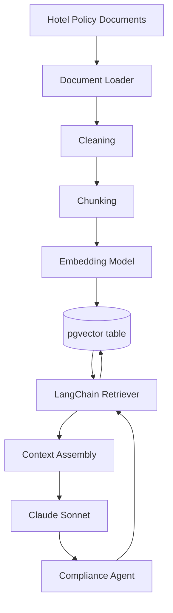
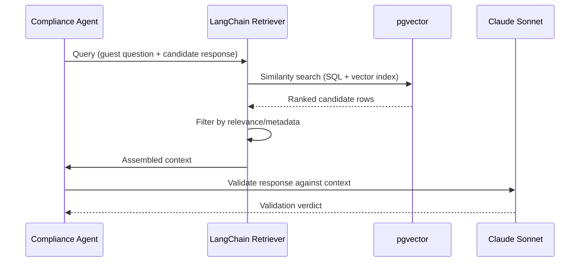

RAG Design Specification
Multi-Agent AI Hotel Support System
	
Companion Docs	`project_vision.md` v2.0 · `technology_decisions.md` v2.0 · `architecture.md` v2.0 · `workflow.md` v2.0 · `conversation_agent.md` v2.0 · `compliance_agent.md` v2.0
Component Type	Retrieval-Augmented Generation Subsystem (Python / LangChain / pgvector / Claude Sonnet)
Version	2.0
---
1. Introduction
The RAG system gives the Compliance Agent trusted, retrievable hotel knowledge — policies, booking rules, FAQs, cancellation and check-in/check-out terms — grounding every validation decision in authoritative source documents. It is retrieval infrastructure, not a standalone agent, built on pgvector: policy embeddings live as a table inside the same PostgreSQL instance used for reservation data, rather than a separate vector-database service. The Compliance Agent is the only component that queries it.
---
2. RAG Architecture

Offline ingestion (top) is decoupled from online retrieval (bottom), which only the Compliance Agent invokes.
---
3. Knowledge Sources
Hotel Policies (cancellation, refund, pet, age/ID, house rules) · FAQs · Room Information · Booking Rules · Cancellation Policies · Check-in/Check-out Policies · Future: multi-property policy variants, loyalty terms, local area guides. All sources are administrator-curated before ingestion.
---
4. Document Processing Pipeline
Upload (administrator submission) → Validation (format/completeness checks) → Text Extraction → Cleaning (remove artifacts/boilerplate) → Chunking (retrieval-sized segments) → Metadata Tagging (source, category, version) → Storage (passed to the Embedding Pipeline, §5). This pipeline runs administratively, decoupled from guest requests.
---
5. Embedding Pipeline
Each validated chunk is embedded and stored as a row in the pgvector table alongside its metadata (source, category, version), using PostgreSQL's native vector column type and index for efficient similarity search — no separate database or synchronization process is required between transactional and vector data.
---
6. Retrieval Workflow

---
7. pgvector Design
Tables/Collections: policy content stored in dedicated tables, optionally partitioned by category or property as the corpus grows.
Metadata: source document, category, version stored as ordinary relational columns alongside the vector column.
Similarity Search: native vector similarity operators and indexes (e.g., approximate nearest-neighbor indexing) within PostgreSQL.
Filtering: standard SQL `WHERE` filtering combined with vector similarity ordering — no separate query language.
Advantages: single database to operate, transactional consistency between reservation and policy data, no cross-service synchronization.
Limitations: less specialized at very large-scale vector workloads than a dedicated, horizontally-scaled vector database; a documented migration path (Azure AI Search) exists if this becomes a constraint.
---
8. Error Handling
Condition	Response
Missing documents	Retriever returns no results; Compliance Agent falls back to a generic answer
Empty search results	Treated as "cannot ground" — rejected or downgraded
Embedding failures (ingestion)	Document not indexed; administrator notified
Database (PostgreSQL/pgvector) failure	Retrieval fails closed — no approval without grounding
Timeouts	Treated as retrieval failure; default is reject/escalate
---
9. Security
Policy documents and embeddings are accessible only through the Compliance Agent's retrieval path within the shared PostgreSQL instance; standard database access controls (roles, connection scoping) apply. Ingestion is an administrative operation, separate from guest credentials. No guest personal data is embedded into the vector store. Because retrieval queries originate from the Compliance Agent's own reasoning, not raw guest text, prompt injection cannot directly control what is retrieved.
---
10. Future Improvements
Azure AI Search (managed alternative at multi-property scale) · Hybrid Search (keyword + vector) · Re-ranking (secondary relevance pass) · Semantic Cache (reduce repeated validation cost/latency) · Knowledge Graph (explicit policy relationships) · Multi-language Support (as translation capability is added, per `project_vision.md`).
---
11. Summary
By co-locating policy retrieval with transactional data in a single PostgreSQL/pgvector instance, this design keeps the Compliance Agent's grounding infrastructure operationally simple while preserving the same governance guarantee as a dedicated vector database would: every policy statement a guest receives can be traced back to an approved hotel document, with retrieval defaulting to rejection whenever grounding cannot be established.
End of Document — RAG Design Specification v2.0