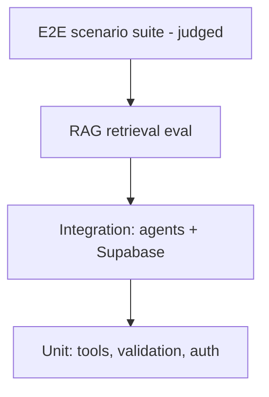

Testing & Evaluation Specification
Multi-Agent AI Hotel Support System
	
Companion Docs	`project_vision.md` v2.0 · `technology_decisions.md` v2.0 · `architecture.md` v2.0 · `workflow.md` v2.0 · `conversation_agent.md` v2.0 · `reservation_agent.md` v2.0 · `compliance_agent.md` v2.0
Component Type	Test & Evaluation Specification
Version	2.0
---
## 1. Introduction

Testing an LLM-driven multi-agent system is hard for three reasons: conversations are hard to verify with static examples; the same input can produce varied output (non-determinism); and multi-agent interaction is not fully predictable. The strategy is therefore layered — deterministic where possible, judged where not — and every layer feeds a **repeatable pass/fail signal** gated in CI, not a human eyeballing single outputs.

---

## 2. Test Pyramid

Many fast deterministic tests at the base; few expensive judged scenarios at the top.

---

## 3. Unit Tests (deterministic, no LLM)

Test the parts that are deterministic so their failures never masquerade as "flaky AI":
- **Input validation** — past check-in rejected, `check_out <= check_in` rejected, over-occupancy rejected, malformed confirmation code rejected.
- **Tool query logic** (seeded test DB) — availability math (sold-out vs. available), lookup, cancel sets `cancelled` and **keeps the row**.
- **JWT verification** — valid Supabase token accepted; expired/tampered/unverified-email rejected; role claim parsed correctly.
- **Error mapping** — DB exception → correct code, no schema leaked.

Run with `pytest`; must be fast and 100% green.

---

## 4. Integration Tests (agents + Supabase)

Spin up an ephemeral Postgres (Supabase CLI or the `pgvector` image), seed it, and drive each reservation tool end-to-end. Assert the structured output contract (`reservation_agent.md` §5) and that a create writes both `reservations` and `reservation_status_history`. Include a **cross-guest access test**: guest A cannot read/modify guest B's booking even with the correct confirmation code.

---

## 5. RAG / Compliance Retrieval Eval

The Compliance Agent is only as good as its retrieval. Evaluate the two phases separately (`compliance_agent.md` §5–7):
- **Retrieval metrics (RAGAS-style):** context precision/recall — does top-k surface the relevant policy chunk?
- **Judgment accuracy:** a labeled set of (candidate response, expected verdict) pairs — compliant drafts approved, non-compliant blocked/regenerated.
- **Fail-closed behavior:** with retrieval unavailable or empty, the agent **rejects** rather than approves (`compliance_agent.md` §8).
- Tune chunking, top-k, and re-ranking against these metrics, not by feel.

---

## 6. End-to-End Scenario Suite (judged)

Scripted multi-turn conversations across the three intents + edge cases. Grade with a mix (`workflow.md`; handbook §9.2):
- **LLM-as-judge** — a strong model scores the final reply against a rubric (correct? grounded in tool output? policy-compliant? on-tone?); calibrate against human-labeled cases, route disagreements to human review.
- **Confidence scoring** and **agent self-assessment** — low-confidence outputs flagged.
- **Deterministic assertions where possible** — e.g. the reply must contain the confirmation code the tool returned.

**Metric for a customer-facing agent:** report **pass^k**, not pass@k. pass@k rewards "right at least once in k tries"; pass^k requires success on *every* run — the honest bar when inconsistency erodes guest trust. Gate CI on pass^k.

---

## 7. Authentication & Authorization Tests

- Signup → email-verification gate: an unverified account cannot complete a booking (`api_design.md` §7).
- Anonymous session can ask FAQ/info questions but a booking intent triggers `auth_required`.
- Admin-only routes reject non-admin tokens.
- Guest scoping holds end-to-end (a booking action only ever touches the caller's `guest_id`).

---

## 8. Invariant Tests (must-pass safety properties)

- **Compliance gate never bypassed** — simulate a non-compliant draft and assert the WS `final` event is never emitted (only regenerate/reject). Guards the fixed ordering (`workflow.md` §2).
- **Hallucination guard** — with no tool result available, the agent does not invent a confirmation code, rate, or availability (`reservation_agent.md` §11).
- **Fail-closed on data-layer failure** — pgvector/Postgres failure yields rejection, never an ungrounded approval (`compliance_agent.md` §8, `architecture.md` §15).

---

## 9. Edge Cases

Past check-in date · sold-out dates · invalid/foreign confirmation code · database connection drop (controlled error + retry) · oversized/garbage input · ambiguous request needing clarification · Claude Sonnet timeout (bounded retry → safe fallback).

---

## 10. Tooling

- **LangSmith** — trace-native debugging; turns a production failure into a regression dataset row automatically.
- **DeepEval** — code-first metric gates in CI (pytest-style).
- **RAGAS** — retrieval-quality metrics for the compliance path.
- **Promptfoo** — YAML-driven regression alternative.

---

## 11. CI Gate

Every PR: unit → integration → RAG eval → judged e2e. Eval thresholds (accuracy, compliance-pass, pass^k) are **quality gates**; a regression blocks merge. Scores are tracked over time so prompt/model changes are measured, not guessed (`deployment.md` §7).

---

## 12. Acceptance Checks

| Check | Proven by |
|---|---|
| **A1 — Conversation** | Multi-turn scenario: remembers earlier turns; routes question vs. reservation vs. policy (`conversation_agent.md`) |
| **A2 — Reservation** | Integration suite: lookup/create/modify/cancel correct; cancel keeps the row; cross-guest access denied (`reservation_agent.md` §13) |
| **A3 — Compliance** | Retrieval eval + invariant tests: non-compliant blocked, compliant passes, nothing bypasses the gate, fail-closed on retrieval loss |
| **Testing DoD** | Whole suite runs in CI with an explainable, repeatable pass/fail |

End of Document — Testing & Evaluation Specification v2.0
