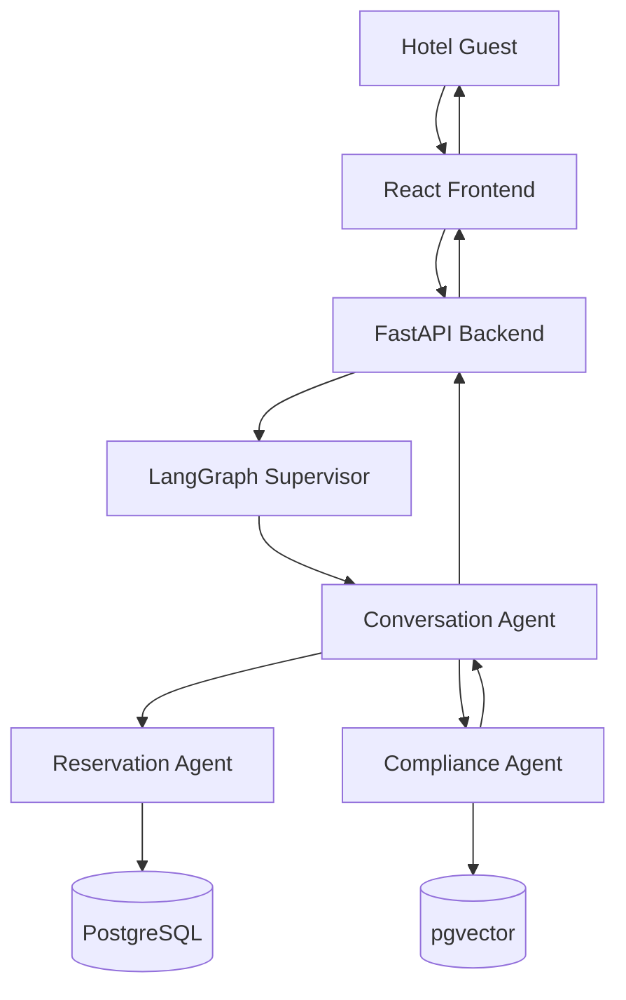

Project Vision Document
Multi-Agent AI Hotel Support System
	
Document Type	Project Vision — Software Design Documentation (SDD)
Methodology	Spec-Driven Development (SDD)
Version	2.0
---
Project Overview
The Multi-Agent AI Hotel Support System is an AI-powered hotel assistant enabling guests to interact naturally with hotel services through conversational AI. It supports room availability, room reservations, booking modification and cancellation, hotel FAQs, hotel policies, and general hotel information — all through a single conversational interface, orchestrated by a Supervisor-based multi-agent architecture and developed under Spec-Driven Development, where every capability is formally specified before implementation.
---
Project Objectives
Improve guest experience — replace multi-step, staff-dependent interactions with a single, natural conversational interface available at any time.
Automate hotel support — resolve routine guest requests (availability, booking, policy questions) without requiring a human staff member.
Reduce manual workload — free hotel reception staff from repetitive inquiries so they can focus on guest situations that genuinely require human judgment.
Ensure trustworthy AI responses — every response is validated against hotel policy before reaching the guest, preventing inaccurate or fabricated answers.
Enable scalable AI architecture — a Supervisor-coordinated multi-agent design that can absorb growing guest volume and additional capabilities without re-architecture.
---
Target Users
User	Relationship to the System
Guests	Primary end users; interact with the assistant to check availability, book, modify, or cancel stays, and ask policy/FAQ questions.
Hotel Reception Staff	Indirect beneficiaries; offloaded from routine inquiries, handle exceptions and situations the assistant cannot resolve.
Hotel Administrators	Own business outcomes; maintain policy content and oversee system performance and guest satisfaction.
---
Project Scope
In Scope: conversational handling of room availability, reservations, modifications, and cancellations; hotel FAQs and general information; policy-compliant, RAG-grounded responses; a single-property (or small pilot) web-based deployment.
Out of Scope: payment processing; multi-language/translation support; voice-based interaction; personalized recommendations; multi-property/multi-hotel support; third-party OTA/PMS integrations; native mobile applications. These are candidate future enhancements (see below), not Version 1 commitments.
---
Business Benefits
24/7 Availability — guest support is not limited by staff shifts or business hours.
Reduced Operational Cost — automation absorbs routine inquiry volume without proportional staffing increases.
Consistent Customer Support — every guest receives the same, policy-grounded answer regardless of when or how they ask.
Scalable Architecture — the multi-agent design scales guest-facing capacity independently of specialist processing (reservations, compliance validation).
Better Customer Satisfaction — faster, more accurate responses reduce guest frustration and support repeat direct bookings.
---
Non-Functional Goals
Goal	Description
Scalability	The system must scale horizontally as guest volume grows, without architectural rework.
Reliability	Reservation operations must be transactionally consistent; no guest response is delivered without compliance validation.
Security	Guest data and hotel policy content must be protected through appropriate access controls and encryption.
Maintainability	Each agent and layer must be independently modifiable without destabilizing the rest of the system.
Performance	Guest-facing responses should be returned within a few seconds under normal load.
Observability	Every agent decision and response must be logged and traceable for quality assurance and compliance review.
---
High-Level System Overview

The Conversation Agent acts as Supervisor, receiving every guest request, understanding intent, maintaining context, and routing work to the Reservation Agent (which communicates with PostgreSQL for availability, booking, modification, and cancellation) and the Compliance Agent (which retrieves hotel policy content from pgvector via Retrieval-Augmented Generation and validates every response before it reaches the guest).
---
Project Deliverables
Area	Deliverable
Frontend	React (Vite) guest-facing conversational interface
Backend	FastAPI service exposing the multi-agent system
AI Agents	Conversation Agent (Supervisor), Reservation Agent, Compliance Agent, orchestrated via LangGraph
Database	PostgreSQL schema for reservations, guest, and conversation data
RAG	pgvector-backed policy knowledge store and retrieval pipeline serving the Compliance Agent
Deployment	A deployable, documented package supporting production operation
---
Future Enhancements
Payment Agent · Recommendation Agent · Translation Agent · Voice Assistant · Multi-Hotel Support — each extending the Supervisor-based architecture with additional specialist agents or channels without requiring a redesign of the core system.
End of Document — Project Vision v2.0